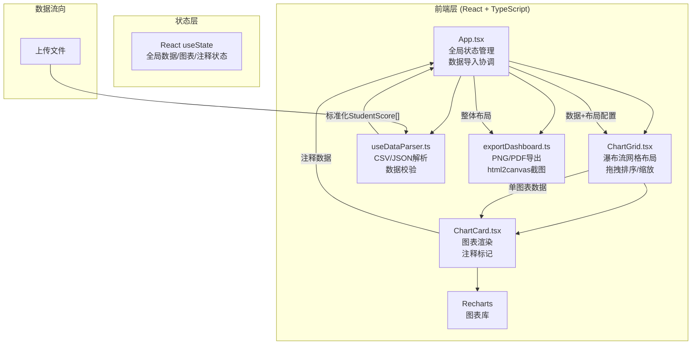
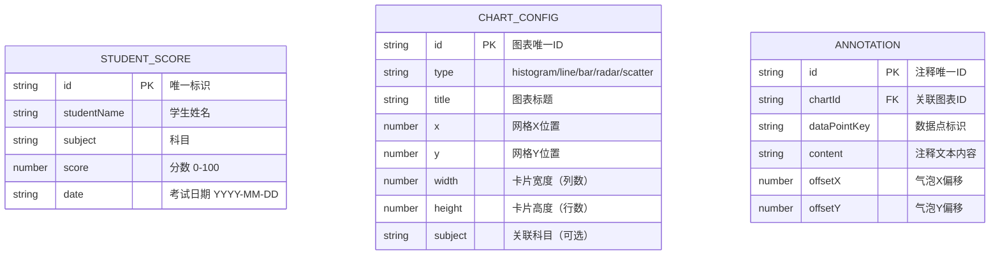

## 1. 架构设计



## 2. 技术描述
- **前端框架**：React@18 + TypeScript@5
- **构建工具**：Vite@5
- **图表库**：Recharts@2
- **拖拽库**：react-dnd@16 + react-dnd-html5-backend@16
- **唯一标识**：uuid@9
- **导出截图**：html2canvas@1 + jsPDF@2（可选用于PDF）
- **状态管理**：React useState/useReducer（轻量级场景）

## 3. 文件结构定义
| 文件路径 | 职责说明 | 调用关系 |
|----------|----------|----------|
| package.json | 依赖管理、启动脚本配置 | - |
| vite.config.js | Vite构建配置（端口、别名、构建优化） | - |
| tsconfig.json | TypeScript严格模式配置 | - |
| index.html | 应用入口HTML，挂载root节点 | - |
| src/App.tsx | 主组件：管理全局state、文件上传处理、布局协调 | 调用useDataParser → 传递数据给ChartGrid → 调用exportDashboard |
| src/components/ChartGrid.tsx | 瀑布流网格：拖拽排序、缩放控制、布局计算 | 接收App数据 → 渲染ChartCard列表 → 传递布局变化给App |
| src/components/ChartCard.tsx | 图表卡片：Recharts渲染、注释气泡、缩放手柄 | 接收ChartGrid数据 → 调用Recharts组件 → 回传注释给App |
| src/hooks/useDataParser.ts | 数据解析Hook：CSV/JSON解析、字段校验、标准化输出 | 被App.tsx调用，返回{data, errors, isLoading} |
| src/utils/exportDashboard.ts | 导出工具：html2canvas截图、PNG下载、PDF生成 | 被App.tsx调用，接收DOM节点引用 |
| src/types/index.ts | 全局类型定义：StudentScore、ChartConfig、Annotation等 | 所有组件共享引用 |

## 4. 核心数据模型

### 4.1 数据模型定义


### 4.2 TypeScript类型定义
```typescript
interface StudentScore {
  id: string;
  studentName: string;
  subject: string;
  score: number;
  date: string;
}

type ChartType = 'histogram' | 'line' | 'bar' | 'radar' | 'scatter';

interface ChartConfig {
  id: string;
  type: ChartType;
  title: string;
  x: number;
  y: number;
  width: number;
  height: number;
  subject?: string;
}

interface Annotation {
  id: string;
  chartId: string;
  dataPointKey: string;
  content: string;
  offsetX: number;
  offsetY: number;
}

interface ParseResult {
  data: StudentScore[];
  errors: string[];
  isLoading: boolean;
}
```

## 5. 性能优化方案
- **大数据处理**：5000条数据解析使用Web Worker或分片处理，避免阻塞主线程
- **图表渲染优化**：Recharts使用纯组件渲染，useMemo缓存图表数据计算结果
- **拖拽性能**：使用transform替代top/left定位，CSS will-change提示GPU加速
- **帧率保证**：节流拖拽事件处理（requestAnimationFrame），目标30fps+
- **首次生成**：预计算图表聚合数据（科目分组、平均分、趋势统计），缓存结果
- **导出优化**：html2canvas使用scale参数控制清晰度，优先截图可见区域
