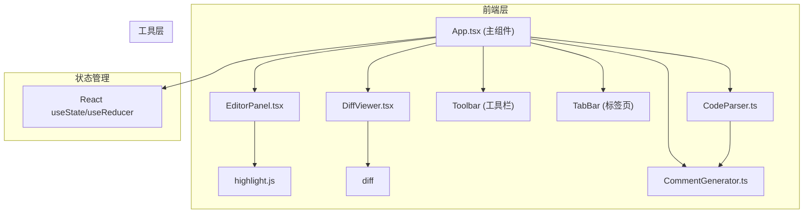

## 1. 架构设计



## 2. 技术说明

- **前端框架**：React 18 + TypeScript
- **构建工具**：Vite
- **代码语法高亮**：highlight.js
- **差异计算**：diff 库
- **状态管理**：React Hooks (useState, useCallback, useEffect)
- **图标库**：lucide-react
- **样式方案**：原生CSS + CSS变量（深色主题）

## 3. 项目目录结构

```
├── package.json
├── vite.config.js
├── tsconfig.json
├── index.html
└── src/
    ├── App.tsx              # 主组件，状态管理与布局
    ├── main.tsx             # 入口文件
    ├── index.css            # 全局样式
    ├── components/
    │   ├── EditorPanel.tsx  # 代码编辑器组件
    │   └── DiffViewer.tsx   # 差异对比面板
    └── utils/
        ├── CodeParser.ts         # 代码解析器
        └── CommentGenerator.ts   # 注释生成器
```

## 4. 数据模型定义

### 4.1 核心类型定义

```typescript
// 支持的编程语言
type Language = 'javascript' | 'typescript' | 'python' | 'java';

// 注释风格
type CommentStyle = 'jsdoc' | 'sphinx' | 'javadoc';

// 函数参数
interface FunctionParam {
  name: string;
  type: string;
  defaultValue?: string;
}

// 函数信息
interface FunctionInfo {
  name: string;
  params: FunctionParam[];
  returnType: string;
  startLine: number;
  endLine: number;
  isClassMethod: boolean;
  className?: string;
}

// 类信息
interface ClassInfo {
  name: string;
  methods: FunctionInfo[];
  startLine: number;
  endLine: number;
}

// 解析结果
interface ParseResult {
  language: Language;
  functions: FunctionInfo[];
  classes: ClassInfo[];
}

// 生成的注释
interface GeneratedComment {
  targetLine: number;
  text: string;
  functionName: string;
  style: CommentStyle;
  applied: boolean;
}

// Diff行
interface DiffLine {
  type: 'added' | 'removed' | 'unchanged' | 'modified';
  oldLineNumber: number | null;
  newLineNumber: number | null;
  content: string;
}

// 标签页
interface Tab {
  id: string;
  filename: string;
  language: Language;
  originalCode: string;
  modifiedCode: string;
  parseResult: ParseResult | null;
  comments: GeneratedComment[];
  history: string[];  // 用于撤销
  historyIndex: number;
}
```

## 5. API 定义（工具函数）

### 5.1 CodeParser

```typescript
// 自动检测语言
detectLanguage(code: string, filename?: string): Language

// 解析代码结构
parseCode(code: string, language: Language): ParseResult

// 提取JavaScript/TypeScript函数
parseJavaScriptFunctions(code: string): FunctionInfo[]

// 提取Python函数
parsePythonFunctions(code: string): FunctionInfo[]

// 提取Java函数
parseJavaFunctions(code: string): FunctionInfo[]
```

### 5.2 CommentGenerator

```typescript
// 为单个函数生成注释
generateFunctionComment(func: FunctionInfo, style: CommentStyle, language: Language): string

// 为类生成注释
generateClassComment(cls: ClassInfo, style: CommentStyle, language: Language): string

// 将注释应用到代码
applyComments(code: string, comments: GeneratedComment[]): string
```

## 6. 性能优化策略

1. **防抖处理**：代码编辑时使用500ms防抖，避免频繁解析
2. **增量解析**：仅在代码实际变更时重新解析
3. **懒加载**：highlight.js语言包按需加载
4. **虚拟滚动**：对于超过1000行的代码使用虚拟滚动（如需要）
5. **useMemo缓存**：解析结果和diff计算结果使用useMemo缓存
