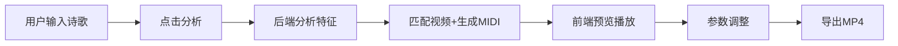

## 1. 产品概述

本产品是一款诗歌朗诵配乐视频自动生成应用，解决诗歌爱好者难以将文字作品配上合适背景音乐和节奏朗读的问题。用户输入诗歌文本后，系统自动分析诗歌特征，匹配背景音乐与背景视频，生成可交互的诗歌朗诵视频。

- 核心用户：诗歌爱好者、文学创作者、教育工作者
- 市场价值：降低诗歌多媒体创作门槛，让普通用户也能制作专业级诗歌朗诵视频

## 2. 核心功能

### 2.1 用户角色

| 角色 | 注册方式 | 核心权限 |
|------|----------|----------|
| 普通用户 | 无需注册 | 诗歌分析、视频预览、参数调整、视频导出 |

### 2.2 功能模块

1. **诗歌分析模块**：分析诗歌韵律、情感基调、字数结构，生成结构化特征向量
2. **视频生成模块**：基于特征向量匹配背景视频风格，生成MIDI背景音乐
3. **播放控制模块**：视频预览、逐行高亮、点击跳转、语速音量调节
4. **导出模块**：合成最终视频并导出为MP4格式

### 2.3 页面详情

| 页面名称 | 模块名称 | 功能描述 |
|---------|----------|----------|
| 主页面 | 诗歌输入区 | 文本输入框、分析按钮 |
| 主页面 | 诗歌展示区 | 白色文字、滚动显示、金色高亮当前行、点击跳转 |
| 主页面 | 视频播放器 | 16:9比例、播放/暂停、进度条、音量控制、行提示动画 |
| 主页面 | 控制面板 | 语速滑块(0.5x-2x)、音量滑块、风格选择按钮组、导出按钮 |

## 3. 核心流程

用户输入诗歌文本 → 点击分析按钮 → 后端分析诗歌特征 → 匹配背景视频与音乐 → 前端加载视频与音乐 → 逐行高亮同步播放 → 用户调整参数 → 点击导出生成MP4

## 4. 用户界面设计

### 4.1 设计风格

- 主背景色：#1a1a2e（深空蓝）
- 强调色：#e94560（玫红）
- 高亮色：#ffd700（金色）
- 文字色：#ffffff（白色）
- 按钮风格：圆角8px，悬停微缩放动画
- 字体：标题使用 'Playfair Display' 衬线字体，正文使用 'Noto Serif SC' 中文衬线字体
- 布局：三栏式桌面布局，移动端自适应为上下堆叠
- 视觉元素：渐变背景、细微噪点纹理、柔和阴影、淡入淡出动画

### 4.2 页面设计概述

| 页面名称 | 模块名称 | UI元素 |
|---------|----------|--------|
| 主页面 | 顶部标题栏 | 应用Logo、说明文字、深色渐变背景 |
| 主页面 | 诗歌展示区 | 左侧栏、白色文字、金色高亮行、滚动条美化 |
| 主页面 | 视频播放器 | 中间栏、16:9容器、播放控制栏、进度条行提示动画 |
| 主页面 | 控制面板 | 右侧栏、滑块组件、风格按钮组、导出主按钮 |

### 4.3 响应式

- 桌面端（>1024px）：三栏并列布局（左25% + 中50% + 右25%）
- 平板端（768px-1024px）：上下堆叠（诗歌区在上，播放器在中，控制面板在下）
- 移动端（<768px）：全屏单页滚动，触控优化，滑块加大点击区域

### 4.4 交互动效

- 页面加载：元素错落淡入（staggered fade-in）
- 行高亮：金色渐变扫光效果
- 进度条：播放时诗歌行提示淡入淡出
- 按钮悬停：微妙缩放（scale 1.02）+ 阴影加深
- 视频切换：交叉溶解过渡
