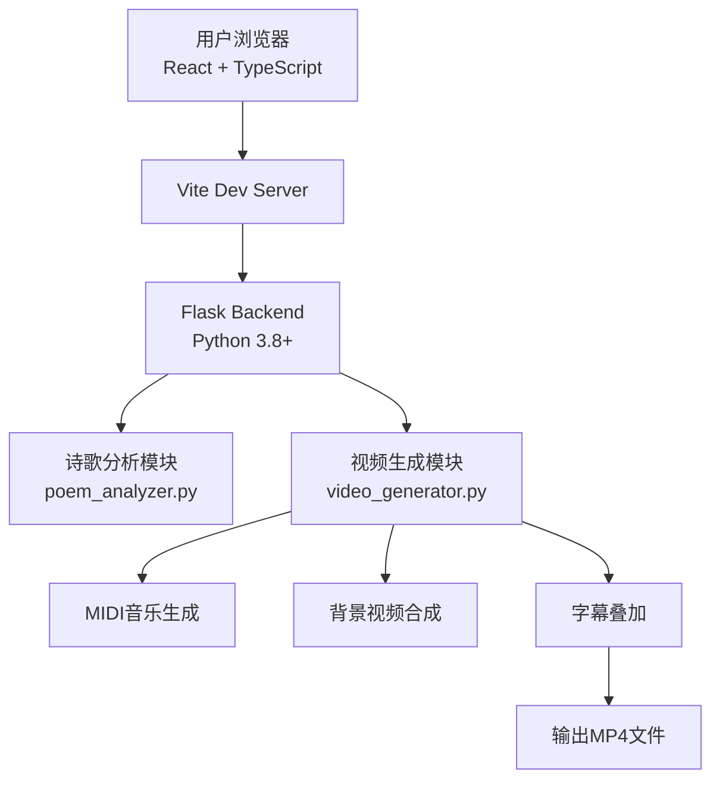
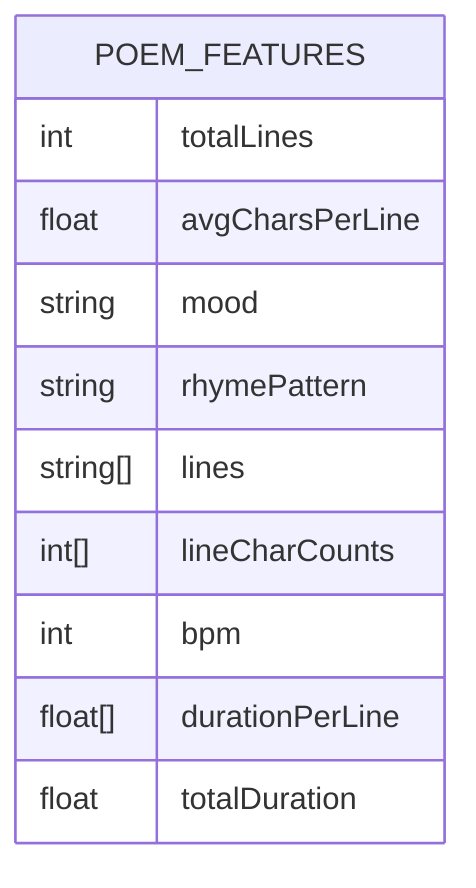
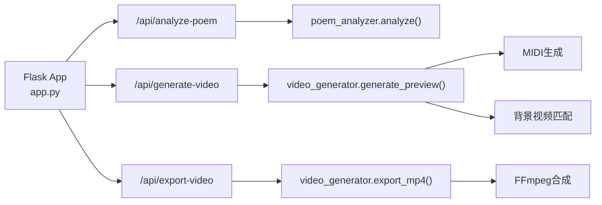

## 1. 架构设计



## 2. 技术栈

- 前端：React 18 + TypeScript 5 + Vite 5
- 样式：原生CSS + CSS变量
- HTTP客户端：Axios
- 后端：Python 3.8+ + Flask 3.0
- 音频处理：MIDIUtil（生成MIDI）+ FluidSynth（MIDI转音频）
- 视频处理：OpenCV / MoviePy（视频合成）
- 视频编码：FFmpeg（最终MP4导出）

## 3. 目录结构

```
project-root/
├── package.json
├── index.html
├── tsconfig.json
├── vite.config.js
├── src/
│   ├── App.tsx
│   ├── components/
│   │   ├── VideoPlayer.tsx
│   │   ├── PoemDisplay.tsx
│   │   └── ControlPanel.tsx
│   └── types/
│       └── index.ts
└── backend/
    ├── app.py
    ├── poem_analyzer.py
    ├── video_generator.py
    ├── requirements.txt
    ├── background_videos/
    └── output/
```

## 4. 路由定义

| 路由 | 用途 |
|------|------|
| / | 主应用页面（单页应用） |

## 5. API 定义

### 5.1 POST /api/analyze-poem

分析诗歌文本，返回特征向量。

**请求体：**
```typescript
interface AnalyzePoemRequest {
  text: string;
}
```

**响应体：**
```typescript
interface PoemFeatures {
  totalLines: number;
  avgCharsPerLine: number;
  mood: "passionate" | "gentle" | "melancholic" | "peaceful" | "inspiring";
  rhymePattern: string;
  lines: string[];
  lineCharCounts: number[];
  bpm: number;
  durationPerLine: number[];
  totalDuration: number;
}
```

### 5.2 POST /api/generate-video

根据诗歌特征和用户参数生成视频。

**请求体：**
```typescript
interface GenerateVideoRequest {
  poemFeatures: PoemFeatures;
  speed: number;
  volume: number;
  style: string;
}
```

**响应体：**
```typescript
interface GenerateVideoResponse {
  videoUrl: string;
  audioUrl: string;
  backgroundVideoUrl: string;
  lines: string[];
  lineTimestamps: number[];
  totalDuration: number;
}
```

### 5.3 POST /api/export-video

导出最终合成的MP4视频。

**响应体：**
```typescript
interface ExportVideoResponse {
  downloadUrl: string;
  filename: string;
}
```

## 6. 数据模型

### 6.1 诗歌特征数据模型



### 6.2 播放状态模型

```typescript
interface PlaybackState {
  isPlaying: boolean;
  currentTime: number;
  currentLineIndex: number;
  totalDuration: number;
  speed: number;
  volume: number;
  style: string;
}
```

## 7. 服务器架构



## 8. 性能要求

- 端到端延迟：诗歌输入到视频预览 < 8秒
- 视频合成：采用分片并行处理
- 缓存策略：相同诗歌特征复用已生成的MIDI和视频片段
- 静态资源：背景视频预置在本地，避免网络IO
