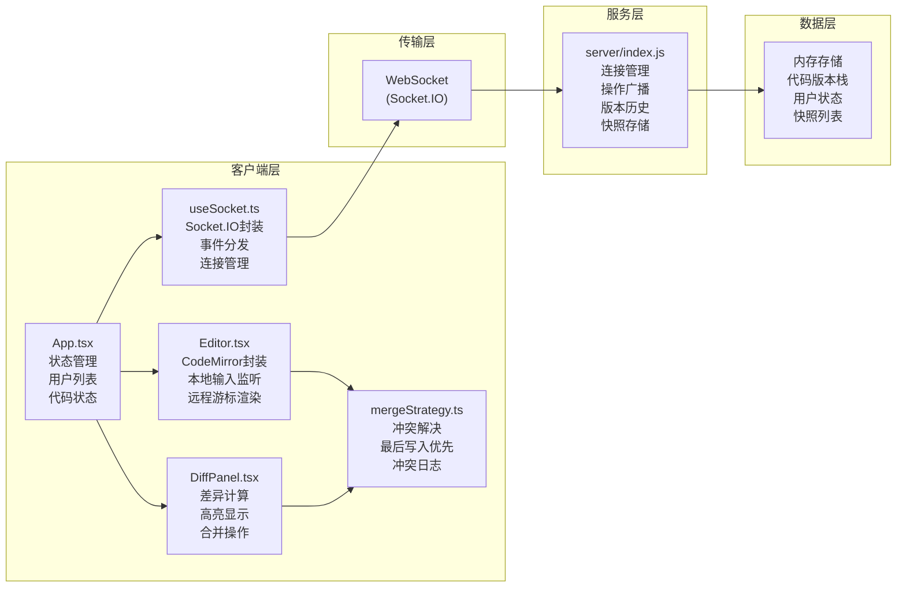

## 1. 架构设计



**数据流向**：
1. 本地编辑 → Editor.tsx → 增量操作 → useSocket → WebSocket → 服务器广播
2. 远程操作 → WebSocket → useSocket → App.tsx → Editor.tsx应用操作
3. 历史版本选择 → App.tsx → DiffPanel.tsx → diff计算 → 显示差异
4. 应用差异 → DiffPanel.tsx → mergeStrategy → App.tsx → 广播更新

## 2. 技术描述
- **前端**：React@18 + TypeScript + Vite
- **后端**：Node.js + Express + Socket.IO
- **编辑器**：CodeMirror 6
- **差异计算**：diff库
- **状态管理**：React Hooks (useState, useEffect, useCallback)
- **唯一标识**：uuid
- **WebSocket**：socket.io-client@4 + socket.io@4
- **样式**：CSS Modules + CSS Variables（深色主题）

## 3. 核心文件结构
```
auto21/
├── package.json              # 依赖配置
├── vite.config.js            # Vite构建配置
├── tsconfig.json             # TypeScript严格模式
├── index.html                # 入口HTML
├── server/
│   └── index.js              # WebSocket服务
└── src/
    ├── App.tsx               # 主组件
    ├── main.tsx              # 入口文件
    ├── index.css             # 全局样式
    ├── components/
    │   ├── Editor.tsx        # 编辑器组件
    │   └── DiffPanel.tsx     # 差异面板组件
    ├── hooks/
    │   └── useSocket.ts      # Socket自定义Hook
    ├── utils/
    │   └── mergeStrategy.ts  # 合并策略工具
    └── types/
        └── index.ts          # 类型定义
```

## 4. WebSocket事件定义

### 客户端 → 服务器
| 事件名 | 数据结构 | 说明 |
|--------|----------|------|
| `join` | `{ userId, userName, color }` | 用户加入房间 |
| `edit` | `{ userId, version, ops: Op[] }` | 发送编辑操作 |
| `cursor` | `{ userId, from, to }` | 发送游标位置 |
| `undo` | `{ userId }` | 撤销操作 |
| `redo` | `{ userId }` | 重做操作 |
| `saveSnapshot` | `{ name, code }` | 保存快照 |
| `getHistory` | - | 获取历史版本列表 |
| `getSnapshots` | - | 获取快照列表 |

### 服务器 → 客户端
| 事件名 | 数据结构 | 说明 |
|--------|----------|------|
| `init` | `{ code, version, users, history, snapshots }` | 初始化同步 |
| `userJoin` | `{ user }` | 用户加入通知 |
| `userLeave` | `{ userId }` | 用户离开通知 |
| `remoteEdit` | `{ userId, ops, version }` | 远程编辑操作 |
| `remoteCursor` | `{ userId, from, to }` | 远程游标更新 |
| `remoteUndo` | `{ userId, code, version }` | 远程撤销通知 |
| `historyUpdate` | `{ history }` | 历史版本更新 |
| `snapshotSaved` | `{ snapshot }` | 快照保存成功 |
| `conflict` | `{ message, operations }` | 冲突通知 |

## 5. 数据模型

### 5.1 TypeScript类型定义

```typescript
// 用户类型
interface User {
  id: string;
  name: string;
  color: string;
  online: boolean;
  cursor: { from: number; to: number } | null;
  editRange: { start: number; end: number } | null;
}

// 操作类型（OT增量操作）
interface Op {
  type: 'insert' | 'delete' | 'replace';
  from: number;
  to: number;
  text?: string;
  timestamp: number;
  userId: string;
}

// 历史版本
interface HistoryVersion {
  version: number;
  code: string;
  timestamp: number;
  userId: string;
  ops: Op[];
}

// 快照
interface Snapshot {
  id: string;
  name: string;
  code: string;
  timestamp: number;
  userId: string;
}

// 差异结果
interface DiffResult {
  type: 'added' | 'removed' | 'modified' | 'unchanged';
  value: string;
  lineNumber: number;
  oldLineNumber?: number;
}

// 冲突日志
interface ConflictLog {
  id: string;
  timestamp: number;
  position: number;
  localOp: Op;
  remoteOp: Op;
  resolvedBy: 'local' | 'remote';
}
```

### 5.2 服务器内存存储

```javascript
// 服务器状态
const state = {
  code: '',                    // 当前代码
  version: 0,                  // 当前版本号
  users: new Map(),            // 用户映射 userId -> User
  history: [],                 // 历史版本栈
  snapshots: [],               // 快照列表
  userHistory: new Map(),      // 用户个人撤销栈 userId -> Op[][]
};
```

## 6. 核心算法

### 6.1 合并策略（最后写入者优先）
```
输入：本地操作localOps、远程操作remoteOps
输出：合并后的操作序列、冲突日志

1. 按时间戳排序所有操作
2. 检测位置重叠：
   - 无重叠：按顺序应用
   - 有重叠：保留时间戳较晚的操作，标记冲突
3. 记录冲突日志（被覆盖的操作）
4. 返回合并结果和冲突列表
```

### 6.2 差异计算
```
使用diff库的diffLines方法：
1. 输入：旧代码oldCode、新代码newCode
2. 输出：DiffResult数组
3. 行类型映射：
   - added → 绿色高亮 + 左侧绿线
   - removed → 红色高亮 + 左侧红线
   - modified → 橙色高亮 + 左侧橙线
   - unchanged → 无样式
```

### 6.3 撤销/重做栈
```
每个用户维护独立的撤销栈（最多5层）：
- 编辑操作压入用户撤销栈
- 撤销时弹出栈顶操作，反向应用
- 重做栈保存被撤销的操作
- 新编辑操作清空重做栈
- 撤销操作广播给其他用户同步
```

## 7. 性能优化点

1. **增量同步**：仅传输编辑操作而非全量代码，减少网络开销
2. **防抖处理**：编辑输入防抖100ms后发送，避免频繁网络请求
3. **虚拟滚动**：CodeMirror内置虚拟滚动，支持5000+行流畅编辑
4. **Diff缓存**：相同版本对比结果缓存，避免重复计算
5. **requestAnimationFrame**：动画和重渲染使用RAF，保持60fps
6. **Web Worker**：大文件diff计算移至Worker，不阻塞UI
