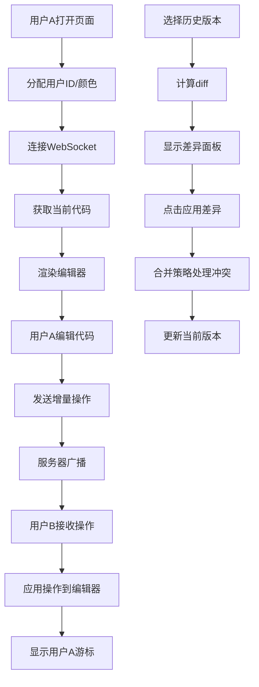

## 1. 产品概述
实时代码协作编辑与差异可视化应用，解决远程协作开发中团队成员实时同步代码增删改查的痛点，提供轻量级的实时代码差异对比与合并工具。
- 面向远程协作的开发团队，支持多用户同时编辑同一段代码
- 核心价值：500ms内实时同步、可视化差异对比、智能冲突解决、版本快照管理

## 2. 核心功能

### 2.1 用户角色
| 角色 | 注册方式 | 核心权限 |
|------|----------|----------|
| 协作用户 | 匿名进入（自动分配ID） | 编辑代码、查看他人游标、撤销操作、对比版本、保存快照 |

### 2.2 功能模块
1. **协作编辑模块**：多用户实时编辑、远程游标显示、操作同步
2. **历史版本模块**：操作撤销/重做、历史版本下拉、差异对比
3. **差异合并模块**：差异行高亮显示、一键应用差异、冲突自动处理
4. **用户状态模块**：在线用户列表、编辑行号显示、连接状态监控
5. **快照管理模块**：保存命名快照、快照列表、恢复/导出功能

### 2.3 页面详情
| 页面名称 | 模块名称 | 功能描述 |
|----------|----------|----------|
| 主编辑页 | 工具栏 | Undo/Redo按钮、历史版本下拉框、保存快照按钮、导出按钮 |
| 主编辑页 | 代码编辑器 | CodeMirror编辑区域、远程游标彩色标识、编辑行高亮 |
| 主编辑页 | 用户列表边栏 | 在线用户列表、状态圆点、当前编辑行号（L:12-15格式） |
| 主编辑页 | 差异面板 | 增删改行高亮（绿/红/橙）、应用差异按钮、冲突提示 |
| 主编辑页 | 快照栏 | 底部横向滚动快照列表、恢复快照、导出为txt |

## 3. 核心流程
用户打开URL → 自动分配用户ID和颜色 → 连接WebSocket服务器 → 加载当前共享代码 → 开始编辑
- 编辑时：本地输入 → 发送增量操作 → 服务器广播 → 其他客户端应用操作
- 撤销时：本地回滚5步内操作 → 广播撤销事件 → 服务器更新版本历史
- 差异对比：选择历史版本 → 计算diff → 显示高亮差异 → 点击应用 → 合并策略处理冲突

## 4. 用户界面设计

### 4.1 设计风格
- **深色主题**：背景#1e1e1e，文本#d4d4d4，边框#333，边栏背景#252526
- **主色调**：差异新增#22c55e（绿）、删除#ef4444（红）、修改#f97316（橙）
- **用户颜色**：为每个连接用户分配唯一颜色（#3b82f6蓝、#8b5cf6紫、#ec4899粉、#14b8a6青）
- **按钮样式**：圆角6px，背景#3c3c3c，hover#4a4a4a，点击缩放0.95
- **字体**：代码区使用JetBrains Mono等宽字体，UI使用Inter无衬线字体
- **布局**：编辑器占80%，右侧边栏200px，底部快照栏固定高度60px

### 4.2 页面设计概述
| 页面名称 | 模块名称 | UI元素 |
|----------|----------|--------|
| 主编辑页 | 工具栏 | 固定顶部、高度52px、按钮间距8px、下拉框宽度180px |
| 主编辑页 | 编辑器区域 | 代码行号、语法高亮、远程游标色块、编辑行背景高亮 |
| 主编辑页 | 用户列表 | 右侧固定、宽度200px、用户项高度48px、状态圆点8px |
| 主编辑页 | 差异面板 | 右侧滑入、半透明背景rgba(0,0,0,0.6)、差异行左侧竖线标识 |
| 主编辑页 | 快照栏 | 底部固定、高度60px、横向滚动、快照卡片圆角8px |

### 4.3 响应式
- **桌面端（>768px）**：右侧用户列表边栏200px，差异面板从右侧滑入覆盖部分编辑器
- **移动端（≤768px）**：用户列表折叠为底部横向条，差异面板全屏覆盖，工具栏按钮简化
- **触摸优化**：按钮最小高度44px，滑动手势关闭面板

### 4.4 动画规范
- 所有交互过渡：0.3s ease-in-out
- 按钮点击：transform: scale(0.95)
- 面板滑入：transform: translateX(100%) → translateX(0)
- 差异高亮：opacity 0 → 1，background-color渐变
- 版本切换：内容淡入淡出，保持60fps

---
**文件调用关系说明**：
- `src/App.tsx` → 调用 `useSocket`、`Editor`、`DiffPanel`、`mergeStrategy`
- `src/components/Editor.tsx` → 调用 `mergeStrategy`、接收 `App` 传入的代码和事件
- `src/components/DiffPanel.tsx` → 调用 `diff` 库、`mergeStrategy`
- `src/hooks/useSocket.ts` → 封装 `socket.io-client`，供 `App` 调用
- `src/utils/mergeStrategy.ts` → 被 `Editor` 和 `DiffPanel` 调用
- `server/index.js` → WebSocket服务，与客户端双向通信
