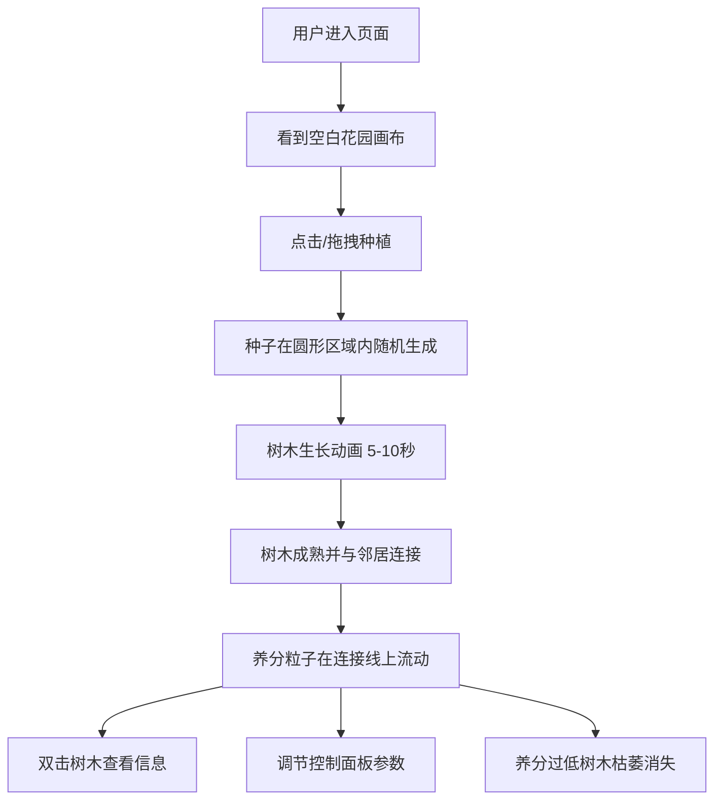

## 1. 产品概述

数字花园是一个在线交互式Canvas应用，用户可以在画布上种植虚拟植物，观察树木随时间生长、与相邻树木交换养分，最终形成一片动态的数字森林。产品旨在提供放松治愈的交互体验，让用户在虚拟园艺中感受生命生长的乐趣。

## 2. 核心功能

### 2.1 用户角色
| 角色 | 注册方式 | 核心权限 |
|------|----------|----------|
| 访客用户 | 无需注册 | 种植树木、调节参数、查看树木信息 |

### 2.2 功能模块
1. **花园画布**：主交互区域，种植树木、渲染生长动画、显示连接线和粒子效果
2. **树木信息面板**：双击树木弹出，显示年龄、养分值、相邻连接关系
3. **全局控制面板**：调节生长速度、养分交换速率、最大树木数量

### 2.3 页面详情
| 页面名称 | 模块名称 | 功能描述 |
|----------|----------|----------|
| 主页 | 花园画布 | 点击/拖拽种植种子，树木生长动画，养分交换粒子效果，枯萎动画 |
| 主页 | 树木信息面板 | 双击弹出，显示树木年龄、养分值、连接关系，平滑过渡动画 |
| 主页 | 控制面板 | 三个参数滑块（生长速度、养分速率、最大数量），实时数值显示，粒子背景，重置按钮 |

## 3. 核心流程

用户进入页面 → 看到深绿色草地背景的空白画布 → 点击或拖拽画布 → 在圆形区域内随机位置生成种子 → 种子以5-10秒动画生长为成熟树木 → 树木之间根据距离自动连接 → 养分通过连接线在树木间流动 → 双击树木查看详细信息 → 通过控制面板调节世界参数 → 养分过低的树木逐渐枯萎消失

## 4. 用户界面设计

### 4.1 设计风格
- **主色调**：深绿色系草地背景 (#1a472a ~ #2d5a3d)，嫩绿到深绿的树木渐变
- **辅助色**：半透明发光连接线 (青绿色)，金黄色枯萎警告色
- **按钮风格**：扁平化设计，圆角，柔和阴影，悬停微动画
- **字体**：现代无衬线字体，清晰易读
- **布局风格**：干净简约，画布为主区域，控制面板浮动在侧边
- **整体风格**：有机手绘风格，扁平化带轻微渐变，治愈系视觉体验

### 4.2 页面设计概述
| 页面名称 | 模块名称 | UI元素 |
|----------|----------|--------|
| 主页 | 花园画布 | 深绿色渐变草地背景，Canvas绘制树木、连接线、粒子，点击/拖拽交互 |
| 主页 | 树木信息面板 | 半透明毛玻璃效果，滑入动画，显示树木数据，关闭按钮 |
| 主页 | 控制面板 | 侧边浮动面板，三个滑块带数值显示，粒子背景动效，重置按钮 |

### 4.3 响应式设计
- **桌面端**：画布占据主区域，控制面板固定在右侧
- **平板端**：控制面板可折叠，画布自适应
- **移动端**：自动切换为树状图/列表模式显示树木状态信息，画布适当缩放

### 4.4 动效设计
- 树木生长使用CSS keyframe与Canvas动画结合
- 面板滑入滑出使用平滑CSS过渡
- 粒子流动效果使用Canvas绘制
- 所有交互元素有hover和active状态反馈
