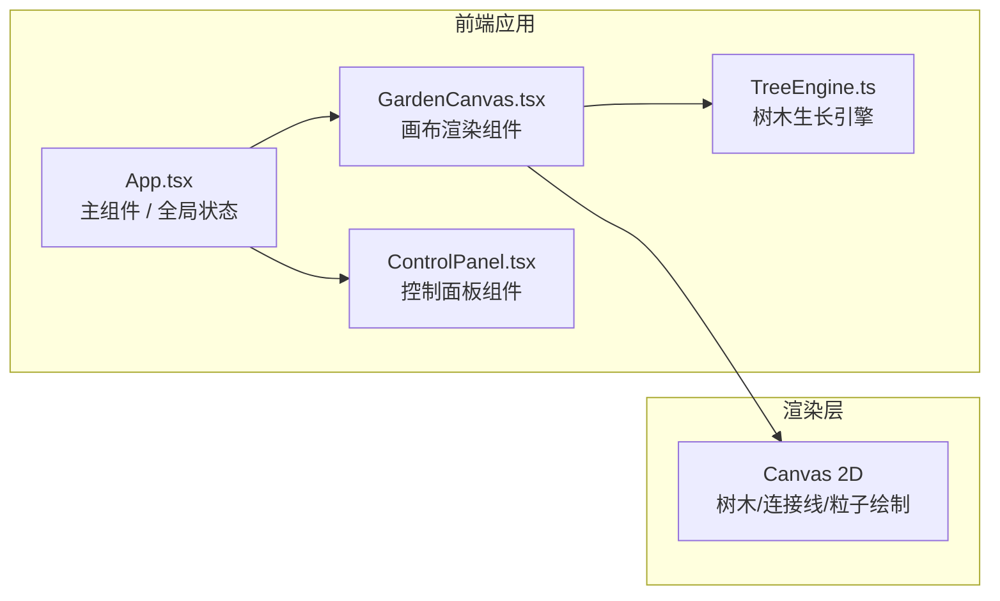

## 1. 架构设计



## 2. 技术描述

- **前端框架**：React 18 + TypeScript
- **构建工具**：Vite
- **渲染技术**：Canvas 2D API
- **状态管理**：React useState/useRef (轻量级)
- **动画驱动**：requestAnimationFrame
- **唯一ID**：uuid

## 3. 模块文件结构

| 文件路径 | 用途 |
|----------|------|
| `src/App.tsx` | 主应用组件，管理全局状态、树木数据、控制面板参数 |
| `src/modules/garden/GardenCanvas.tsx` | Canvas画布组件，负责所有2D绘制、用户交互事件 |
| `src/modules/garden/TreeEngine.ts` | 树木生长引擎，树木类、养分交换算法、枯萎检测 |
| `src/components/ControlPanel.tsx` | 控制面板组件，三个参数滑块 + 重置按钮 |

## 4. 数据模型

### 4.1 树木数据结构

```typescript
interface Tree {
  id: string;
  x: number;
  y: number;
  age: number;           // 生长时间（秒）
  growthProgress: number; // 0~1 生长进度
  nutrients: number;      // 养分值
  maxHeight: number;      // 成熟时高度
  maxCanopyRadius: number; // 成熟时树冠半径
  isWilting: boolean;     // 是否正在枯萎
  wiltTime: number;       // 枯萎持续时间（秒）
  isDead: boolean;        // 是否死亡
  trunkBranches: number;  // 树干分叉数量
}
```

### 4.2 粒子数据结构

```typescript
interface NutrientParticle {
  x: number;
  y: number;
  fromTreeId: string;
  toTreeId: string;
  progress: number; // 0~1 在连接线上的位置
  speed: number;
}
```

### 4.3 全局配置

```typescript
interface GardenConfig {
  growthSpeedMultiplier: number;  // 0.5 ~ 5
  nutrientExchangeRate: number;   // 0.1 ~ 0.5
  maxTreeCount: number;           // 50 ~ 200
  connectionDistance: number;     // 80px 连接距离
  initialNutrients: number;       // 100 初始养分
  wiltThreshold: number;          // 20 枯萎阈值
  wiltDeathTime: number;          // 30秒 枯萎死亡时间
}
```

## 5. 核心算法

### 5.1 养分交换算法
- 遍历所有距离小于80px的树木对
- 每帧按速率进行均值均衡：`diff = (a.nutrients - b.nutrients) * rate * 0.5`
- 总养分守恒，仅在树木间转移
- 粒子从高养分树流向低养分树

### 5.2 生长算法
- 生长进度随时间增长，受生长速度倍率影响
- 树高和树冠半径按生长进度插值
- 颜色从嫩绿渐变到深绿
- 树干分叉随生长阶段逐步出现

### 5.3 枯萎检测
- 养分低于阈值触发枯萎状态
- 枯萎期间颜色逐渐变黄，叶片逐渐减少
- 枯萎超过30秒未恢复则树木消失

## 6. 性能优化

- 使用 requestAnimationFrame 驱动渲染循环
- 树木数量限制在配置范围内
- 粒子对象池复用，避免频繁GC
- 距离检测使用空间划分（可选优化）
- 目标帧率：30FPS+，150棵树以内流畅运行
