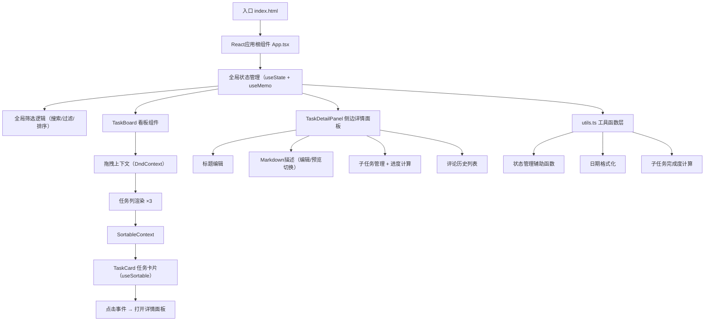

## 1. 架构设计



## 2. 技术选型说明
- **前端框架**：React@18 + TypeScript（严格模式）
- **构建工具**：Vite@5
- **拖拽库**：@dnd-kit/core + @dnd-kit/sortable + @dnd-kit/utilities
- **Markdown渲染**：react-markdown
- **唯一ID生成**：uuid
- **样式方案**：原生CSS + CSS变量（主题色、间距、圆角等）
- **状态管理**：React Hooks（useState/useMemo/useCallback），轻量场景无需额外状态库

## 3. 文件结构

```
e:\solo\SoloAutoDemo\tasks\auto25
├── index.html                 # 入口HTML，挂载点root，引入Inter字体
├── package.json              # 依赖配置：react/react-dom/typescript/vite/dnd-kit系列/react-markdown/uuid
├── vite.config.js            # Vite构建配置
├── tsconfig.json             # TS严格模式配置
└── src/
│   ├── App.tsx           # 主组件：看板状态 + 全局筛选逻辑
│   ├── TaskBoard.tsx       # 看板：三列渲染 + 拖拽上下文
│   ├── TaskCard.tsx       # 单卡片：拖拽 + 优先级 + 点击展开
│   ├── TaskDetailPanel.tsx # 侧边面板：编辑/子任务/评论
│   └── utils.ts          # 工具函数
└── .trae/documents/
    ├── PRD.md
    └── ARCHITECTURE.md
```

## 4. 数据模型

### 4.1 类型定义

```typescript
type Priority = 'P1' | 'P2' | 'P3';
type TaskStatus = 'todo' | 'in-progress' | 'done';

interface SubTask {
  id: string;
  title: string;
  completed: boolean;
}

interface Comment {
  id: string;
  content: string;
  createdAt: number;
}

interface Task {
  id: string;
  title: string;
  description: string;
  priority: Priority;
  status: TaskStatus;
  dueDate: string | null;
  subtasks: SubTask[];
  comments: Comment[];
  createdAt: number;
}

interface FilterState {
  keyword: string;
  priorities: Priority[];
  sortOrder: 'asc' | 'desc' | null;
}
```

### 4.2 初始Mock数据

包含至少6条示例任务，覆盖三种优先级、三种状态、带子任务和评论，便于直接预览效果。

## 5. 关键实现策略

### 5.1 拖拽性能优化
- 使用 `@dnd-kit` 的 `useSortable` + CSS transform 实现硬件加速拖拽
- 拖拽动画使用 `transform` 和 `transition` 独立于React渲染
- 使用 `will-change: transform` 提升GPU合成层

### 5.2 筛选性能优化
- `useMemo` 缓存筛选后的任务列表，依赖项精确控制
- 防抖搜索输入（debounce 100ms）
- 避免全量重渲染

### 5.3 动画效果
- CSS transition + CSS实现所有微交互（悬停缩放1.1倍、淡入淡出过渡
- 侧边面板使用 translateX 滑入动画（400ms cubic-bezier缓动
- 拖拽弹性效果使用 dnd-kit transition 配置
