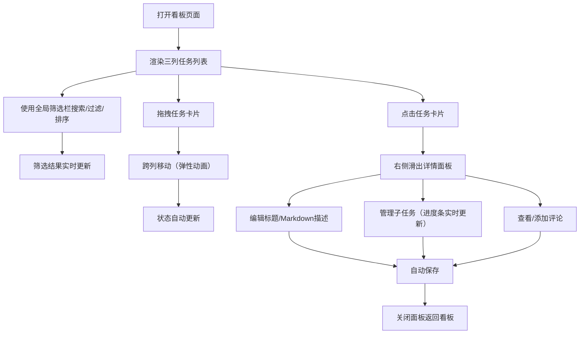

## 1. 产品概述

多功能待办事项看板是一款面向个人用户的任务管理工具，通过可视化看板将日常任务与长期目标整合管理，直观展示任务优先级与进度。

- 解决个人用户在多任务场景下的任务追踪、优先级排序和进度可视化需求
- 目标用户为注重效率、需要可视化管理工作与生活任务的个人用户
- 通过拖拽式看板 + 侧边详情面板的交互模式，提升任务管理效率与使用愉悦度

## 2. 核心功能

### 2.1 用户角色
| 角色 | 注册方式 | 核心权限 |
|------|-----------|----------|
| 普通用户 | 无需注册（本地存储） | 创建/编辑/删除任务、拖拽任务状态切换、全局筛选搜索 |

### 2.2 功能模块
1. **看板主页面**：任务列表展示、拖拽排序、状态列管理
2. **任务卡片**：优先级标签、到期日、拖拽切换
3. **侧边详情面板**：标题编辑、Markdown描述、子任务进度、评论历史
4. **全局筛选栏**：关键词搜索、优先级过滤、到期日排序

### 2.3 页面详情
| 页面名称 | 模块名称 | 功能描述 |
|----------|-----------|----------|
| 看板主页面 | 任务列容器 | 三列纵向布局（待办/进行中/已完成），移动端横向滑动 |
| 看板主页面 | 全局筛选栏 | 顶部固定，支持搜索框、优先级多选下拉、排序切换 |
| 看板主页面 | 任务卡片 | 12px圆角卡片，悬浮阴影加深，优先级彩色标签，优先级标签 |
| 看板主页面 | 拖拽交互 | dnd-kit实现卡片跨列拖拽，平滑动画+弹性效果 |
| 侧边详情面板 | 标题编辑 | 可编辑任务标题，失焦自动保存 |
| 侧边详情面板 | Markdown描述 | 编辑/预览双模式切换，实时渲染 |
| 侧边详情面板 | 子任务进度 | 可勾选子任务列表，顶部百分比进度条 |
| 侧边详情面板 | 评论历史 | 时间线式评论列表，支持添加新评论 |

## 3. 核心流程

用户打开看板 → 浏览三列任务卡片（待办/进行中/已完成）→ 通过筛选栏快速定位目标任务 → 拖拽卡片切换状态（带动画反馈）→ 点击卡片打开侧边详情面板 → 编辑标题/描述/子任务/添加评论 → 关闭面板返回看板

## 4. 用户界面设计

### 4.1 设计风格
- **主色**：深灰 `#1a1b2f` 为页面背景，渐变蓝紫 `#4f6ef7 → #7c3aed` 为强调色
- **按钮风格**：圆角12px，悬停放大1.1倍+背景色变化过渡
- **字体**：Inter（通过Google Fonts引入）
- **布局**：卡片式布局，三列纵向排列，间距均匀
- **优先级标签色**：P1红色`#ef4444，P2橙色`#f97316，P3蓝色`#3b82f6

### 4.2 页面设计概览
| 页面名称 | 模块名称 | UI元素 |
|----------|----------|---------|
| 看板主页面 | 全局筛选栏 | 深色背景、渐变按钮、搜索输入框带图标、圆角 |
| 看板主页面 | 任务列 | 卡片式列标题+数量徽标、列内容区纵向排列 |
| 看板主页面 | 任务卡片 | 12px圆角、悬浮阴影加深、优先级色块、拖拽手柄 |
| 侧边详情面板 | 头部 | 关闭按钮、标题编辑区、渐变色装饰条 |
| 看板主页面 | 任务卡片 | 深色卡片、渐变按钮、时间戳、悬停放大动效 |
| 侧边详情面板 | 子任务区域 | 复选框、进度条渐变填充、删除按钮 |
| 侧边详情面板 | 评论区 | 头像占位、评论气泡、时间线 |

### 4.3 响应式
- 桌面端：三列并列展示
- 移动端（768px以下：任务列改为横向滑动容器，详情面板全宽覆盖
- 触摸优化：拖拽增加触觉反馈延迟，按钮点击区域≥44px

### 4.4 性能指标
- 拖拽帧率≥55fps（使用transform硬件加速）
- 筛选过滤响应延迟<100ms（使用useMemo缓存计算）
