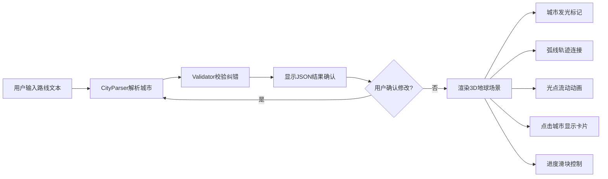

## 1. 产品概述

3D地球旅行路线可视化应用，帮助旅行爱好者将文字描述的行程转化为直观的交互式3D地球轨迹展示，便于行程规划预览与分享。
- 核心目标：解决文字路线难以直观理解和分享的痛点
- 目标用户：旅行爱好者、旅行博主、行程规划师

## 2. 核心特性

### 2.1 用户角色
| 角色 | 注册方式 | 核心权限 |
|------|----------|----------|
| 普通用户 | 无需注册 | 输入路线文本、解析查看3D可视化、编辑调整路线 |

### 2.2 功能模块
1. **主页面**：文本输入区、解析结果确认区、3D地球展示区、路线控制面板
2. **3D场景模块**：地球纹理渲染、城市发光标记、弧线轨迹、光点动画
3. **解析模块**：中英文城市名识别、经纬度查询、停留天数提取
4. **控制模块**：城市列表编辑、删除、进度滑块动画控制

### 2.3 页面详情
| 页面名称 | 模块名称 | 功能描述 |
|----------|----------|----------|
| 主页面 | 顶部导航栏 | 深蓝到紫色渐变，应用标题，简洁大气 |
| 主页面 | 文本输入区 | 多行文本框，解析按钮，支持中英文城市名输入 |
| 主页面 | 解析结果区 | JSON格式展示，可编辑修改，确认后渲染到地球 |
| 主页面 | 3D地球区 | 左侧70%宽度，可旋转缩放，城市标记+弧线+光点动画 |
| 主页面 | 控制面板 | 右侧350px，磨砂玻璃效果，城市列表编辑，进度滑块 |

## 3. 核心流程

用户输入旅行路线文本 → 系统解析城市名称和经纬度 → 显示JSON结果供确认/编辑 → 确认后渲染3D地球场景 → 城市标记发光圆点 → 弧线连接各城市 → 光点沿弧线流动 → 用户可拖拽旋转/缩放 → 点击城市显示信息卡片 → 控制面板编辑删除城市 → 进度滑块控制动画位置

## 4. 界面设计

### 4.1 设计风格
- **主色调**：深蓝渐变(#1e3a8a → #7c3aed)，发光蓝紫渐变标记点
- **辅助色**：绿色(短距离弧线)、红色(长距离弧线)、白色(文字)
- **按钮样式**：圆角8px，磨砂玻璃背景，悬浮微发光效果
- **字体**：主标题用Playfair Display，正文字体用Inter
- **布局风格**：左右分栏(桌面) / 上下堆叠(移动端)，卡片式组件
- **视觉特效**：磨砂玻璃(backdrop-filter)、发光辉光(bloom)、渐变纹理

### 4.2 页面设计概览
| 页面名称 | 模块名称 | UI元素 |
|----------|----------|--------|
| 主页面 | 导航栏 | 渐变背景、大标题、留白、高度60px |
| 主页面 | 3D地球区 | 星空背景、地球发光标记、弧线辉光、鼠标拖拽提示 |
| 主页面 | 控制面板 | 深色半透明磨砂、15px圆角、浅色边框、城市卡片列表 |
| 主页面 | 信息卡片 | 毛玻璃背景、白色文字、城市名、天数、景点推荐 |

### 4.3 响应式布局
- 桌面端(≥1024px)：左70%地球 + 右350px控制面板
- 平板端(768-1023px)：左65%地球 + 右300px面板
- 移动端(<768px)：上下堆叠，地球占满宽度，面板固定在底部可展开

### 4.4 3D场景指导
- **环境**：深邃星空背景，宇宙尘埃粒子，大气辉光
- **光照**：环境光(0.6强度) + 方向光(模拟太阳，1.2强度，暖色) + 点光源补光
- **相机**：PerspectiveCamera，初始距离3.5，fov 45°，OrbitControls禁z轴翻转
- **构图**：地球居中略偏左，留出右侧面板空间，城市标记有层次深度
- **交互**：拖拽旋转(阻尼0.05)、滚轮缩放(范围2-6)、悬停标记发光增强、点击弹出卡片
- **后处理**：BloomEffect(发光效果，阈值0.6，强度1.2)、FXAA抗锯齿
- **资源**：使用Three.js内置地球纹理或程序化生成纹理，性能预算单帧<16ms(60fps)，最低45fps
