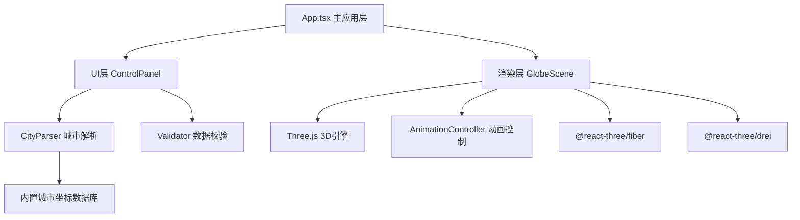

## 1. 架构设计



## 2. 技术说明

- **前端框架**：React@18 + TypeScript@5 + Vite@5
- **3D引擎**：Three@0.160 + @react-three/fiber@8 + @react-three/drei@9
- **HTTP客户端**：Axios@1 (预留 Nominatim 地理编码API)
- **状态管理**：React useState/useCallback (轻量级场景，无需zustand)
- **样式方案**：CSS Modules + global.css全局变量
- **初始化工具**：vite-init (react-ts模板)
- **后端服务**：无，纯前端应用，城市坐标使用内置数据库+可选在线地理编码

## 3. 路由定义

| 路由 | 用途 |
|------|------|
| / | 主应用页面(3D地球+控制面板) |

## 4. 数据模型

### 4.1 核心数据结构

```typescript
// 城市节点
interface CityNode {
  id: string;
  name: string;            // 城市名(中文或英文)
  nameEn?: string;         // 英文名(可选)
  lat: number;             // 纬度
  lng: number;             // 经度
  days: number;            // 停留天数，默认1
  attractions?: string[];  // 推荐景点摘要
  order: number;           // 顺序索引
}

// 解析结果
interface ParseResult {
  cities: CityNode[];
  rawText: string;
  warnings: string[];      // 未识别城市等警告
}

// 弧线数据
interface ArcData {
  start: CityNode;
  end: CityNode;
  distance: number;        // 球面距离(km)
  colorStart: string;
  colorEnd: string;
}

// 动画状态
interface AnimationState {
  progress: number;        // 0-1 整体进度
  currentArcIndex: number;
  currentArcProgress: number;
  isPlaying: boolean;
}
```

### 4.2 城市数据库(内置)
使用JSON存储约150个主要中外城市的经纬度和景点信息，格式：
```json
{
  "北京": { "lat": 39.9042, "lng": 116.4074, "en": "Beijing", "attractions": ["故宫", "长城", "天坛"] },
  "Beijing": { "lat": 39.9042, "lng": 116.4074, "en": "Beijing", "attractions": ["故宫", "长城", "天坛"] }
}
```

## 5. 文件组织结构

```
src/
├── modules/
│   ├── parser/
│   │   ├── CityParser.ts       # 文本解析、城市识别、坐标查询
│   │   └── Validator.ts        # 解析结果校验和纠错
│   ├── renderer/
│   │   ├── GlobeScene.tsx      # Three.js地球场景主组件
│   │   └── AnimationController.ts  # 动画状态与进度控制
│   ├── ui/
│   │   └── ControlPanel.tsx    # 右侧控制面板组件
│   ├── data/
│   │   └── cityDatabase.ts     # 内置城市坐标数据库
│   └── App.tsx                 # 主应用组件
├── styles/
│   ├── global.css              # 全局样式与CSS变量
│   ├── ControlPanel.module.css # 控制面板样式
│   └── App.module.css          # 主布局样式
└── main.tsx                    # 入口文件
```

## 6. 性能优化策略

1. **3D渲染优化**：
   - 使用@react-three/drei的Stars组件代替手动粒子系统
   - 城市标记使用InstancedMesh批量渲染(若城市>20个)
   - 弧线使用TubeGeometry + 顶点色渐变，避免逐帧重建几何体
   - 后处理按需启用Bloom，城市<30个用Bloom，>30个用手动发光材质

2. **数据层优化**：
   - 城市数据库使用Map<K,V>做O(1)查询
   - 中文→英文双向映射表，模糊匹配使用编辑距离算法(城市少的情况下线性扫描即可)

3. **动画优化**：
   - 光点动画使用shader material或顶点位移，不逐帧重建
   - 进度滑块使用requestAnimationFrame节流，避免频繁触发
   - useMemo/useCallback避免不必要的重渲染

4. **加载性能**：
   - 地球纹理使用CDN的低分辨率(1024x512)贴图，首屏<1.5s
   - Three.js库代码预加载，业务代码按需Tree-shaking
