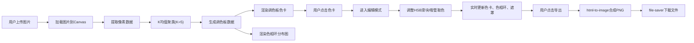

## 1. 产品概述

照片色彩分析工具是一款面向摄影爱好者的交互式Web应用，帮助用户分析照片的色彩构成，提取主色调并进行可视化展示与编辑。用户上传图片后可获得调色板、色彩比例图和色相环分布图，并支持实时调整颜色和预览效果，最终可导出完整的色彩分析报告。

- **核心目标**：降低摄影作品色彩分析的门槛，为用户提供直观、专业的色调理解和调整工具
- **目标用户**：摄影爱好者、设计师、视觉创作者
- **产品价值**：快速理解照片色彩构成，辅助后期调色决策，输出可分享的色彩分析报告

## 2. 核心特性

### 2.1 功能模块

1. **图片上传与预览模块**：支持拖拽/点击上传，图片格式校验，实时缩略图预览
2. **主色调提取模块**：基于K均值聚类算法的5主色调提取，颜色占比计算
3. **调色板展示模块**：横向色卡展示，HEX/RGB/HSL多格式色值，占比百分比显示
4. **色相环分布图模块**：Canvas绘制的圆形色相环，弧长正比于颜色占比，悬停交互
5. **色彩编辑模块**：HSB滑块调整，吸管取色器，实时预览更新
6. **导出模块**：合成调色板+色相环+缩略图为PNG图片，2倍清晰度输出

### 2.2 页面详情

| 页面名称 | 模块名称 | 功能描述 |
|-----------|-------------|---------------------|
| 主页 | 上传区域 | 点击/拖拽上传JPG/PNG/WebP，最大5MB，拖拽高亮提示 |
| 主页 | 图片预览区 | 原始图片缩略图，圆角边框，选中颜色区域遮罩标记 |
| 主页 | 调色板展示区 | 5个横向色卡，色块+色值+占比，hover放大，点击进入编辑 |
| 主页 | 色相环分布图 | Canvas绘制，弧段正比占比，刻度标注，悬停凸出+tooltip |
| 主页 | 色彩编辑区 | H/S/B三滑块，吸管取色器，键盘微调，实时数值显示 |
| 主页 | 导出功能区 | 导出按钮，进度条动画，保存为PNG |

## 3. 核心流程

用户上传图片 → 系统加载图片并绘制到Canvas → 提取像素数据 → K均值聚类计算5个主色调 → 生成调色板和占比数据 → 渲染调色板、色相环 → 用户点击色卡进入编辑模式 → 调整HSB滑块/使用吸管 → 实时更新色卡、色相环和图片遮罩 → 点击导出 → 合成DOM并保存为PNG

## 4. 用户界面设计

### 4.1 设计风格

- **设计理念**：极简主义日式设计，强调留白、克制、自然
- **主背景色**：白色(#FFFFFF)、浅灰色(#F8F8F6)
- **点缀色**：从当前分析图片中提取的主色调动态使用
- **圆角**：统一8px圆角
- **阴影**：统一`0 2px 8px rgba(0,0,0,0.1)`
- **过渡动画**：统一`ease-in-out 150ms`
- **字体**：使用优雅的无衬线字体，标题中等字重，正文轻盈

### 4.2 页面布局

| 区域 | 占比 | 内容 |
|-----------|-------------|-------------|
| 左侧栏 | 40% | 顶部：上传区域；底部：图片缩略图预览 |
| 右侧栏 | 60% | 从上到下：调色板展示区(120px高)、色相环(300px正方，居中)、色彩编辑区 |
| 移动端(<768px) | 上下布局 | 左侧栏在上，右侧栏在下；调色板竖向排列 |

### 4.3 视觉细节

- **上传区域**：虚线边框圆角矩形，云朵上传图标，拖拽时边框变蓝、显示吸彩色背景
- **色卡**：微妙渐变光泽效果，hover时scale 1.05+阴影，1px白色分隔线
- **色相环**：0-360度渐变背景，0°/90°/180°/270°刻度标注，弧段间1px间隔，悬停凸出5px
- **滑块**：水平滑块，右侧实时显示数值，键盘左右键±1微调
- **加载动画**：旋转彩虹环
- **导出进度**：进度条动画

### 4.4 响应式设计

- 桌面端优先(≥1024px)：左右两栏布局
- 平板端(768-1024px)：左右比例微调
- 移动端(<768px)：上下布局，调色板竖向排列，滑块宽度适配

## 5. 性能指标

- **2MB以下图片分析时间**：≤3秒
- **主线程阻塞时间**：≤200ms（使用requestIdleCallback/Web Worker优化）
- **色相环悬停动画帧率**：≥50fps
- **页面首次加载时间**：≤1.5秒
