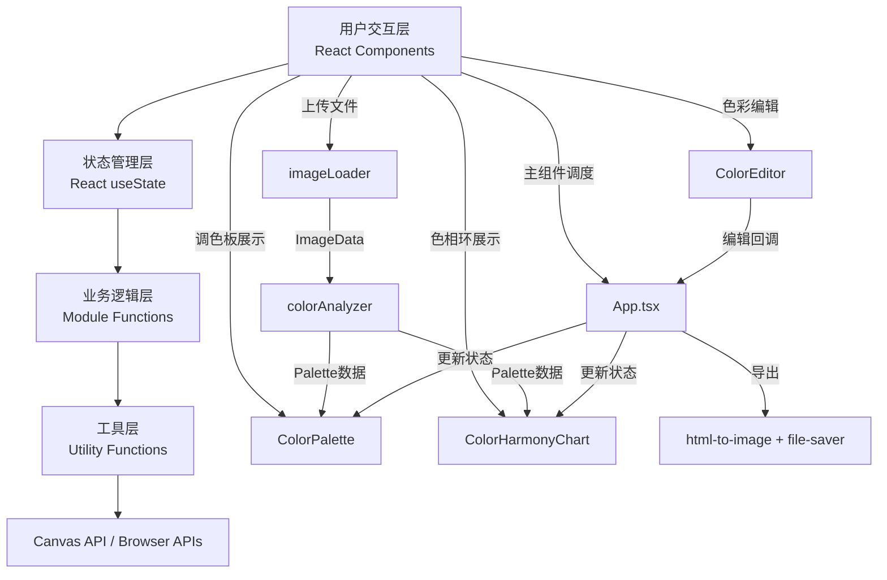

## 1. 架构设计



## 2. 技术描述

- **前端框架**：React 18 + TypeScript
- **构建工具**：Vite（轻量快速，支持HMR）
- **UI方案**：原生CSS（极简风格，无需Tailwind）
- **状态管理**：React useState（集中在App.tsx中管理）
- **第三方依赖**：
  - `react-color`：吸管取色器组件
  - `html-to-image`：DOM转图片导出
  - `file-saver`：文件下载保存
  - `@types/react`、`@types/react-dom`：TypeScript类型支持

## 3. 文件结构与职责

| 文件路径 | 职责 | 数据流向 |
|-----------|-------------|-------------|
| `package.json` | 依赖管理、启动脚本 | 配置入口 |
| `vite.config.js` | Vite构建配置 | 配置入口 |
| `tsconfig.json` | TypeScript严格模式配置 | 配置入口 |
| `index.html` | HTML入口文件 | 挂载React根节点 |
| `src/types.ts` | 类型定义：ColorInfo、Palette、HarmonySegment等 | 被所有模块引用 |
| `src/utils/imageLoader.ts` | 图片加载+Canvas预处理，File→ImageData | 被App.tsx调用 |
| `src/colorAnalyzer.ts` | K均值聚类算法，ImageData→Palette+占比 | 被App.tsx调用，依赖types.ts |
| `src/colorPalette.tsx` | 调色板色卡展示组件，Palette→ReactElement | 接收App.tsx传入props |
| `src/colorHarmonyChart.tsx` | 色相环Canvas绘制组件，Palette→Canvas渲染 | 接收App.tsx传入props |
| `src/colorEditor.tsx` | HSB滑块+吸管取色器，输出调整后颜色 | 接收App.tsx传入props，回调更新 |
| `src/App.tsx` | 主组件：状态管理、模块调度、数据流中枢 | 串联所有模块 |

### 数据流向总图

```
用户上传File
    ↓
App.tsx → imageLoader.loadImage(file) → ImageData
    ↓
App.tsx → colorAnalyzer.analyzeColors(imageData, k=5) → Palette
    ↓
App.tsx passes palette props to:
    ├─→ ColorPalette (onColorClick callback)
    └─→ ColorHarmonyChart
    ↓
用户点击色卡 → selectedColorIndex
    ↓
App.tsx passes selectedColor to:
    └─→ ColorEditor (h/s/b sliders, eyedropper)
    ↓
用户调整颜色 → onColorChange(colorInfo)
    ↓
App.tsx updates palette → re-render ColorPalette + ColorHarmonyChart
    ↓
用户点击导出 → html-to-image.toPng() + file-saver.saveAs()
```

## 4. 核心算法设计

### 4.1 K均值聚类颜色提取

```
输入：ImageData（所有像素RGBA）
输出：Palette（5个ColorInfo，含hex/rgb/hsl/percentage）

步骤：
1. 像素采样：降采样（每N个像素取1个）以减少计算量
2. 初始化质心：随机选取K个像素作为初始质心
3. 迭代聚类（最多20次）：
   a. 每个像素分配到最近的质心（欧氏距离）
   b. 重新计算每个簇的质心（平均值）
   c. 若质心变化<阈值则提前收敛
4. 计算每个簇的像素数量占比
5. RGB转换为HEX和HSL
6. 按占比降序排序
```

### 4.2 色彩空间转换

- **RGB→HEX**：逐通道转16进制，拼接
- **RGB→HSL**：标准公式转换，H∈[0,360), S/L∈[0,100]
- **HSL→RGB**：逆转换
- **颜色距离**：RGB空间欧氏距离 ΔE = √[(ΔR)²+(ΔG)²+(ΔB)²]

## 5. 性能优化策略

| 优化点 | 方案 |
|-----------|-------------|
| 像素计算阻塞主线程 | 使用`requestIdleCallback`分片计算，或降采样减少像素量 |
| 色相环重绘性能 | Canvas离屏缓存，仅当palette变化时重绘 |
| 滑块实时更新 | 防抖处理，避免每帧触发完整重计算 |
| 首次加载 | Vite按需编译，无冗余依赖 |
| 图片过大 | 上传后自动缩放到最大尺寸1000px再分析 |

## 6. 类型定义（src/types.ts）

```typescript
export interface RGB { r: number; g: number; b: number; }
export interface HSL { h: number; s: number; l: number; }

export interface ColorInfo {
  hex: string;
  rgb: RGB;
  hsl: HSL;
  percentage: number;  // 0-100
  name?: string;       // 颜色名称，如"蓝绿色"
}

export type Palette = ColorInfo[];  // 长度5

export interface HarmonySegment {
  color: ColorInfo;
  startAngle: number;  // 弧度
  endAngle: number;    // 弧度
}
```
