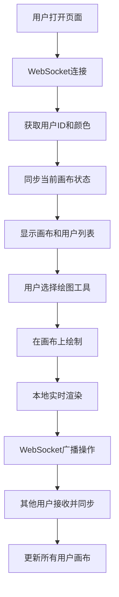

## 1. 产品概述
在线多人实时协作白板应用，支持多用户在同一画布上绘制图形、添加文本和贴图，通过WebSocket实现毫秒级同步，为远程团队协作、在线教育、创意头脑风暴提供高效的可视化协作工具。

### 1.1 核心价值
- 解决远程协作中无法实时共享创意和思路的痛点
- 提供流畅的绘制体验和丰富的绘图工具
- 实现多用户操作的无冲突实时同步

## 2. 核心功能

### 2.1 用户角色
| 角色 | 加入方式 | 核心权限 |
|------|----------|----------|
| 协作用户 | 打开URL自动加入 | 绘制、编辑、删除图形，撤销/重做，查看其他用户 |

### 2.2 功能模块
1. **实时画布模块**：Canvas渲染、图形绘制、拖拽缩放、选中编辑
2. **绘图工具栏模块**：工具选择、颜色选择、粗细调节、撤销重做、贴图
3. **参与者管理模块**：用户列表展示、在线人数统计、用户颜色标识
4. **同步通信模块**：WebSocket连接、操作广播、状态合并、冲突处理
5. **历史记录模块**：撤销/重做栈管理、状态回滚同步

### 2.3 页面详情
| 页面名称 | 模块名称 | 功能描述 |
|----------|----------|----------|
| 白板主页 | 画布区域 | 浅灰网格背景，支持所有绘图操作，最小高度100vh |
| 白板主页 | 左侧工具栏 | 垂直排列绘图工具按钮，支持工具切换、颜色、粗细调节 |
| 白板主页 | 右上角参与者面板 | 彩色圆点头像横向排列，悬停显示昵称，显示在线人数 |
| 白板主页 | 图形选中交互 | 8个蓝色缩放控制点，支持等比例缩放，Shift锁定宽高比 |

## 3. 核心流程

### 3.1 用户加入流程
用户打开页面 → 自动建立WebSocket连接 → 服务器分配用户ID和颜色 → 用户列表更新 → 拉取当前画布状态 → 开始协作

### 3.2 绘图操作同步流程
用户执行绘制操作 → 本地画布实时渲染 → 操作序列化 → WebSocket广播 → 其他用户接收 → 操作反序列化 → 合并到本地状态 → 重绘画布

### 3.3 撤销/重做流程
用户触发撤销 → 本地历史栈回滚 → 画布状态更新 → 撤销操作广播 → 其他用户同步回滚

## 4. 用户界面设计

### 4.1 设计风格
- **主色调**：深灰色工具栏（#2c2c2c）+ 亮色画布（#f5f5f5）
- **强调色**：用户操作颜色（24色预设色板）、选中控制点蓝色（#0078ff）
- **按钮样式**：2px圆角，hover背景变浅（#444），选中时左侧高亮指示条
- **字体**：系统无衬线字体，简洁现代
- **布局风格**：左侧固定工具栏 + 主体画布 + 右上角浮动面板
- **图标风格**：简约线性图标，清晰辨识度

### 4.2 页面设计概述
| 页面名称 | 模块名称 | UI 元素 |
|----------|----------|----------|
| 白板主页 | 画布区域 | 5px间距浅灰网格（#e0e0e0），淡入动画（0.3s opacity），60fps拖拽流畅性 |
| 白板主页 | 左侧工具栏 | 宽度60px，垂直排列，图标按钮，24色预设色板，粗细滑块1-20px |
| 白板主页 | 参与者面板 | 直径32px彩色圆点头像，横向排列，悬停显示昵称，在线人数文字 |
| 白板主页 | 选中状态 | 8个蓝色小方块控制点，等比例缩放，Shift锁定宽高比 |

### 4.3 响应式设计
- **桌面优先**：主要针对桌面端设计，1024px以上屏幕最优体验
- **触控优化**：支持触控设备的绘制和拖拽操作
- **自适应**：画布区域自适应窗口大小，工具栏和面板固定定位

## 5. 性能指标

| 指标 | 要求 |
|------|------|
| 同步延迟 | ≤500ms |
| 绘制帧率 | ≥60fps（200个图形时） |
| 选中响应 | ≤50ms |
| 历史记录 | 最多50步撤销/重做 |
