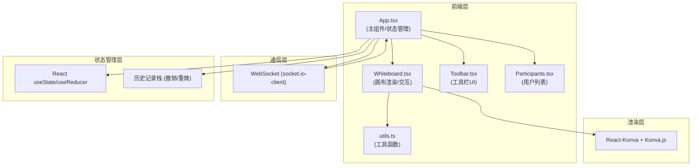

## 1. 架构设计



## 2. 技术描述

### 2.1 前端技术栈
- **框架**: React 18 + TypeScript 5
- **构建工具**: Vite 5
- **画布渲染**: Konva.js + react-konva
- **实时通信**: socket.io-client 4
- **唯一标识**: uuid 9
- **类型定义**: @types/react, @types/react-dom, @types/node

### 2.2 后端模拟
- **WebSocket服务**: 由于用户未指定后端，使用本地模拟 + 公共WebSocket服务进行演示
- **状态同步**: 基于操作的CRDT思想实现多用户操作合并

### 2.3 核心技术决策
1. **Canvas渲染**: 使用Konva.js而非原生Canvas，提供更高级的图形对象模型和事件系统
2. **状态管理**: 轻量级useState管理，避免过度设计
3. **历史记录**: 双栈结构实现撤销/重做，最多50步限制
4. **操作同步**: 基于操作(Operation-based)而非基于状态(State-based)，减少网络传输

## 3. 目录结构

```
e:\solo\SoloAutoDemo\tasks\auto28\
├── package.json
├── vite.config.js
├── tsconfig.json
├── index.html
└── src/
    ├── App.tsx              # 主组件：WebSocket管理、全局状态、用户列表
    ├── Whiteboard.tsx       # 画布组件：渲染、交互、同步
    ├── Toolbar.tsx          # 工具栏：工具选择、颜色、粗细、撤销重做
    ├── Participants.tsx     # 参与者面板
    └── utils.ts             # 工具函数
```

## 4. 核心数据模型

### 4.1 图形类型定义

```typescript
type ShapeType = 'pen' | 'rect' | 'circle' | 'line' | 'text' | 'sticker';

interface BaseShape {
  id: string;
  type: ShapeType;
  x: number;
  y: number;
  userId: string;
  userName: string;
  userColor: string;
  createdAt: number;
}

interface PenShape extends BaseShape {
  type: 'pen';
  points: number[];
  stroke: string;
  strokeWidth: number;
}

interface RectShape extends BaseShape {
  type: 'rect';
  width: number;
  height: number;
  stroke: string;
  strokeWidth: number;
  fill?: string;
}

interface CircleShape extends BaseShape {
  type: 'circle';
  radius: number;
  stroke: string;
  strokeWidth: number;
  fill?: string;
}

interface LineShape extends BaseShape {
  type: 'line';
  points: [number, number, number, number];
  stroke: string;
  strokeWidth: number;
}

interface TextShape extends BaseShape {
  type: 'text';
  text: string;
  fontSize: number;
  fill: string;
}

interface StickerShape extends BaseShape {
  type: 'sticker';
  emoji: string;
  fontSize: number;
  rotation?: number;
  scaleX?: number;
  scaleY?: number;
}

type Shape = PenShape | RectShape | CircleShape | LineShape | TextShape | StickerShape;
```

### 4.2 用户类型定义

```typescript
interface User {
  id: string;
  name: string;
  color: string;
}
```

### 4.3 操作类型定义

```typescript
type OperationType = 'add' | 'update' | 'delete' | 'undo' | 'redo';

interface BaseOperation {
  type: OperationType;
  id: string;
  userId: string;
  timestamp: number;
}

interface AddOperation extends BaseOperation {
  type: 'add';
  shape: Shape;
}

interface UpdateOperation extends BaseOperation {
  type: 'update';
  shapeId: string;
  updates: Partial<Shape>;
}

interface DeleteOperation extends BaseOperation {
  type: 'delete';
  shapeId: string;
}

interface UndoOperation extends BaseOperation {
  type: 'undo';
}

interface RedoOperation extends BaseOperation {
  type: 'redo';
}

type Operation = AddOperation | UpdateOperation | DeleteOperation | UndoOperation | RedoOperation;
```

### 4.4 工具类型定义

```typescript
type Tool = 'select' | 'pen' | 'rect' | 'circle' | 'line' | 'text' | 'sticker';
```

## 5. WebSocket 消息协议

```typescript
interface WSMessage {
  type: 'join' | 'leave' | 'operation' | 'sync' | 'users' | 'init';
  payload: any;
}

// 加入消息
interface JoinMessage extends WSMessage {
  type: 'join';
  payload: { user: User };
}

// 操作消息
interface OperationMessage extends WSMessage {
  type: 'operation';
  payload: { operation: Operation };
}

// 用户列表消息
interface UsersMessage extends WSMessage {
  type: 'users';
  payload: { users: User[] };
}

// 初始化同步
interface InitMessage extends WSMessage {
  type: 'init';
  payload: { shapes: Shape[]; users: User[] };
}
```

## 6. 性能优化策略

### 6.1 渲染优化
1. **React.memo**: 对图形组件进行memo包装，避免不必要重渲染
2. **useMemo/useCallback**: 合理使用缓存计算结果和回调函数
3. **Konva优化**: 使用Layer分层渲染，静态图层和交互图层分离
4. **批量更新**: 画笔绘制时使用requestAnimationFrame批量更新points
5. **虚拟渲染**: 超出视口外的图形简化渲染

### 6.2 同步优化
1. **节流防抖**: 画笔绘制时节流发送，减少WebSocket消息
2. **增量同步**: 仅同步操作而非全量状态
3. **操作合并**: 短时间内的相似操作合并发送
4. **本地优先**: 本地先渲染再同步，提升用户体验

### 6.3 交互优化
1. **requestAnimationFrame**: 所有动画和拖拽使用RAF确保60fps
2. **离屏Canvas**: 复杂图形预渲染
3. **事件委托**: 减少事件监听器数量
4. **形状缓存**: Konva图形对象缓存

## 7. 冲突处理机制

### 7.1 操作时序
- 每个操作携带时间戳，以服务器时间为准
- 本地操作先执行，远程操作按时间戳合并

### 7.2 冲突类型及处理
1. **同时编辑同一图形**: 最后写入胜出(LWW)，以时间戳较新的为准
2. **删除后编辑**: 忽略已删除图形的编辑操作
3. **撤销冲突**: 撤销操作携带操作ID，精确回滚

## 8. 预设颜色方案

### 8.1 24色预设色板
```
#000000, #ffffff, #ff0000, #ff6600, #ffcc00, #00cc00,
#00cccc, #0066ff, #6600ff, #cc00cc, #cc6600, #999999,
#ff9999, #ffcc99, #ffff99, #ccffcc, #ccffff, #99ccff,
#cc99ff, #ffccff, #996633, #cccccc, #666666, #333333
```

### 8.2 用户颜色分配
从预设色板中为每个新用户分配不同颜色

## 9. 历史记录栈

```typescript
interface HistoryState {
  past: Shape[][];
  present: Shape[];
  future: Shape[][];
}

const MAX_HISTORY = 50;
```

- **past**: 已执行的状态快照
- **present**: 当前状态
- **future**: 已撤销的状态快照
- 每次操作后将present推入past，清空future
- 超出MAX_HISTORY时丢弃最早的记录
