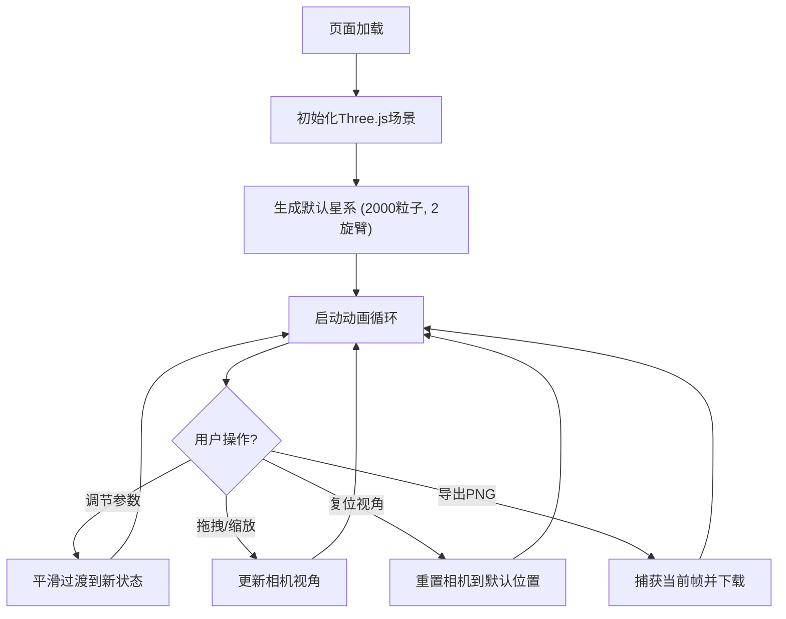

## 1. 产品概述

3D粒子星系生成器——一个基于WebGL的实时交互式螺旋星系可视化应用，让用户通过调节核心参数动态生成并观察壮观的螺旋星系效果。面向天文爱好者、视觉艺术家和前端开发者，提供沉浸式的太空探索体验。

## 2. 核心功能

### 2.1 功能模块

1. **3D星系渲染页**：粒子星系实时渲染、鼠标交互视角控制、参数控制面板

### 2.2 页面详情

| 页面名称 | 模块名称 | 功能描述 |
|---------|---------|---------|
| 星系渲染页 | 3D粒子星系 | 默认2000粒子双旋臂螺旋星系，暖黄→冷蓝紫色渐变，y轴持续自转 |
| 星系渲染页 | 控制面板 | 滑块控制粒子数量/旋转速度/旋臂数/粒子大小，颜色选择器设定内外圈颜色，参数1秒内平滑过渡 |
| 星系渲染页 | 视角控制 | 鼠标拖拽旋转、滚轮缩放、复位视角按钮 |
| 星系渲染页 | 导出功能 | 导出当前帧为PNG图片 |

## 3. 核心流程

用户打开页面后，自动渲染默认螺旋星系。用户可通过右侧控制面板实时调节参数，星系在1秒内平滑过渡到新状态。用户可拖拽旋转视角、缩放观察，随时复位视角或导出当前帧截图。

## 4. 用户界面设计

### 4.1 设计风格

- **主色调**：深空黑 #0B0C10 背景，暖黄 #FDB813 到冷蓝紫 #4A90E2 的星系渐变
- **控制面板**：毛玻璃半透明效果 rgba(255,255,255,0.08)，固定宽度320px，右侧定位
- **控件样式**：圆角卡片分组，滑块带实时数值显示，颜色选择器内嵌
- **字体**：科技感无衬线字体，标签用小号大写字母
- **动画**：ease-out曲线过渡，1秒参数平滑插值
- **布局**：全屏3D画布 + 右侧固定面板浮层

### 4.2 页面设计概览

| 页面名称 | 模块名称 | UI元素 |
|---------|---------|--------|
| 星系渲染页 | 3D画布 | 全屏黑色背景，WebGL粒子渲染，y轴旋转动画 |
| 星系渲染页 | 控制面板-参数组 | 毛玻璃面板，4个带数值的滑块（粒子数/旋转速度/旋臂数/粒子大小） |
| 星系渲染页 | 控制面板-颜色组 | 内圈/外圈颜色选择器各一个 |
| 星系渲染页 | 控制面板-操作组 | 复位视角按钮 + 导出PNG按钮 |

### 4.3 响应式

桌面优先设计，3D画布自适应窗口大小，控制面板在右侧固定定位。窗口resize时自动调整渲染器尺寸和相机纵横比。

### 4.4 3D场景指引

- **环境**：深空黑色 #0B0C10 纯色背景，无环境光，粒子自发光
- **相机**：PerspectiveCamera，初始位置(0, 5, 15)，观察原点，支持OrbitControls交互
- **粒子系统**：BufferGeometry + Points，自定义ShaderMaterial实现大小衰减和颜色渐变
- **动画**：y轴持续旋转，旋转速度可调，使用Uniform驱动shader动画
- **性能预算**：5000粒子时帧率≥50FPS，使用GPU着色器避免CPU瓶颈
