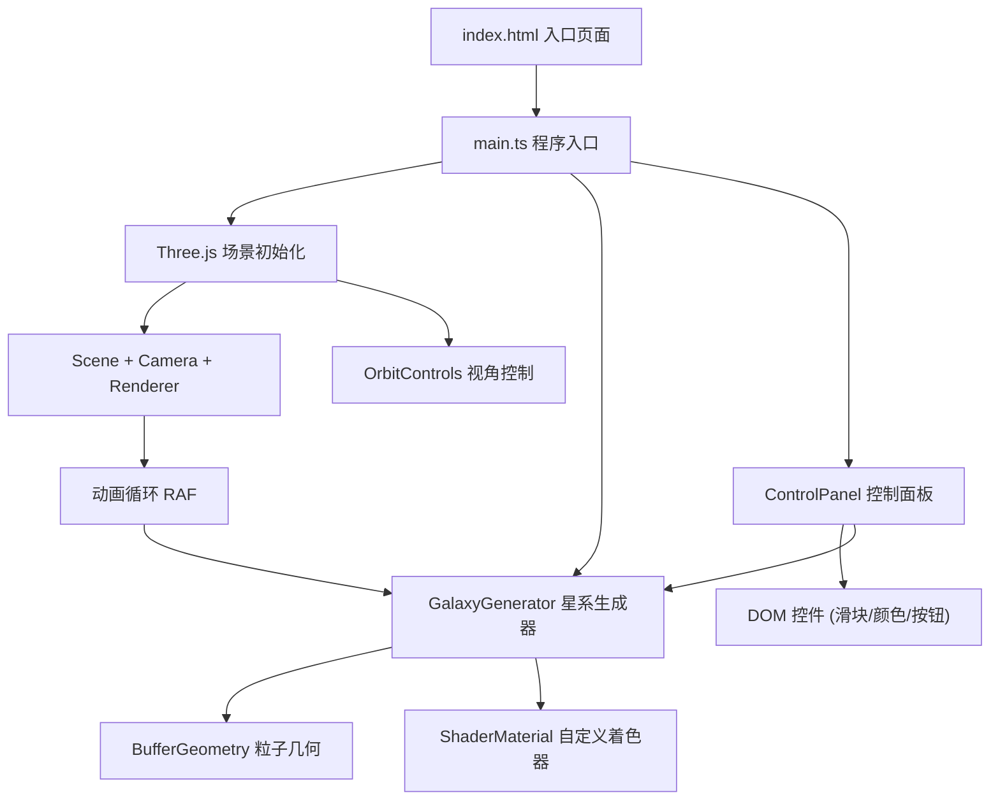

## 1. 架构设计



## 2. 技术说明

- **前端**：TypeScript + Three.js + Vite（纯Vanilla TS，不使用React/Vue）
- **构建工具**：Vite（开发服务器 + HMR）
- **3D渲染**：Three.js（BufferGeometry + Points + ShaderMaterial）
- **交互控制**：Three.js OrbitControls
- **UI面板**：原生DOM + CSS（毛玻璃效果，无需UI框架）

## 3. 文件结构

| 文件路径 | 职责 |
|---------|------|
| package.json | 依赖管理：three, typescript, vite, @types/three |
| vite.config.js | Vite构建配置，开发服务器 |
| tsconfig.json | TypeScript严格模式配置 |
| index.html | 入口HTML，黑色全屏背景，引入main.ts |
| src/main.ts | 程序入口：初始化场景/相机/渲染器/OrbitControls，启动动画循环 |
| src/GalaxyGenerator.ts | 星系生成模块：接收参数对象，生成粒子几何体，返回粒子系统，含update方法 |
| src/ControlPanel.ts | UI控制面板：创建DOM控件，监听操作，触发GalaxyGenerator更新 |

## 4. 核心数据结构

### 4.1 GalaxyParameters

```typescript
interface GalaxyParameters {
  particleCount: number;      // 500 - 5000
  rotationSpeed: number;      // 0.1 - 2.0
  armCount: number;           // 2 - 5
  particleSize: number;       // 0.5 - 3.0
  innerColor: string;         // 内圈颜色，默认 #FDB813
  outerColor: string;         // 外圈颜色，默认 #4A90E2
}
```

### 4.2 粒子属性（BufferGeometry Attributes）

- `position` (Float32Array): x, y, z 坐标，基于螺旋臂数学模型生成
- `aSize` (Float32Array): 粒子大小，随距中心距离递减
- `aColorMix` (Float32Array): 颜色混合因子 0-1，0=内圈色，1=外圈色
- `aRandomness` (Float32Array): 随机偏移量，使粒子分布更自然

### 4.3 Shader Uniforms

- `uTime`: 动画时间
- `uRotationSpeed`: 旋转速度
- `uInnerColor`: 内圈颜色 vec3
- `uOuterColor`: 外圈颜色 vec3
- `uSizeScale`: 粒子大小缩放

## 5. 性能策略

- **GPU着色器**：粒子旋转和颜色插值在顶点/片元着色器中完成，避免每帧CPU更新
- **参数过渡**：使用lerp在动画循环中平滑插值uniform值，1秒ease-out过渡
- **粒子重建**：仅在粒子数量或旋臂数变化时重建BufferGeometry，其他参数通过uniform实时更新
- **防抖**：粒子数量滑块使用debounce，避免频繁重建几何体
