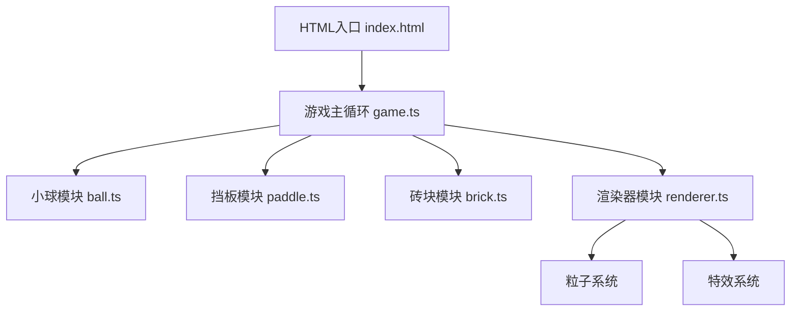

## 1. 架构设计



## 2. 技术描述

- 前端技术栈：
  - TypeScript（严格模式）
  - Vite（构建工具）
  - HTML5 Canvas（2D渲染）
  - 原生Canvas API（物理碰撞检测）

- 无后端，纯前端游戏
- 无需数据库，游戏状态内存管理

## 3. 项目结构

```
├── index.html          # 入口HTML，包含Canvas元素
├── package.json       # 项目配置
├── vite.config.js     # Vite配置
├── tsconfig.json    # TypeScript配置
└── src/
    ├── game.ts      # 主游戏循环，状态管理，碰撞检测
    ├── ball.ts       # 小球逻辑
    ├── paddle.ts   # 挡板逻辑
    ├── brick.ts     # 砖块管理，粒子系统
    └── renderer.ts  # 渲染器，绘制所有元素
```

## 4. 核心数据模型

### 4.1 小球 (Ball)
```typescript
interface Ball {
  x: number;
  y: number;
  dx: number;
  dy: number;
  radius: number;
  speed: number;
}
```

### 4.2 挡板 (Paddle)
```typescript
interface Paddle {
  x: number;
  y: number;
  width: number;
  height: number;
}
```

### 4.3 砖块 (Brick)
```typescript
interface Brick {
  x: number;
  y: number;
  width: number;
  height: number;
  color: string;
  hits: number;
  isHardened: boolean;
  isMoving: boolean;
  moveDirection: number;
  moveSpeed: number;
}
```

### 4.4 粒子 (Particle)
```typescript
interface Particle {
  x: number;
  y: number;
  vx: number;
  vy: number;
  size: number;
  color: string;
  rotation: number;
  rotationSpeed: number;
  life: number;
  maxLife: number;
}
```

### 4.5 游戏状态 (GameState)
```typescript
type GameStatus = 'playing | 'gameover' | 'levelComplete' | 'win';

interface GameState {
  score: number;
  lives: number;
  level: number;
  status: GameStatus;
  totalBricks: number;
}
```

## 5. 核心算法

### 5.1 碰撞检测
- 小球与挡板：AABB碰撞检测，根据击中位置计算反弹角度
- 小球与砖块：AABB碰撞检测，根据碰撞面确定反弹方向
- 小球与边界：简单边界检测

### 5.2 粒子系统
- 砖块破碎时生成5-8个随机方向粒子
- 粒子具有渐隐和旋转效果
- 生命周期1秒，超出自动回收

### 5.3 关卡配置
- 关卡1：普通砖块8x10排列
- 关卡2：50%砖块为钢化砖（需击打2次）
- 关卡3：砖块随机水平移动

### 5.4 评级系统
- S级：得分 ≥ 2400分（满分）
- A级：得分 ≥ 1800分
- B级：得分 ≥ 1200分
- C级：得分 < 1200分
