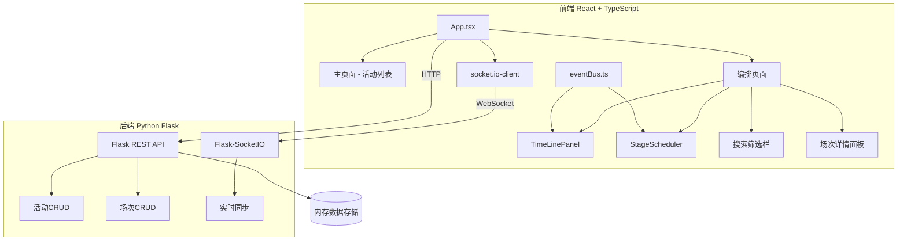
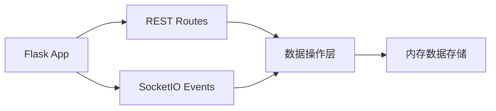
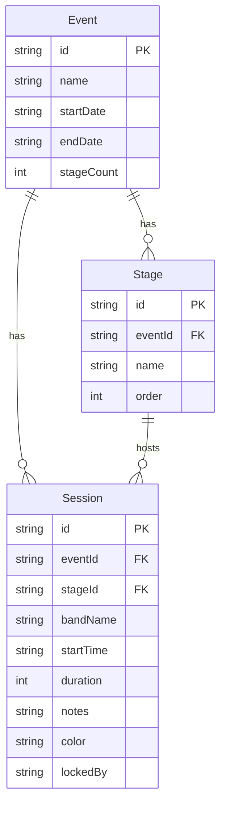

## 1. 架构设计



## 2. 技术说明
- 前端：React 18 + TypeScript + Vite
- 状态管理：React useState/useReducer + Context
- 拖拽：react-beautiful-dnd
- HTTP通信：axios
- WebSocket：socket.io-client ↔ flask-socketio
- 日期处理：date-fns
- 颜色选择：react-color
- 后端：Python Flask + flask-socketio + flask-cors
- 数据存储：内存数据（重启丢失，用于演示）

## 3. 路由定义
| 路由 | 用途 |
|------|------|
| / | 主页面 - 活动创建与列表展示 |
| /event/:id | 编排页面 - 时间线与舞台调度 |

## 4. API定义

### 4.1 活动API
| 方法 | 路径 | 描述 | 请求体 | 响应 |
|------|------|------|--------|------|
| GET | /api/events | 获取所有活动 | - | Event[] |
| POST | /api/events | 创建活动 | {name, startDate, endDate, stageCount} | Event |
| GET | /api/events/:id | 获取活动详情 | - | Event |

### 4.2 场次API
| 方法 | 路径 | 描述 | 请求体 | 响应 |
|------|------|------|--------|------|
| GET | /api/events/:id/sessions | 获取活动场次 | - | Session[] |
| POST | /api/events/:id/sessions | 创建场次 | SessionCreate | Session |
| PUT | /api/sessions/:id | 更新场次 | SessionUpdate | Session |
| DELETE | /api/sessions/:id | 删除场次 | - | {success: true} |

### 4.3 WebSocket事件
| 事件名 | 方向 | 数据 | 描述 |
|--------|------|------|------|
| join_event | Client→Server | {eventId, username} | 加入活动协作房间 |
| session_added | Server→Client | Session | 新增场次广播 |
| session_updated | Server→Client | Session | 更新场次广播 |
| session_deleted | Server→Client | {sessionId} | 删除场次广播 |
| session_dragging | Client→Server | {sessionId, username} | 拖拽锁定广播 |
| session_drag_end | Client→Server | {sessionId} | 拖拽结束解锁 |

### 4.4 数据类型
```typescript
interface Event {
  id: string;
  name: string;
  startDate: string;
  endDate: string;
  stageCount: number;
  stages: Stage[];
  sessions: Session[];
}

interface Stage {
  id: string;
  name: string;
  order: number;
}

interface Session {
  id: string;
  eventId: string;
  bandName: string;
  stageId: string;
  startTime: string;
  duration: number;
  notes: string;
  color: string;
  lockedBy: string | null;
}
```

## 5. 服务端架构



## 6. 数据模型

### 6.1 数据模型定义



### 6.2 数据初始化
- 活动创建时自动生成对应数量的舞台（舞台1、舞台2...）
- 每个场次默认颜色为预设8色中的第一个
- 所有数据存储在Python内存字典中
