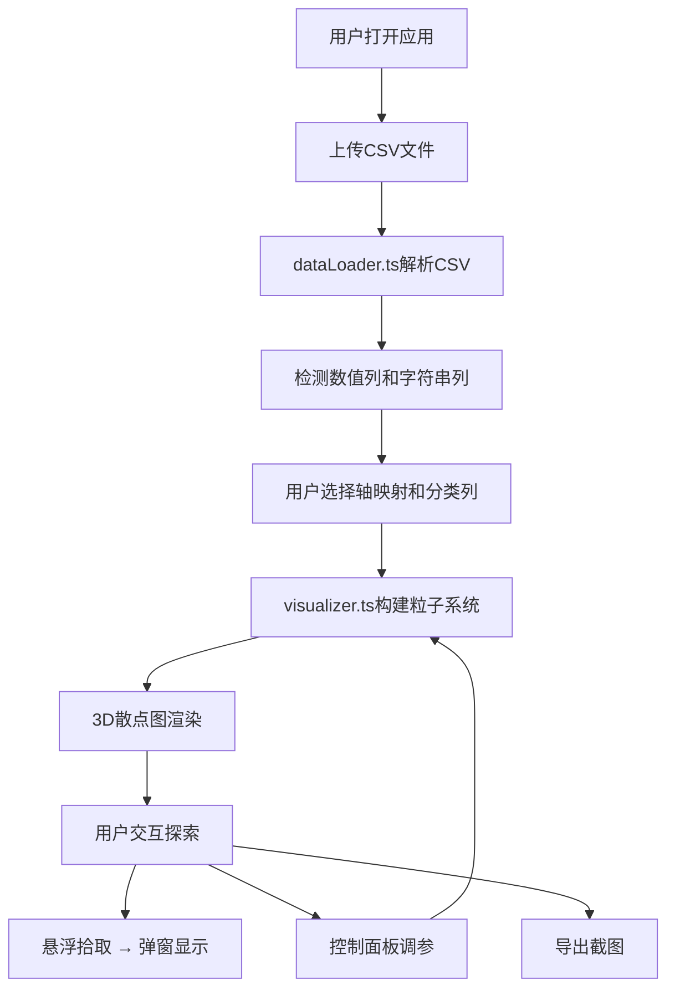

## 1. 产品概述

交互式3D散点图可视化应用，面向数据分析从业者，解决多维数据难以直观呈现的痛点。用户上传CSV文件后，自动解析数值列并映射到三维坐标轴，生成可旋转、缩放、平移的动态散点图，每个数据点根据分类字段着色并支持悬浮详情弹窗，帮助用户快速洞察数据聚类和分布趋势。

- 目标用户：数据分析师、科研人员、数据工程师
- 核心价值：零配置快速生成3D可视化，流畅交互体验，一站式数据探索

## 2. 核心功能

### 2.1 用户角色

| 角色 | 使用方式 | 核心权限 |
|------|----------|----------|
| 普通用户 | 无需注册，直接使用 | 上传CSV、浏览和交互3D散点图、调整控制参数、导出截图 |

### 2.2 功能模块

1. **主页面**：文件上传区域、3D散点图场景、控制面板、统计面板

### 2.3 页面详情

| 页面 | 模块 | 功能描述 |
|------|------|----------|
| 主页面 | 文件上传区域 | 左上角折叠式卡片，支持拖拽/点击上传CSV，上传后可折叠 |
| 主页面 | 轴映射选择器 | 上传CSV后显示下拉框，让用户选择X/Y/Z轴对应的数值列和颜色分类列 |
| 主页面 | 3D散点图场景 | Three.js全屏场景，粒子系统渲染，OrbitControls交互，Raycaster悬浮拾取 |
| 主页面 | 控制面板 | 右侧固定300px宽，含轴标签开关、透明度滑块、背景色切换、重置视角、导出截图 |
| 主页面 | 统计面板 | 左下角固定150px宽，显示粒子总数、各轴数据范围、分类占比CSS柱状图 |
| 主页面 | 悬浮弹窗 | 鼠标悬停粒子时显示半透明弹窗，展示该点所有字段名和值 |

## 3. 核心流程

用户打开应用 → 上传CSV文件 → 系统解析并识别数值列/字符串列 → 用户选择X/Y/Z轴映射和分类列 → 生成3D散点图 → 用户通过鼠标旋转/缩放/平移探索数据 → 悬浮查看数据详情 → 通过控制面板调整可视化参数 → 导出截图

## 4. 用户界面设计

### 4.1 设计风格

- **主题**：深色星空主题，背景从 #0a0a1a 渐变到 #1a1a2e
- **色彩**：主色调深蓝黑，文字浅灰 #cccccc，数据点使用12色调色板
- **面板风格**：毛玻璃效果（backdrop-filter: blur(8px)），微边框
- **字体**：UI字体使用系统无衬线字体，数据标签使用等宽字体
- **布局**：全屏3D场景，控制面板右侧固定，统计面板左下角固定，上传区域左上角折叠
- **图标**：Font Awesome免费图标
- **动画**：按钮/滑块交互缩放动画（transform: scale(0.95→1.0), transition 0.2s）

### 4.2 页面设计概览

| 页面 | 模块 | UI元素 |
|------|------|--------|
| 主页面 | 3D场景 | 全屏Three.js Canvas，深色星空渐变背景 |
| 主页面 | 上传区域 | 左上角折叠卡片，拖拽区域，折叠/展开按钮 |
| 主页面 | 轴映射选择 | 下拉选择框（X/Y/Z轴+分类列），确认按钮 |
| 主页面 | 控制面板 | 右侧300px面板，开关、滑块、按钮组 |
| 主页面 | 统计面板 | 左下角150px面板，数字指标+CSS柱状图 |
| 主页面 | 悬浮弹窗 | 半透明深色卡片，字段名值对列表 |

### 4.3 响应式适配

- 桌面端（≥768px）：3D场景全屏，控制面板右侧固定，统计面板左下角固定
- 移动端（<768px）：控制面板和统计面板变为底部可拖拽滑出抽屉，3D场景占满剩余空间

### 4.4 3D场景指引

- **环境**：深色星空主题，无HDRI，使用渐变背景色
- **灯光**：环境光 + 平行光，确保粒子颜色清晰可见
- **相机**：透视相机，默认45度俯视角度
- **粒子**：球形粒子，半径3-8单位（根据数据密度自动调整），12色调色板着色
- **交互**：OrbitControls旋转/缩放/平移，Raycaster悬浮拾取
- **性能**：10,000粒子保持30fps+，粒子最小半径2单位
- **后处理**：悬浮粒子外发光效果

## 5. 性能约束

- 数据点数量达到10,000个时，交互帧率需稳定在30fps以上
- 粒子大小自动限制最小不低于2单位，避免渲染过密导致性能下降
- 使用InstancedMesh而非独立Mesh以优化渲染性能
