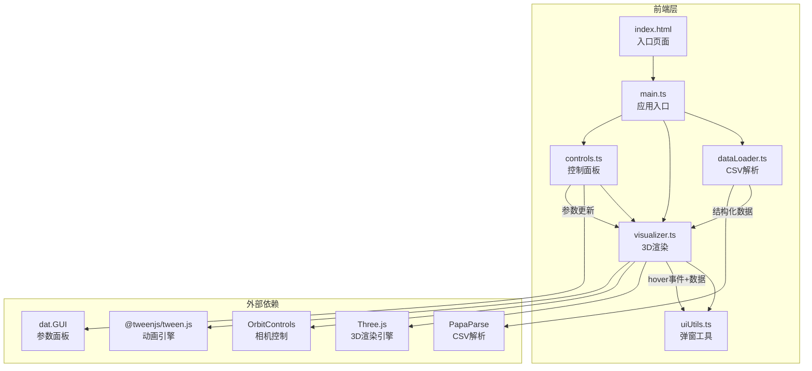
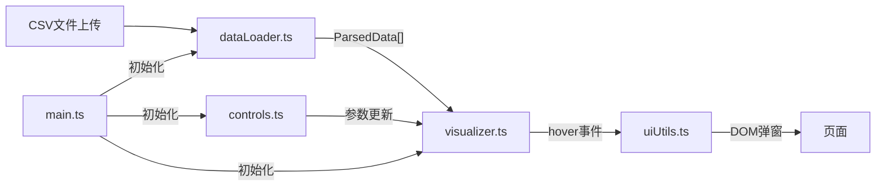

## 1. 架构设计



## 2. 技术说明

- **前端框架**：纯 TypeScript + Three.js（无React/Vue，用户明确指定）
- **构建工具**：Vite
- **3D引擎**：Three.js + OrbitControls + Raycaster
- **CSV解析**：PapaParse
- **控制面板**：dat.GUI（用户明确指定）
- **动画**：@tweenjs/tween.js（视角重置等平滑动画）
- **图标**：Font Awesome免费图标
- **无后端**：纯前端应用，数据本地处理

## 3. 路由定义

| 路由 | 用途 |
|------|------|
| / | 单页面应用，包含所有功能模块 |

## 4. 数据流向



### 数据结构定义

```typescript
interface ParsedData {
  headers: string[]
  numericColumns: string[]
  stringColumns: string[]
  rows: Record<string, string | number>[]
}

interface ScatterConfig {
  xColumn: string
  yColumn: string
  zColumn: string
  categoryColumn: string | null
}

interface VisualizerParams {
  opacity: number
  showLabels: boolean
  backgroundColor: string
  pointScale: number
}
```

## 5. 文件结构

```
├── package.json
├── vite.config.js
├── tsconfig.json
├── index.html
├── src/
│   ├── main.ts          # 应用入口
│   ├── dataLoader.ts    # CSV解析
│   ├── visualizer.ts    # 3D可视化
│   ├── controls.ts      # 控制面板
│   └── uiUtils.ts       # 弹窗工具
```

### 模块职责与调用关系

| 文件 | 职责 | 输入 | 输出 | 调用方 |
|------|------|------|------|--------|
| main.ts | 初始化场景、渲染器、相机，协调各模块 | 无 | 应用实例 | 浏览器 |
| dataLoader.ts | 解析CSV，识别列类型 | File对象 | ParsedData | main.ts |
| visualizer.ts | 构建粒子系统，交互拾取 | ParsedData + ScatterConfig | 3D场景 | main.ts, controls.ts |
| controls.ts | dat.GUI面板，参数调节 | 无 | 参数更新指令 | main.ts |
| uiUtils.ts | 悬浮弹窗生成和定位 | hover坐标+数据 | DOM弹窗 | visualizer.ts |

## 6. 性能策略

- 使用 InstancedMesh 替代独立 Mesh 渲染粒子，10,000粒子保持30fps+
- Raycaster 限制检测频率（throttle），避免每帧拾取导致性能下降
- 粒子半径最小2单位，数据密度高时自动缩小粒子
- CSS柱状图使用纯CSS实现，避免Canvas开销
- TWEEN动画使用 requestAnimationFrame 调度
