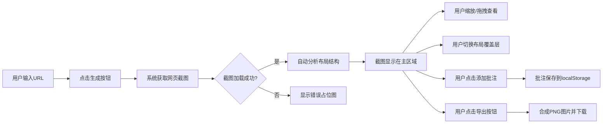

## 1. 产品概述

网页截图预览与布局分析应用，解决在网页设计评审或内容收藏时，需要快速获取页面视觉概览和结构分析的问题。

- 主要用途：网页截图获取、布局结构分析、批注标注、导出分享
- 目标用户：UI/UX设计师、前端开发者、产品经理、内容运营人员
- 产品价值：提供一站式网页视觉分析工具，提升设计评审效率和内容收藏体验

## 2. 核心功能

### 2.1 用户角色
| 角色 | 注册方式 | 核心权限 |
|------|----------|----------|
| 普通用户 | 无需注册 | 使用全部截图、分析、批注和导出功能 |

### 2.2 功能模块
1. **主页面**：URL输入栏、截图显示区域、布局分析覆盖层、批注层、功能操作区

### 2.3 页面详情
| 页面名称 | 模块名称 | 功能描述 |
|----------|----------|----------|
| 主页面 | URL输入栏 | 支持输入完整URL，提交生成截图，一键清空输入 |
| 主页面 | 截图显示区 | 完整页面截图展示，支持滚轮缩放(0.5x-3x)、拖拽平移，显示当前缩放倍数浮标 |
| 主页面 | 布局分析覆盖层 | 可切换显示/隐藏，自动识别头部(蓝)、导航、内容区(绿)、侧边栏、底部(紫)，显示区域名称和宽度百分比标签，标签5秒后自动淡出 |
| 主页面 | 批注层 | 点击截图任意位置添加文本批注(最多200字)，气泡形式显示(#FFF9C4浅黄背景, 12px深灰字体)，支持编辑/删除，数据持久化到localStorage |
| 主页面 | 导出功能 | 一键将截图+批注合成为PNG下载，导出时去除布局分析覆盖层但保留批注气泡 |

## 3. 核心流程

用户输入URL → 提交生成截图 → 系统获取完整页面截图 → 自动分析布局结构 → 用户可缩放/拖拽查看 → 用户可切换布局覆盖层 → 用户可点击添加批注 → 用户可导出合成图片

## 4. 用户界面设计

### 4.1 设计风格
- 主色调：#7C3AED（紫色系）
- 背景色：#1E1E2E（暗色主题）
- 按钮风格：圆角按钮，悬停有平滑过渡动画(0.3s ease)
- 字体：现代无衬线字体，正文14px，批注气泡12px
- 布局：顶部搜索框居中(宽度60%)，主体截图区域(高度70vh，四周20px边距)
- 图标风格：简洁线条图标

### 4.2 页面设计概述
| 页面名称 | 模块名称 | UI元素 |
|----------|----------|--------|
| 主页面 | URL输入栏 | 圆角搜索框(60%宽度居中)、提交按钮、清空按钮、紫色主题 |
| 主页面 | 截图加载状态 | 紫色渐变旋转圆环加载动画 |
| 主页面 | 截图显示区 | 居中显示、缩放浮标、拖拽光标 |
| 主页面 | 布局覆盖层 | 半透明彩色蒙版(头部蓝、内容绿、底部紫)、区域标签、5秒标签淡出动画 |
| 主页面 | 批注气泡 | 圆角浅黄(#FFF9C4)背景、12px深灰字体、编辑/删除操作 |
| 主页面 | 导出按钮 | 紫色主题按钮、平滑悬停过渡 |

### 4.3 响应式设计
- 桌面端优先，移动端自适应
- 移动端(宽度<768px)：截图区域占满宽度100%，批注气泡缩小为12px字体，增加触摸点击反馈
- 所有交互(缩放、拖拽、添加批注、导出)都有平滑过渡动画(0.3s ease)

### 4.4 性能要求
- 截图加载不超过3秒（需支持loading状态）
- 缩放和拖拽保持60fps流畅度
- 批注数量不超过50个时的响应无明显延迟
