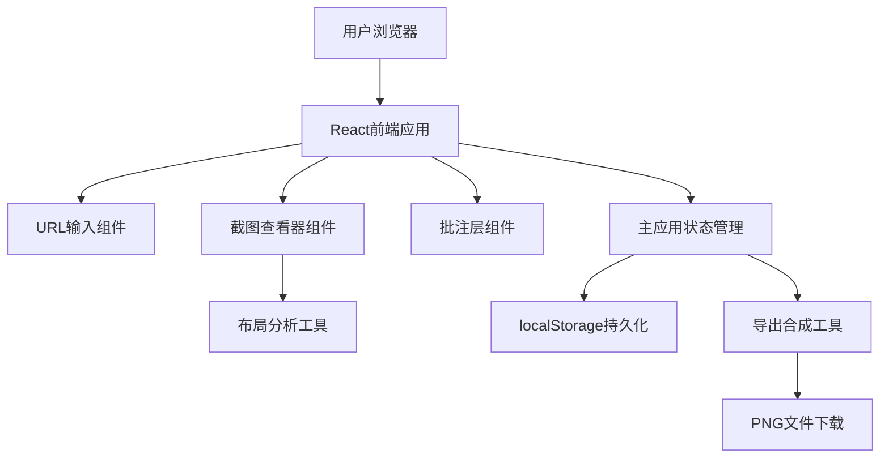

## 1. 架构设计



## 2. 技术描述

- 前端框架：React@18 + TypeScript
- 构建工具：Vite@5
- 截图工具：html2canvas（前端截图，包含滚动内容）
- 状态管理：React Hooks (useState, useRef, useEffect) - 轻量级场景无需额外状态库
- 数据持久化：localStorage（保存批注数据）
- 导出工具：file-saver（文件下载）+ Canvas API（图片合成）
- 唯一ID生成：uuid

## 3. 文件结构

| 文件路径 | 用途 |
|----------|------|
| package.json | 项目依赖配置和启动脚本 |
| vite.config.js | Vite构建配置 |
| tsconfig.json | TypeScript严格模式配置 |
| index.html | 入口页面，挂载点div#root |
| src/App.tsx | 主应用组件，管理URL输入、截图状态、布局分析结果和批注列表 |
| src/components/UrlInputBar.tsx | URL输入和提交按钮组件 |
| src/components/ScreenshotViewer.tsx | 截图显示、缩放拖拽和布局覆盖层渲染的核心组件 |
| src/components/AnnotationLayer.tsx | 批注气泡渲染、添加和编辑组件 |
| src/utils/layoutAnalyzer.ts | 布局分析算法，返回区域列表及其颜色 |
| src/utils/exportHandler.ts | 导出合成图片的工具函数 |

## 4. 核心数据类型定义

```typescript
// 截图状态
type ScreenshotStatus = 'idle' | 'loading' | 'success' | 'error';

// 布局区域类型
type LayoutRegionType = 'header' | 'nav' | 'content' | 'sidebar' | 'footer';

// 布局区域
interface LayoutRegion {
  id: string;
  type: LayoutRegionType;
  x: number;      // 相对于截图左上角的x坐标
  y: number;      // 相对于截图左上角的y坐标
  width: number;  // 区域宽度(像素)
  height: number; // 区域高度(像素)
  color: string;  // 半透明颜色
  label: string;  // 区域名称标签
  widthPercent: number; // 宽度百分比(相对于截图宽度)
}

// 批注
interface Annotation {
  id: string;
  x: number;          // 相对于截图左上角的x坐标
  y: number;          // 相对于截图左上角的y坐标
  text: string;       // 批注内容(最多200字)
  createdAt: number;  // 创建时间戳
}

// 应用状态
interface AppState {
  url: string;
  screenshotStatus: ScreenshotStatus;
  screenshotDataUrl: string | null;
  screenshotWidth: number;
  screenshotHeight: number;
  layoutRegions: LayoutRegion[];
  annotations: Annotation[];
  showLayoutOverlay: boolean;
}
```

## 5. 关键实现方案

### 5.1 网页截图方案
- 使用html2canvas库在前端iframe中加载目标URL并截图
- 注意：由于跨域限制，实际部署时可能需要后端代理服务
- 开发演示阶段：可使用html2canvas对iframe内容截图，或展示示例截图演示功能

### 5.2 布局分析算法
- 基于截图图像的启发式分析：
  - 顶部区域：识别为头部(header)
  - 头部下方水平条带：识别为导航(nav)
  - 中间主体：识别为内容区(content)
  - 内容区两侧：识别为侧边栏(sidebar)
  - 底部区域：识别为底部(footer)
- 基于相对位置和尺寸比例进行区域划分
- 每个区域分配不同颜色的半透明蒙版

### 5.3 缩放与拖拽实现
- 使用CSS transform: scale() 实现缩放
- 使用CSS transform: translate() 实现拖拽平移
- 监听wheel事件实现滚轮缩放（范围0.5x-3x）
- 监听mousedown/mousemove/mouseup实现拖拽
- 使用requestAnimationFrame确保60fps流畅度

### 5.4 批注持久化
- 使用localStorage存储批注数据
- 以URL为key存储对应批注列表
- 页面加载时自动恢复之前的批注

### 5.5 图片导出合成
- 创建新的Canvas元素
- 先绘制原始截图
- 再在对应位置绘制批注气泡（使用Canvas文本API）
- 不绘制布局分析覆盖层
- 使用file-saver将Canvas导出为PNG文件下载

## 6. UI样式方案

### 6.1 主题配色（CSS变量）
```css
:root {
  --bg-primary: #1E1E2E;
  --bg-secondary: #2D2D44;
  --accent-primary: #7C3AED;
  --accent-hover: #8B5CF6;
  --text-primary: #FFFFFF;
  --text-secondary: #A0A0B8;
  --annotation-bg: #FFF9C4;
  --annotation-text: #333333;
  --layout-header: rgba(59, 130, 246, 0.35);
  --layout-nav: rgba(234, 179, 8, 0.35);
  --layout-content: rgba(34, 197, 94, 0.35);
  --layout-sidebar: rgba(236, 72, 153, 0.35);
  --layout-footer: rgba(139, 92, 246, 0.35);
  --transition: 0.3s ease;
}
```

### 6.2 动画方案
- 所有状态切换使用transition: 0.3s ease
- 加载动画：紫色渐变圆环旋转(spin)
- 标签淡出：opacity从1过渡到0，5秒后触发
- 批注气泡出现：scale从0.8到1的弹性动画
- 按钮悬停：背景色过渡 + 轻微上浮效果
