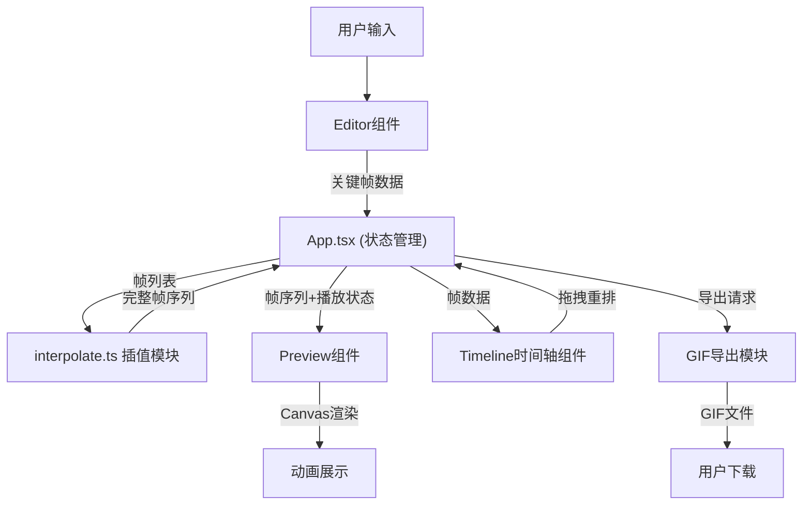

## 1. 架构设计

本项目采用纯前端React单页应用架构，无需后端服务。核心数据流遵循单向数据流原则：用户在Editor组件中绘制像素并保存关键帧 → App组件统一管理全局状态 → 调用插值工具生成过渡帧 → Preview组件接收完整帧序列进行Canvas渲染播放。



## 2. 技术描述

- **前端框架**：React 18 + TypeScript 5
- **构建工具**：Vite 5（启用TypeScript严格模式）
- **状态管理**：React useState/useReducer（轻量场景无需额外状态库）
- **渲染技术**：Canvas 2D API（像素级精确渲染）
- **样式方案**：原生CSS + CSS Variables（深色主题、霓虹强调色）
- **GIF导出**：gif.js 库（浏览器端合成GIF）
- **图标库**：lucide-react（简洁线性图标）
- **包管理器**：npm
- **项目初始化**：vite-init react-ts 模板

**关键技术决策**：
1. 使用Canvas API而非DOM元素渲染像素，保证30+ FPS的动画性能
2. 插值算法采用Web Worker异步执行，避免阻塞主线程超过500ms
3. 帧数据采用TypedArray存储，减少内存占用提高计算效率
4. 响应式布局使用CSS Grid + Media Queries实现

## 3. 核心数据结构定义

```typescript
// 像素颜色 - RGBA通道各0-255
interface PixelColor {
  r: number;
  g: number;
  b: number;
  a: number;
}

// 单帧像素矩阵 - 32x32二维数组
type PixelFrame = PixelColor[][];

// 关键帧对象
interface KeyFrame {
  id: string;
  index: number;
  pixels: PixelFrame;
  timestamp: number;
}

// 工具类型
type ToolType = 'brush' | 'eraser';

// 播放状态
interface PlaybackState {
  isPlaying: boolean;
  currentFrame: number;
  fps: number;
  totalFrames: number;
}

// 应用全局状态
interface AppState {
  keyFrames: KeyFrame[];
  currentEditorFrame: PixelFrame;
  selectedColor: PixelColor;
  currentTool: ToolType;
  transitionFrames: number;
  playback: PlaybackState;
  fullFrameSequence: PixelFrame[];
}

// 调色板预设 - 8色
const COLOR_PALETTE: PixelColor[] = [
  { r: 0, g: 0, b: 0, a: 255 },       // 黑
  { r: 255, g: 255, b: 255, a: 255 }, // 白
  { r: 255, g: 0, b: 0, a: 255 },     // 红
  { r: 0, g: 255, b: 0, a: 255 },     // 绿
  { r: 0, g: 0, b: 255, a: 255 },     // 蓝
  { r: 255, g: 255, b: 0, a: 255 },   // 黄
  { r: 255, g: 0, b: 255, a: 255 },   // 品红
  { r: 0, g: 255, b: 255, a: 255 },   // 青
];
```

## 4. 模块调用关系

| 模块 | 输入 | 输出 | 依赖 | 调用者 |
|------|------|------|------|--------|
| `src/App.tsx` | 用户事件、子组件数据 | 全局状态、帧序列 | interpolate.ts, Editor, Preview, Timeline | main.tsx |
| `src/components/Editor.tsx` | 当前帧像素、选中颜色、工具类型 | 更新后的像素数据、保存关键帧事件 | 无 | App.tsx |
| `src/components/Preview.tsx` | 完整帧序列、播放状态 | Canvas渲染结果 | 无 | App.tsx |
| `src/components/Timeline.tsx` | 关键帧列表、当前帧索引 | 帧重排事件、帧选择事件 | 无 | App.tsx |
| `src/components/ToolPanel.tsx` | 当前颜色、当前工具 | 颜色选择、工具切换事件 | 无 | App.tsx |
| `src/utils/interpolate.ts` | 两个关键帧、过渡帧数 | 中间帧数组 | 无 | App.tsx |
| `src/utils/gifExporter.ts` | 帧序列、延迟参数 | GIF Blob下载 | gif.js | App.tsx |
| `src/utils/canvasUtils.ts` | 帧数据、Canvas上下文 | 渲染结果 | 无 | Editor, Preview, Timeline |

## 5. 文件结构

```
auto41/
├── .trae/documents/
│   ├── PRD.md              # 产品需求文档
│   └── ARCHITECTURE.md     # 技术架构文档
├── index.html              # 入口HTML
├── package.json            # 项目依赖和脚本
├── vite.config.js          # Vite构建配置
├── tsconfig.json           # TypeScript配置
├── src/
│   ├── main.tsx            # React应用入口
│   ├── App.tsx             # 主应用组件(状态管理)
│   ├── types/
│   │   └── index.ts        # 类型定义
│   ├── components/
│   │   ├── Editor.tsx      # 像素编辑器
│   │   ├── Preview.tsx     # 动画预览器
│   │   ├── Timeline.tsx    # 时间轴
│   │   └── ToolPanel.tsx   # 工具面板
│   ├── utils/
│   │   ├── interpolate.ts  # 帧插值算法
│   │   ├── canvasUtils.ts  # Canvas渲染工具
│   │   └── gifExporter.ts  # GIF导出工具
│   └── styles/
│       └── index.css       # 全局样式
```

## 6. 性能优化策略

1. **帧序列缓存**：插值计算结果缓存，关键帧变化时才重新计算
2. **离屏Canvas**：预览渲染使用离屏Canvas提高重绘性能
3. **requestAnimationFrame**：动画播放使用RAF保证帧率稳定
4. **批量更新**：像素绘制时批量更新状态，减少重渲染
5. **懒计算**：过渡帧按需生成，优先保证首帧显示
6. **Web Worker**：50帧以上插值计算移入Worker线程，避免UI阻塞
