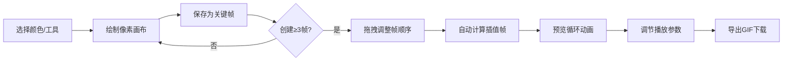

## 1. 产品概述

像素角色行走动画生成器是一款面向独立游戏开发者的专业工具，帮助程序员快速为像素艺术角色生成连贯的行走动画帧序列。用户只需绘制少量关键姿态，系统自动通过插值算法生成平滑过渡的完整动画循环。

- **核心目标**：解决手动绘制像素动画耗时、动作不连贯的痛点
- **目标用户**：独立游戏开发者、像素艺术爱好者、2D动画设计师
- **市场价值**：将像素动画制作效率提升10倍以上，降低独立游戏开发门槛

## 2. 核心功能

### 2.1 用户角色

| 角色 | 注册方式 | 核心权限 |
|------|----------|----------|
| 普通用户 | 无需注册，直接使用 | 绘制关键帧、生成动画、导出GIF |

### 2.2 功能模块

1. **关键帧编辑器**：32x32像素画布，8色调色板，橡皮擦工具，帧管理
2. **动画插值引擎**：RGB+Alpha线性插值，可配置过渡帧数
3. **动画预览器**：循环播放、速度控制、帧步进、暂停/继续
4. **时间轴管理**：关键帧拖拽排序、过渡帧可视化、当前帧高亮
5. **GIF导出器**：帧序列合成GIF、可配置延迟、下载保存

### 2.3 页面详情

| 页面名称 | 模块名称 | 功能描述 |
|---------|----------|----------|
| 主应用页 | 导航栏 | 项目名称显示、GIF导出按钮 |
| 主应用页 | 左侧工具面板 | 8色调色板选择、画笔/橡皮擦切换、清除画布 |
| 主应用页 | 中间编辑区 | 32x32像素画布(16倍放大)、格子线显示、棋盘格背景 |
| 主应用页 | 右侧预览区 | 动画循环播放、速度滑块、播放控制按钮、帧信息显示 |
| 主应用页 | 底部时间轴 | 关键帧缩略图、拖拽排序、插入位置指示、当前帧高亮 |

## 3. 核心流程

用户首先在左侧面板选择颜色或橡皮擦工具，在中间画布上点击绘制像素，完成一个姿态后保存为关键帧。重复此过程创建至少3个关键帧（站立、迈左腿、迈右腿），可通过底部时间轴拖拽调整帧顺序。系统自动在相邻关键帧之间生成指定数量的过渡帧，右侧预览区实时循环播放完整动画。用户可调节播放速度、单帧步进查看，满意后点击导出按钮下载GIF文件。

## 4. 用户界面设计

### 4.1 设计风格

- **主色调**：深色背景 #1e1e1e，营造专业创作氛围
- **强调色**：霓虹绿 #00ff88，用于按钮高亮、当前帧边框、交互反馈
- **面板色**：左栏 #2a2a2a，预览区 #1a1a1a，形成层次感
- **按钮风格**：矩形按钮，霓虹绿边框/文字，悬停时浅绿色发光效果，0.2秒ease-out过渡
- **字体**：使用等宽字体保证像素绘制的精确感，标题粗体，正文清晰可读
- **布局**：三栏式桌面布局，移动端自动转为上下滑动单栏
- **图标风格**：简洁线性图标，与像素艺术风格协调

### 4.2 页面设计概述

| 页面名称 | 模块名称 | UI元素 |
|---------|----------|--------|
| 主应用页 | 导航栏 | 高度50px，深色背景，左侧项目名称"像素动画生成器"，右侧霓虹绿导出按钮 |
| 主应用页 | 工具面板 | 宽度80px，深灰底色，垂直排列8个圆形调色板，下方画笔/橡皮擦切换按钮，清除按钮 |
| 主应用页 | 编辑区 | 512x512像素画布(32x16倍)，浅灰格子线，棋盘格透明背景，鼠标悬停像素高亮 |
| 主应用页 | 预览区 | 等比例显示动画，右上角色/总帧数显示，底部速度滑块(1-10fps)、播放/暂停、步进按钮 |
| 主应用页 | 时间轴 | 高度100px，水平滚动缩略图条，关键帧边框，过渡帧半透明，当前帧2px霓虹绿边框 |

### 4.3 响应式

采用桌面优先设计，通过CSS媒体查询适配移动端：
- 屏幕宽度 < 768px 时，三栏布局转为上下堆叠的单栏布局
- 画布缩放比例自动适配屏幕宽度
- 时间轴改为横向滑动，支持触摸操作
- 按钮尺寸增大，优化触控体验
- 调色板改为水平排列，节省垂直空间

### 4.4 动效设计

- 所有交互（工具切换、按钮悬停、拖拽、播放动画）均带有0.2秒ease-out过渡
- 关键帧拖拽时显示高亮插入位置指示器
- 缩略图悬停时120%放大预览
- 霓虹绿按钮悬停时产生柔和发光效果
- 动画预览平滑循环，无跳帧
