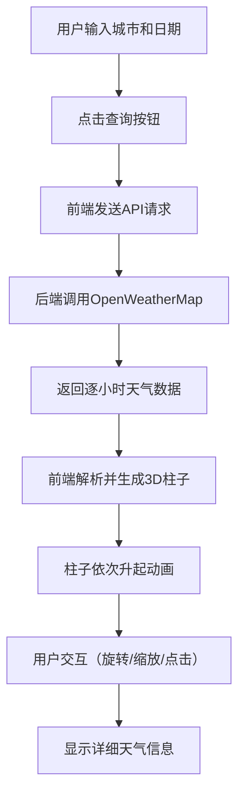

## 1. 产品概述

交互式3D天气演变可视化地图应用，帮助气象爱好者和旅行者直观查阅未来多日天气变化趋势。用户输入城市名称和日期范围后，系统以3D柱状图形式动态展示逐小时温度、降雨概率、风速等气象数据。

- 核心解决问题：传统天气预报难以直观展示多日天气变化趋势，缺乏交互式3D可视化体验
- 目标用户：气象爱好者、旅行者、需要规划行程的普通用户
- 产品价值：通过沉浸式3D可视化，让天气数据更加直观易懂，提升行程规划效率

## 2. 核心 Features

### 2.1 用户角色
| 角色 | 注册方式 | 核心权限 |
|------|----------|----------|
| 普通用户 | 无需注册 | 输入城市查询天气、交互3D场景、查看天气详情 |

### 2.2 功能模块
1. **主3D场景页面**：3D天气可视化场景、柱子网格、天气图标精灵、星空背景
2. **右侧控制侧边栏**：城市输入框、日期选择器、查询按钮、加载状态指示器
3. **交互图例面板**：温度色带映射条、天气图标对照表、时间区间滑块
4. **悬浮信息面板**：点击柱子显示详细天气数据

### 2.3 页面详情
| 页面名称 | 模块名称 | 功能描述 |
|----------|----------|----------|
| 主页面 | 3D场景模块 | 渲染56个立方体柱子（7天×8时段），高度映射温度，颜色蓝红渐变，顶部天气图标 |
| 主页面 | 侧边栏控制模块 | 城市输入（中英双语）、日期范围选择（3-7天）、查询触发、加载状态显示 |
| 主页面 | 交互图例模块 | 温度色带、天气图标说明、时间滑块过滤高亮 |
| 主页面 | 信息面板模块 | 点击柱子显示时间、温度、降雨概率、风速，渐入渐出动画 |

## 3. 核心流程

用户在侧边栏输入城市名称和选择日期范围 → 点击查询按钮 → 前端发送请求到后端 → 后端调用OpenWeatherMap API获取逐小时预报数据 → 后端返回格式化JSON数据 → 前端解析数据生成柱子几何体 → 柱子依次从地面升起动画 → 用户可拖拽旋转场景、滚轮缩放 → 点击柱子显示详细信息 → 拖动时间滑块过滤显示时段

## 4. 用户界面设计

### 4.1 设计风格
- **主色调**：深灰(#2C2C2C)、天蓝色(#4FC3F7)、深蓝紫色星空背景
- **配色方案**：柱子颜色从蓝色(#2196F3)渐变到红色(#F44336)表示温度
- **按钮风格**：圆角8px矩形，天蓝色高亮，悬停效果
- **字体**：白色无衬线字体，清晰易读
- **布局风格**：毛玻璃半透明侧边栏(blur 10px)，悬浮信息面板半黑透明背景
- **图标风格**：天气精灵图标（太阳、云朵、雨滴）

### 4.2 页面设计概述
| 页面名称 | 模块名称 | UI元素 |
|----------|----------|---------|
| 主页面 | 3D场景 | 深蓝紫色星空背景、圆形地形网格(半径300)、经纬线纹理、56个立方体柱子、天气图标精灵、默认45度俯视等距视角 |
| 主页面 | 侧边栏 | 可折叠、毛玻璃背景、城市输入框、日期范围选择器、查询按钮、旋转加载动画、绿色对勾完成指示器 |
| 主页面 | 图例面板 | 温度色带条(标注最高最低温)、天气图标对照表、时间区间滑块 |
| 主页面 | 信息面板 | 半黑透明背景、圆角8px、渐入渐出动画(1秒)、显示时间/温度/降雨概率/风速 |

### 4.3 响应式设计
- **桌面端(≥768px)**：右侧可折叠侧边栏，3D场景占满剩余空间
- **移动端(<768px)**：侧边栏自动折叠到底部，水平布局，3D场景占满剩余高度
- **触摸优化**：支持触摸拖拽旋转、双指缩放

### 4.4 3D场景指引
- **环境**：深蓝紫色星空背景，营造科技感和沉浸感
- **光照**：环境光+方向光组合，确保柱子色彩鲜明，顶部图标清晰可见
- **相机**：透视相机，初始45度俯视角度，等距视角效果
- **相机运动**：OrbitControls支持鼠标拖拽旋转、滚轮缩放、右键平移
- **构图**：圆形地形居中，柱子网格均匀分布在地形上方，图例固定在角落
- **动画**：柱子依次升起（间隔50ms，总时长2.8秒），场景切换淡入过渡（0.6秒）
- **后处理**：适当抗锯齿，保持30FPS以上帧率
- **资源**：天气图标使用精灵贴图，地形使用程序化生成网格

## 5. 性能要求
- 场景渲染帧率 ≥ 30FPS
- 数据加载到首次显示完成 ≤ 5秒（含API调用和渲染时间）
- 内存占用优化，柱子几何体复用，避免频繁GC
