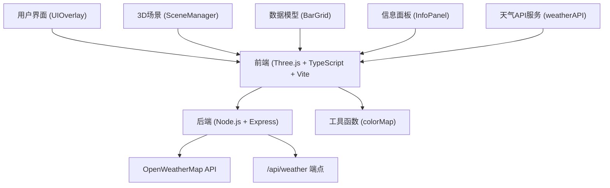
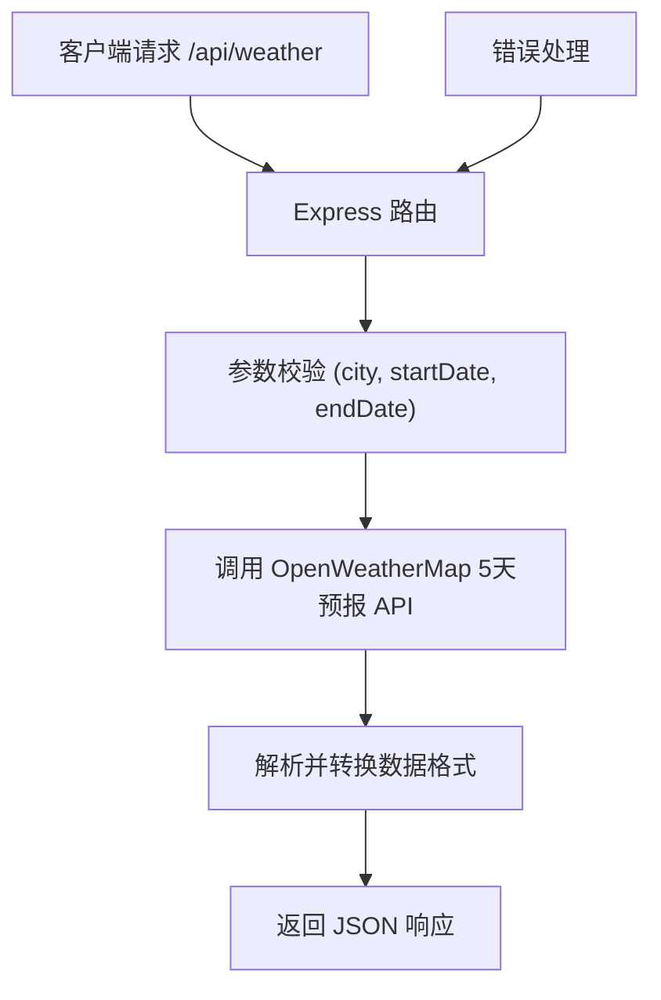
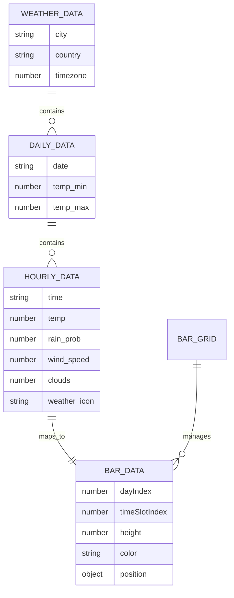

## 1. 架构设计

本项目采用前后端分离架构，前端使用TypeScript + Three.js进行3D可视化，后端使用Node.js + Express提供API代理服务。



## 2. 技术描述

### 2.1 前端技术栈
- **框架**: TypeScript 5.x + Vite 5.x
- **3D渲染**: Three.js 0.160.x
- **类型定义**: @types/three
- **HTTP客户端**: Axios 1.x
- **开发工具**: dat.gui (可选调试)
- **构建工具**: Vite

### 2.2 后端技术栈
- **运行时**: Node.js 18+
- **Web框架**: Express 4.x
- **HTTP客户端**: Axios 1.x
- **CORS中间件**: cors
- **环境变量**: dotenv

### 2.3 初始化方式
- 前端: Vite vanilla-ts 模板
- 后端: 手动创建 Express 服务

## 3. 项目文件结构

```
auto42/
├── package.json
├── vite.config.js
├── tsconfig.json
├── index.html
├── server/
│   └── index.js
├── src/
│   ├── main.ts
│   ├── services/
│   │   └── weatherAPI.ts
│   ├── models/
│   │   └── BarGrid.ts
│   ├── components/
│   │   ├── SceneManager.ts
│   │   ├── InfoPanel.ts
│   │   └── UIOverlay.ts
│   └── utils/
│       └── colorMap.ts
└── public/
    └── icons/
        ├── sunny.png
        ├── cloudy.png
        └── rainy.png
```

## 4. 路由定义

### 4.1 前端路由（单页应用，无前端路由）
| 路径 | 说明 |
|-------|------|
| / | 主页面，包含3D场景和控制面板 |

### 4.2 后端API路由
| 路由 | 方法 | 用途 |
|-------|------|------|
| /api/weather | GET | 获取城市天气数据，参数：city, startDate, endDate |
| /api/health | GET | 健康检查 |

## 5. API 定义

### 5.1 天气数据请求
**请求参数**:
```typescript
interface WeatherRequest {
  city: string;           // 城市名称（中文或英文）
  startDate: string;      // 开始日期 YYYY-MM-DD
  endDate: string;        // 结束日期 YYYY-MM-DD
}
```

**响应数据**:
```typescript
interface WeatherAPIResponse {
  city: string;
  country: string;
  timezone: number;
  daily: DailyWeatherData[];
}

interface DailyWeatherData {
  date: string;
  hourly: HourlyWeatherData[];
  temp_min: number;
  temp_max: number;
}

interface HourlyWeatherData {
  time: string;           // HH:00 格式
  temp: number;          // 摄氏度
  rain_prob: number;    // 0-100 百分比
  wind_speed: number;    // m/s
  clouds: number;        // 0-100 百分比
  weather_icon: string;   // 天气图标代码
  weather_main: string;   // 天气主描述
}
```

**内部使用数据格式**:
```typescript
interface WeatherData {
  date: string;
  hour: number;        // 0-23
  temp: number;
  rainProb: number;
  windSpeed: number;
  clouds: number;
  weatherIcon: string;
  weatherMain: string;
}

interface BarData {
  index: number;
  dayIndex: number;    // 0-6 (7天)
  timeSlotIndex: number;  // 0-7 (8个时段)
  position: { x: number; z: number };
  height: number;       // 映射到 10-100
  color: THREE.Color;
  weatherData: WeatherData;
}
```

## 6. 服务器架构



### 6.1 后端模块
| 模块 | 职责 |
|------|------|
| server/index.js | Express服务器初始化，CORS配置，路由注册 |
| 天气路由 | 接收请求参数，调用外部API，数据格式化，错误处理 |

### 6.2 前端模块职责

| 模块 | 职责 |
|------|------|
| main.ts | 应用入口，初始化场景、相机、渲染器、UI容器，事件调度 |
| weatherAPI.ts | 封装axios调用后端API，解析JSON转换为WeatherData接口 |
| BarGrid.ts | 接收WeatherData数组，计算柱子高度/颜色，生成几何体，管理动画序列，暴露透明度/高亮方法 |
| SceneManager.ts | 创建Three.js场景、相机、渲染器、轨道控制器，提供物体增删改方法 |
| InfoPanel.ts | 创建悬浮信息面板DOM，管理显示/隐藏，射线碰撞检测 |
| UIOverlay.ts | 生成侧边栏DOM，城市输入、日期选择、查询按钮、加载指示器、图例面板 |
| colorMap.ts | 温度映射蓝红渐变色，天气代码映射精灵贴图路径 |

## 7. 数据模型



## 8. 关键实现要点

### 8.1 性能优化
- 柱子几何体复用：使用 InstancedMesh 优化56个柱子的渲染
- 材质复用：共享材质实例
- 动画优化：使用 requestAnimationFrame 统一动画循环
- 射线检测优化：限制检测频率

### 8.2 动画实现
- 柱子升起动画：每个柱子延迟50ms依次升起，使用gsap或自定义tween
- 面板渐入渐出：CSS transition opacity 1秒
- 场景淡入：renderer.domElement.style.opacity 0.6秒过渡

### 8.3 交互实现
- 射线检测：THREE.Raycaster 检测鼠标与柱子碰撞
- 轨道控制器：OrbitControls 支持旋转缩放
- 响应式：window resize 事件监听，更新相机和渲染器尺寸
