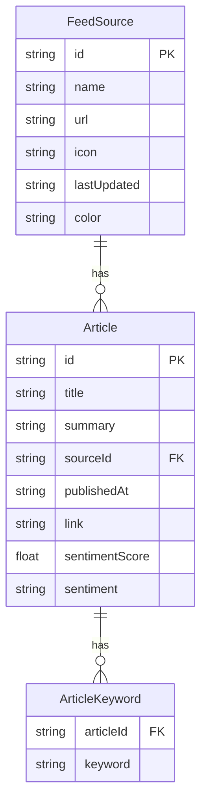

## 1. 架构设计

```mermaid
flowchart TB
    subgraph "前端 (React + TypeScript + Vite)"
        "App.tsx" --> "FeedFetcher.ts"
        "App.tsx" --> "Dashboard.tsx"
        "App.tsx" --> "CompareChart.tsx"
        "App.tsx" --> "Sidebar.tsx"
        "FeedFetcher.ts" -->|"axios GET /api/fetch-feeds"| "Flask后端"
    end
    subgraph "后端 (Python Flask)"
        "Flask后端" --> "RSS解析模块"
        "Flask后端" --> "情绪分析模块"
        "Flask后端" --> "关键词提取模块"
        "Flask后端" --> "数据存储"
    end
    subgraph "外部服务"
        "RSS解析模块" -->|"rss-parser"| "外部RSS源"
    end
```

## 2. 技术说明
- 前端：React@18 + TypeScript + Vite + Chart.js + react-chartjs-2 + axios + date-fns
- 初始化工具：vite-init (react-ts模板)
- 后端：Python Flask + feedparser + flask-cors
- 数据存储：内存存储（JSON文件持久化备份）
- 状态管理：Zustand

## 3. 路由定义
| 路由 | 用途 |
|------|------|
| / | 主页面，包含仪表盘、图表、侧栏 |

## 4. API定义

### 4.1 TypeScript类型定义

```typescript
interface FeedSource {
  id: string;
  name: string;
  url: string;
  icon: string;
  lastUpdated: string;
  color: string;
}

interface Article {
  id: string;
  title: string;
  summary: string;
  sourceId: string;
  sourceName: string;
  publishedAt: string;
  link: string;
  sentimentScore: number;
  sentiment: "positive" | "neutral" | "negative";
  keywords: string[];
}

interface AggregatedData {
  sources: FeedSource[];
  articles: Article[];
  stats: {
    totalArticles: number;
    sourceCount: number;
    avgSentiment: number;
  };
}
```

### 4.2 API端点

| 方法 | 路径 | 请求参数 | 响应 |
|------|------|----------|------|
| GET | /api/feeds | - | `{ sources: FeedSource[] }` |
| POST | /api/feeds | `{ url: string, name?: string }` | `{ source: FeedSource }` |
| DELETE | /api/feeds/:id | - | `{ success: boolean }` |
| GET | /api/fetch-feeds | `?sourceId=&keyword=&sentiment=` | `{ articles: Article[], stats: Stats }` |
| POST | /api/refresh | - | `{ success: boolean, count: number }` |
| GET | /api/compare | - | `{ volumeTrend, keywordTrend, sentimentDist }` |

### 4.3 请求/响应Schema

**POST /api/feeds 请求体：**
```json
{ "url": "https://example.com/rss", "name": "示例源" }
```

**GET /api/fetch-feeds 响应体：**
```json
{
  "articles": [
    {
      "id": "a1",
      "title": "文章标题",
      "summary": "文章摘要...",
      "sourceId": "s1",
      "sourceName": "源名称",
      "publishedAt": "2026-06-17T12:00:00Z",
      "link": "https://...",
      "sentimentScore": 0.65,
      "sentiment": "positive",
      "keywords": ["技术", "AI"]
    }
  ],
  "stats": {
    "totalArticles": 50,
    "sourceCount": 3,
    "avgSentiment": 0.42
  }
}
```

**GET /api/compare 响应体：**
```json
{
  "volumeTrend": {
    "labels": ["6/11", "6/12", "..."],
    "datasets": [{ "sourceName": "源A", "data": [5, 8, "..."] }]
  },
  "keywordTrend": {
    "labels": ["6/11", "6/12", "..."],
    "datasets": [{ "keyword": "AI", "data": [12, 18, "..."] }]
  },
  "sentimentDist": {
    "datasets": [{ "sourceName": "源A", "positive": 30, "neutral": 50, "negative": 20 }]
  }
}
```

## 5. 服务器架构图

```mermaid
flowchart LR
    "Flask路由层" --> "服务层"
    "服务层" --> "RSS解析器"
    "服务层" --> "情绪分析器"
    "服务层" --> "关键词提取器"
    "服务层" --> "数据仓库"
    "RSS解析器" --> "feedparser"
    "情绪分析器" --> "TextBlob/VADER"
    "关键词提取器" --> "TF-IDF"
    "数据仓库" --> "内存+JSON文件"
```

## 6. 数据模型

### 6.1 数据模型定义



### 6.2 数据流向

1. 用户添加RSS源 → POST /api/feeds → 后端存储源信息
2. 定时任务/手动刷新 → 后端抓取所有源 → 解析文章 → 去重 → 情绪分析 → 关键词提取 → 存储
3. 前端请求 → GET /api/fetch-feeds → 后端返回聚合数据 → 前端渲染仪表盘
4. 前端请求 → GET /api/compare → 后端计算对比数据 → 前端渲染图表
