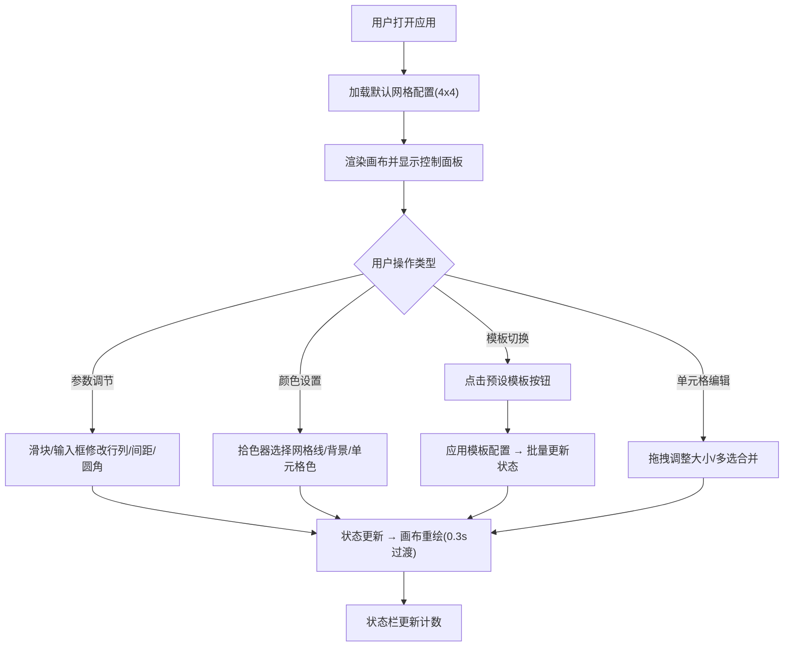

## 1. 产品概述

Grid Layout Studio 是一个在线网页布局网格生成器，帮助前端设计师和开发者快速创建、预览和导出 CSS Grid 布局方案。用户可通过直观的可视化界面自定义网格参数、调整单元格大小和颜色，并实时预览各种布局模板。

- 主要用途：快速生成响应式网页网格布局设计稿，降低 CSS Grid 学习成本
- 目标用户：前端开发者、UI/UX 设计师、网页布局学习者

## 2. 核心功能

### 2.1 用户角色

| 角色 | 注册方式 | 核心权限 |
|------|----------|----------|
| 普通用户 | 无需注册，直接使用 | 创建、编辑、预览网格布局，使用预设模板 |

### 2.2 功能模块

1. **控制面板**：网格参数调节（行列数/间距/圆角）、颜色选择（网格线/背景/单元格）、预设模板切换
2. **画布区域**：CSS Grid 实时渲染、单元格拖拽调整大小、多单元格选择与合并、吸附辅助线
3. **状态栏**：显示总单元格数、已着色单元格数、当前网格配置摘要

### 2.3 页面详情

| 页面名称 | 模块名称 | 功能描述 |
|----------|----------|----------|
| 主页面 | 控制面板 | 滑块输入行列数(1-12)、间距(0-50px)、圆角(0-20px)；拾色器选择网格线颜色和画布背景色；预设色板为单元格着色；预设模板按钮一键应用 |
| 主页面 | 画布区域 | 渲染 CSS Grid 布局；拖拽单元格右下角调整跨度(1-4)；蓝色高亮选中状态；半透明蓝色覆盖层显示拖拽中状态；实时跨度数字指示器；多单元格选中后显示合并按钮；吸附辅助线对齐提示 |
| 主页面 | 状态栏 | 底部固定栏显示总单元格数量、已着色单元格数量、当前行列配置 |
| 主页面 | 汉堡菜单 | 1024px以下触发，抽屉式展开控制面板，0.3秒阻尼动画 |

## 3. 核心流程

用户打开应用 → 默认加载基础网格配置 → 通过控制面板调整参数（实时预览）→ 选择预设模板或手动调整 → 拖拽单元格调整大小 → 选择多个单元格进行合并 → 为单元格分配颜色 → 完成布局设计

## 4. 用户界面设计

### 4.1 设计风格

- 设计风格：极简现代风（Material Design 灵感）
- 主色：蓝色 #1976D2（Material Blue 700）
- 强调色：橙色 #F57C00（Material Orange 700）
- 页面背景：浅灰色 #F5F5F5
- 卡片背景：白色 #FFFFFF，圆角 12px
- 按钮风格：扁平化，悬停背景变深10%，点击缩放0.95倍，过渡0.15s
- 阴影：画布区域 10px 浅灰色内阴影
- 控件间距：卡片内部 16px
- 动效：参数变化 0.3s CSS transition；抽屉展开 0.3s 阻尼平滑滑动

### 4.2 页面设计概述

| 页面名称 | 模块名称 | UI 元素 |
|----------|----------|---------|
| 主页面 | 控制面板(左) | 白色卡片(280px宽)，标题文字，分组滑块控件带数值显示，色块预览，拾色器弹出层，预设色板网格，模板按钮组，响应式汉堡图标 |
| 主页面 | 画布区域(右) | 居中容器，CSS Grid 容器带内阴影，可交互单元格（高亮/着色/拖拽句柄），尺寸指示器浮层，吸附辅助线，合并按钮浮层 |
| 主页面 | 状态栏(底) | 全宽固定栏，三列布局显示统计信息，细分割线 |

### 4.3 响应式设计

- 设计优先：桌面端优先（Desktop First）
- 断点：1024px
  - ≥1024px：控制面板左侧固定280px，画布占据右侧剩余空间
  - <1024px：控制面板折叠为顶部汉堡菜单，点击抽屉式滑出（从顶部滑下，0.3s阻尼动画），画布全宽显示
- 触摸优化：移动端拖拽区域增大，控件最小触控目标 44×44px

### 4.4 性能指标

- 参数调节响应：≤ 30ms 状态更新到画布渲染
- 画布渲染帧率：≥ 50 FPS
- 预设模板切换：≤ 200ms 完成配置更新和重绘
