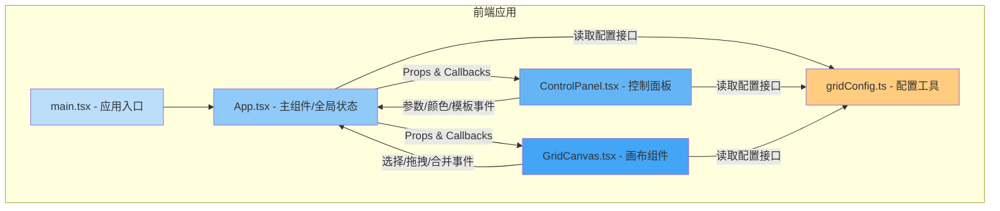

## 1. 架构设计



## 2. 技术描述

- **前端框架**：React 18 + TypeScript 5
- **构建工具**：Vite 5（开发端口 3000）
- **状态管理**：React useState/useCallback（组件级，无需全局store）
- **拖拽交互**：原生 React 事件（onMouseDown/onMouseMove/onMouseUp）实现单元格大小调整
- **颜色选择**：react-color（SketchPicker / ChromePicker）+ @types/react-color
- **样式方案**：内联样式 + CSS-in-JS（styled-components 风格的 style 对象），不使用 Tailwind，遵循用户指定的文件结构
- **类型系统**：TypeScript 严格模式（strict: true）

## 3. 核心数据模型

### 3.1 GridConfig 接口

```typescript
interface GridConfig {
  rows: number;           // 行数 1-12
  cols: number;           // 列数 1-12
  gap: number;            // 间距 0-50px
  borderRadius: number;   // 圆角 0-20px
  gridLineColor: string;  // 网格线颜色 (hex)
  backgroundColor: string;// 画布背景色 (hex)
}
```

### 3.2 Cell 接口

```typescript
interface Cell {
  id: string;             // 唯一标识 "cell-{row}-{col}"
  rowStart: number;       // grid-row-start
  colStart: number;       // grid-col-start
  rowSpan: number;        // 行跨度 1-4
  colSpan: number;        // 列跨度 1-4
  color: string | null;   // 填充颜色，null为透明
}
```

### 3.3 AppState 接口

```typescript
interface AppState {
  config: GridConfig;
  cells: Cell[];
  selectedCellIds: string[];     // 选中的单元格（支持多选合并）
  activeCellId: string | null;   // 当前活跃/正在编辑的单元格
  isDragging: boolean;           // 是否处于拖拽调整大小状态
  dragInfo: DragInfo | null;     // 拖拽临时数据
}
```

## 4. 组件层级与数据流

| 组件 | 职责 | 输入 Props | 输出 Callbacks |
|------|------|-----------|---------------|
| App.tsx | 全局状态容器、布局容器、事件分发、预设模板应用 | - | - |
| ControlPanel.tsx | 参数表单、颜色选择器、预设模板按钮、色板 | config, activeCell, presetTemplates | onConfigChange(partial), onCellColorChange(id, color), onApplyTemplate(name) |
| GridCanvas.tsx | CSS Grid 渲染、单元格选中、拖拽调整、合并、辅助线 | config, cells, selectedIds, isDragging, dragInfo | onCellSelect(id, multi), onCellResize(id, rowSpan, colSpan), onMergeCells(ids) |

## 5. 预设模板定义

```typescript
interface PresetTemplate {
  name: string;
  config: Partial<GridConfig>;
  cells: Omit<Cell, 'id'>[];  // id 由应用时生成
}

// 预设：
// 1. "三列布局"：3列，左列20%，中间自适应，右列20%
// 2. "左侧导航右侧内容"：2列4行，左列跨4行，右列4行分成标题/内容/页脚
// 3. "两栏等分"：2列3行，等分宽度
// 4. "网格画廊"：4列4行，不规则跨度单元格
```

## 6. 性能优化策略

1. **CSS transition 硬件加速**：所有平滑过渡使用 transform + opacity，避免触发布局重排
2. **useMemo 缓存计算值**：网格行列尺寸、单元格跨度校验结果用 useMemo 缓存
3. **useCallback 稳定引用**：事件处理函数用 useCallback 包装，避免子组件不必要重渲染
4. **React.memo 包裹子组件**：ControlPanel、GridCanvas 均 memo 化，仅 props 变更时重渲染
5. **拖拽节流**：onMouseMove 用 requestAnimationFrame 节流，确保 ≤ 60FPS
6. **批量状态更新**：预设模板应用时使用函数式 setState 合并更新，减少渲染次数

## 7. 文件结构

```
auto46/
├── package.json
├── vite.config.js
├── tsconfig.json
├── index.html
└── src/
    ├── main.tsx              # React 挂载入口
    ├── App.tsx               # 主组件：状态/布局/事件
    ├── components/
    │   ├── GridCanvas.tsx    # 画布：CSS Grid + 交互
    │   └── ControlPanel.tsx  # 控制面板：参数/颜色/模板
    └── utils/
        └── gridConfig.ts     # 接口/默认值/计算函数
```
