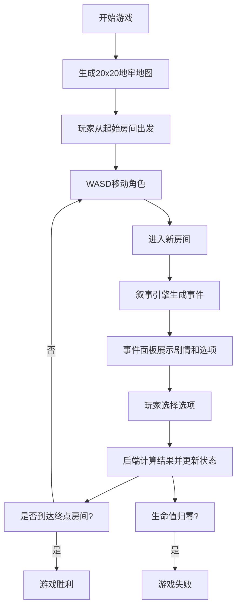

## 1. 产品概述

Roguelike叙事地牢探险游戏，结合程序化地图生成与动态叙事引擎，为玩家提供每次都不同的地牢探险体验。通过根据玩家历史行为动态生成事件和对话，解决传统随机地图缺乏叙事连贯性的问题。

- 核心目标：打造具有重复可玩性的2D地牢探险游戏，每次游戏都能生成独特的微型故事链条
- 目标用户：喜欢Roguelike游戏、地牢探险、叙事驱动游戏的玩家
- 市场价值：将程序化生成与叙事设计结合，提升随机地图游戏的沉浸感和重玩价值

## 2. 核心功能

### 2.1 用户角色

| 角色 | 注册方式 | 核心权限 |
|------|----------|----------|
| 玩家 | 自动分配Session ID | 探索地牢、触发事件、战斗、收集道具 |

### 2.2 功能模块

1. **地牢探索模块**：20x20网格地牢、4种房间类型、WASD移动、平滑视口滚动
2. **叙事事件模块**：动态生成剧情文本、选项分支、NPC对话，根据玩家行为调整
3. **战斗系统模块**：回合制自动战斗、属性计算、战斗结果反馈
4. **玩家状态模块**：生命值、攻击力、护甲、背包系统、状态面板
5. **迷你地图模块**：已探索房间高亮、玩家位置标记、1:4缩放
6. **进度保存模块**：自动保存游戏状态、刷新恢复

### 2.3 页面详情

| 页面名称 | 模块名称 | 功能描述 |
|----------|----------|----------|
| 游戏主界面 | 地牢画布 | Canvas渲染地牢地图、角色、道具、陷阱，支持WASD移动 |
| 游戏主界面 | 事件面板 | 展示叙事文本、选项按钮、NPC头像，磨砂玻璃效果 |
| 游戏主界面 | 状态面板 | 右上角显示生命值、攻击力、护甲、背包，低血量红色闪烁警告 |
| 游戏主界面 | 迷你地图 | 左下角缩略地图，已探索高亮，玩家位置金色闪动 |

## 3. 核心流程

玩家进入游戏后，从起始房间开始探索。使用WASD移动角色，每进入一个新房间触发对应类型的叙事事件。玩家通过选择选项（战斗、搜索、交谈等）与游戏互动，选择结果影响后续事件概率和角色属性。每经过5个房间自动保存，游戏目标是到达终点房间。

## 4. 用户界面设计

### 4.1 设计风格

- **主色调**：深色主题背景 #1a1a2e，墙壁深灰 #2d2d44
- **房间颜色编码**：战斗房红色、宝藏房金色、事件房蓝色、陷阱房紫色
- **按钮风格**：圆角矩形（8px），悬停渐变 #3a3a5c → #5a5a7c，点击弹性缩放动画
- **字体**：叙事文本浅黄色 #f5e6ca，等宽游戏字体
- **布局风格**：画布居中85%区域，左右两侧事件面板和状态面板，左下角迷你地图
- **动效**：角色移动0.2秒平滑过渡、按钮弹性缩放、低血量面板闪烁

### 4.2 页面设计概述

| 页面名称 | 模块名称 | UI元素 |
|----------|----------|--------|
| 游戏主界面 | 地牢画布 | 2D网格地图、房间色块、门、角色精灵、道具图标、陷阱标记、视口平滑滚动 |
| 游戏主界面 | 事件面板 | 半透明磨砂玻璃背景、叙事文本区、NPC头像、选项按钮组、入场/出场动画 |
| 游戏主界面 | 状态面板 | 生命值条、攻击力数值、护甲数值、背包格子、低血量红色闪烁 |
| 游戏主界面 | 迷你地图 | 半透明黑底、2px边框、已探索高亮、未探索灰色、金色玩家圆点闪动 |

### 4.3 响应式

- Desktop-first设计，viewport宽度≥768px时采用三栏布局（事件面板-画布-状态面板）
- 移动端（<768px）自动堆叠为纵向布局，事件面板在画布下方
- 触摸操作支持：虚拟方向键或点击移动

### 4.4 性能指标

- 游戏主循环稳定60FPS
- 画布重绘延迟低于16ms
- 后端WebSocket事件响应时间不超过100ms
