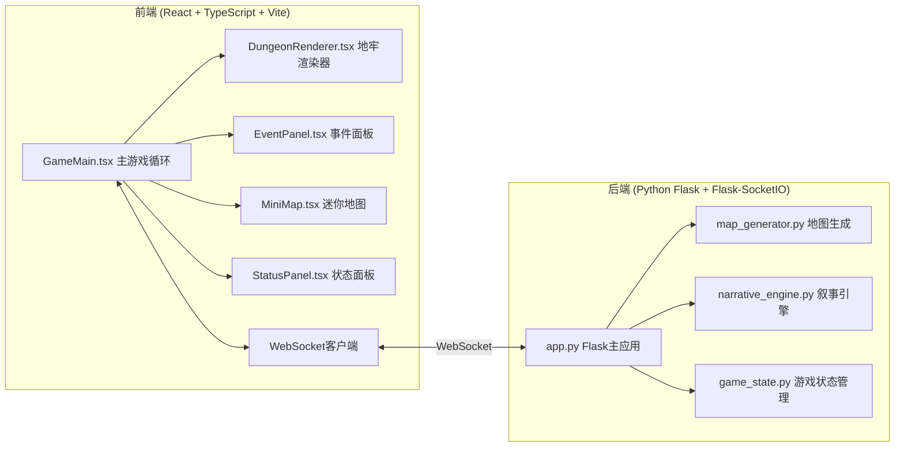
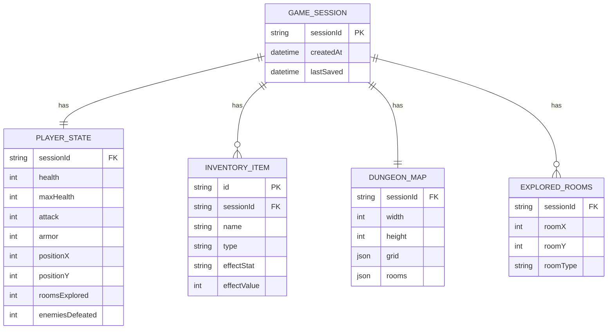

## 1. 架构设计



## 2. 技术说明

### 前端技术栈
- **框架**：React 18 + TypeScript
- **构建工具**：Vite 5
- **WebSocket**：socket.io-client
- **HTTP客户端**：axios
- **渲染**：Canvas 2D API
- **状态管理**：React useState/useReducer（轻量级游戏状态）

### 后端技术栈
- **Web框架**：Flask 3
- **WebSocket**：Flask-SocketIO
- **算法**：随机漫步+房间生长算法（地图生成）、模板匹配+加权随机（叙事生成）
- **存储**：内存存储（以Session ID为key的游戏状态字典）

## 3. 前端目录结构

```
frontend/
├── src/
│   ├── GameMain.tsx        # 主游戏组件，协调各模块
│   ├── DungeonRenderer.tsx # Canvas地牢渲染器
│   ├── EventPanel.tsx      # 事件面板组件
│   ├── MiniMap.tsx         # 迷你地图组件
│   ├── StatusPanel.tsx     # 玩家状态面板
│   ├── types/
│   │   └── game.ts         # TypeScript类型定义
│   ├── hooks/
│   │   └── useGameLoop.ts  # 游戏循环Hook
│   └── utils/
│       └── socket.ts       # WebSocket工具
├── package.json
├── vite.config.js
├── tsconfig.json
└── index.html
```

## 4. 后端目录结构

```
backend/
├── app.py              # Flask主应用，路由和WebSocket管理
├── map_generator.py    # 地牢地图生成模块
├── narrative_engine.py # 叙事引擎模块
├── game_state.py       # 游戏状态管理
└── requirements.txt    # Python依赖
```

## 5. API 定义

### 5.1 REST API

| 方法 | 路径 | 描述 |
|------|------|------|
| POST | /api/game/init | 初始化新游戏，返回session ID和初始地图 |
| GET | /api/game/state/:sessionId | 获取当前游戏状态 |
| POST | /api/game/save | 保存游戏状态 |

### 5.2 WebSocket 事件

| 事件名 | 方向 | 描述 |
|--------|------|------|
| player_move | 客户端→服务端 | 玩家移动指令 (direction) |
| room_entered | 服务端→客户端 | 进入新房间，返回房间信息和事件 |
| event_choice | 客户端→服务端 | 玩家选择事件选项 |
| event_result | 服务端→客户端 | 事件结果，更新玩家状态 |
| combat_update | 服务端→客户端 | 战斗过程更新 |
| game_state_sync | 服务端→客户端 | 游戏状态同步 |

### 5.3 TypeScript 类型定义

```typescript
interface Position {
  x: number;
  y: number;
}

interface Room {
  id: string;
  type: 'start' | 'end' | 'combat' | 'treasure' | 'event' | 'trap' | 'corridor';
  position: Position;
  size: { width: number; height: number };
  explored: boolean;
  doors: Position[];
}

interface PlayerState {
  health: number;
  maxHealth: number;
  attack: number;
  armor: number;
  inventory: Item[];
  position: Position;
  roomsExplored: number;
  enemiesDefeated: number;
}

interface Item {
  id: string;
  name: string;
  type: 'weapon' | 'potion' | 'armor';
  effect: { stat: string; value: number };
}

interface GameEvent {
  id: string;
  roomType: string;
  narrative: string;
  npcName?: string;
  npcAvatar?: string;
  choices: EventChoice[];
}

interface EventChoice {
  id: string;
  text: string;
  outcome: EventOutcome;
}

interface EventOutcome {
  healthChange?: number;
  attackChange?: number;
  armorChange?: number;
  itemGain?: Item;
  narrative: string;
}

interface DungeonMap {
  width: number;
  height: number;
  grid: string[][];
  rooms: Room[];
  startRoom: Position;
  endRoom: Position;
}
```

## 6. 数据模型

### 6.1 游戏状态数据模型



## 7. 核心算法说明

### 7.1 地牢生成算法
1. 在20x20网格中随机放置起始房间（左上角）和终点房间（右下角）
2. 使用随机漫步算法从起始房间开始生成走廊
3. 在走廊末端随机生成房间，使用房间生长算法扩展房间大小
4. 确保至少20个可探索房间，4种房间类型均匀分布
5. 标记每个房间的类型和颜色

### 7.2 叙事生成算法
1. 根据当前房间类型选择叙事模板库
2. 读取玩家历史行为（已探索房间数、击败敌人数、携带道具）
3. 根据历史行为加权选择叙事变体（如多次战斗后NPC语气变化）
4. 生成1-2个选项，每个选项关联不同的结果
5. 选项结果影响后续事件概率分布和角色属性

## 8. 性能优化

- Canvas使用requestAnimationFrame实现60FPS游戏循环
- 仅重绘视口内的地图区域，避免全图重绘
- 角色移动使用插值动画，0.2秒平滑过渡
- WebSocket事件使用二进制或JSON压缩（如需要）
- 后端游戏状态使用内存缓存，避免磁盘IO
