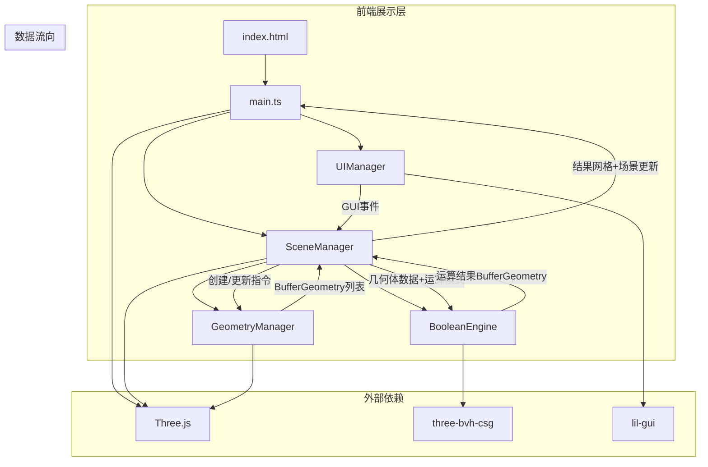

## 1. 架构设计



## 2. 技术说明

- 前端：TypeScript + Three.js + Vite
- 构建工具：Vite（端口3000，开启sourcemap）
- CSG运算：three-bvh-csg库
- UI控制：lil-gui
- 无后端，纯前端应用

## 3. 文件结构与职责

| 文件路径 | 职责 | 调用关系 |
|----------|------|----------|
| package.json | 项目依赖与脚本 | 入口 |
| vite.config.js | 构建配置，端口3000，sourcemap | 被vite使用 |
| tsconfig.json | TypeScript严格模式，moduleResolution=bundler | 被tsc使用 |
| index.html | 入口页面，全屏CSS，挂载div | 加载main.ts |
| src/main.ts | 应用入口，初始化场景/相机/渲染器，实例化SceneManager | 调用SceneManager |
| src/scene/SceneManager.ts | 场景管理核心，协调GeometryManager与BooleanEngine | 调用GeometryManager, BooleanEngine, UIManager |
| src/geometry/GeometryManager.ts | 几何体管理，添加/删除/移动基础几何体 | 被SceneManager调用，返回BufferGeometry |
| src/engine/BooleanEngine.ts | 布尔运算引擎，封装three-bvh-csg | 被SceneManager调用，返回运算结果 |
| src/ui/UIManager.ts | lil-gui界面管理，参数面板 | 监听GUI事件，调用SceneManager |

## 4. 数据流向

```
用户操作 → UIManager(GUI事件) → SceneManager
  → GeometryManager(创建/更新几何体) → BufferGeometry列表
  → BooleanEngine(CSG运算) → 运算结果BufferGeometry
  → SceneManager(更新场景：结果网格+半透明原始体) → 渲染
```

## 5. 关键技术实现

### 5.1 CSG布尔运算
- 使用three-bvh-csg库的SUBTRACTION、INTERSECTION、ADDITION操作
- 输入：两个BufferGeometry + 运算模式
- 输出：运算后的BufferGeometry

### 5.2 几何体管理
- 支持类型：SphereGeometry、BoxGeometry、CylinderGeometry
- 每个几何体存储：类型、位置(x,y,z)、尺寸、变换矩阵、材质引用
- 选中状态：运算对象A/B高亮青色(0.4透明度)，未选中暗淡(0.15透明度)，默认蓝色(0.3透明度)

### 5.3 运算历史回退
- 最多保存5步历史
- 每步记录：运算前的几何体状态和结果网格
- 回退时恢复原始几何体半透明蓝色状态，清除结果网格

### 5.4 OBJ导出
- 将运算结果网格的顶点、面法线、UV数据按Wavefront OBJ格式写入字符串
- 文件名格式：boolean_result_YYYYMMDD_HHmmss.obj
- 通过Blob生成文件并触发浏览器下载

### 5.5 动画效果
- 结果网格：从中心缩放0→1展开，0.6秒ease-out缓动
- 脉冲光效：环境光瞬间增强至1.5倍再回落到0.5倍
- 拖拽光晕：被拖拽几何体跟随点光源(强度2.0, 白色)
