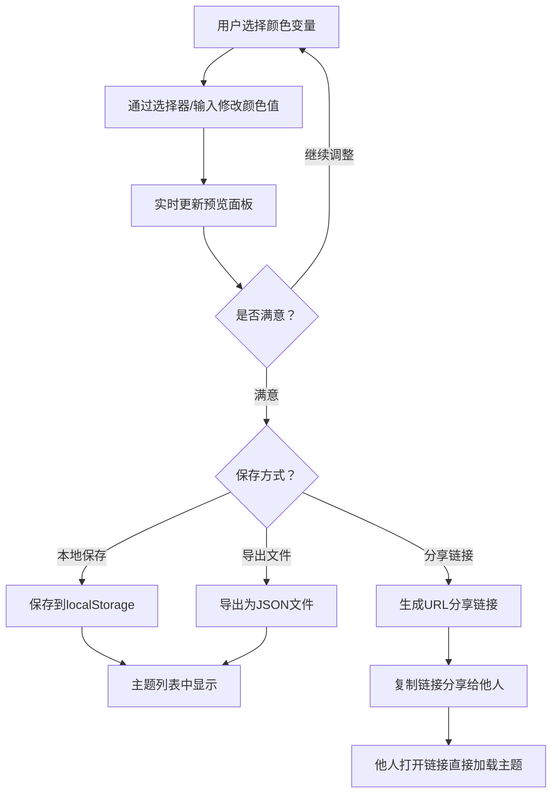

## 1. 产品概述

Color Theme Studio 是一款在线CSS颜色主题生成与预览工具，面向前端开发者、UI设计师及团队协作场景。用户可自由创建、编辑、保存和分享自定义颜色主题，并在模拟的UI组件中实时预览效果，大幅提升设计系统构建效率。

- 解决设计系统中颜色主题定义与预览割裂的问题，实现"所见即所得"的主题编辑体验
- 目标用户：前端开发者、UI设计师、产品团队，市场价值在于提升设计一致性与团队协作效率

## 2. 核心功能

### 2.1 用户角色

| 角色 | 注册方式 | 核心权限 |
|------|----------|----------|
| 普通用户 | 无需注册 | 创建、编辑、保存、导出、分享主题 |

### 2.2 功能模块

1. **主题编辑器**：10个关键颜色变量编辑（primary、secondary、accent、background、surface、textPrimary、textSecondary、error、success、warning），支持颜色选择器、HEX/RGB/HSL手动输入、色板拖拽排序
2. **实时预览面板**：6种UI组件实时预览（主按钮、次要按钮、卡片、输入框、标签、进度条），4种交互状态（正常、悬停、点击、禁用），暗色/亮色模式切换
3. **主题管理器**：保存/加载/重命名/删除主题（localStorage），导出/导入JSON文件，URL分享主题

### 2.3 页面详情

| 页面名称 | 模块名称 | 功能描述 |
|----------|----------|----------|
| 主页面 | 主题编辑区（左侧40%） | 色板展示与拖拽排序、颜色选择器、HEX/RGB/HSL输入框 |
| 主页面 | 实时预览区（右侧60%） | 6种UI组件预览、4种交互状态、暗色/亮色切换 |
| 主页面 | 主题管理器 | 保存主题卡片列表、导入/导出按钮、分享链接生成 |

## 3. 核心流程

1. 用户在左侧编辑区选择颜色变量，通过颜色选择器或手动输入修改颜色值
2. 修改后实时反映到右侧预览面板的UI组件中
3. 用户满意后可保存主题到localStorage，导出为JSON文件，或生成分享链接

## 4. 用户界面设计

### 4.1 设计风格

- 主色：由用户自定义的主题色驱动，默认使用柔和蓝紫色调
- 按钮风格：16px圆角，柔和盒阴影，点击时scale(0.97)按下效果
- 字体：Inter，14-18px层级分明
- 布局：左右分栏（40%/60%），卡片式设计
- 图标：使用lucide-react图标库

### 4.2 页面设计概览

| 页面名称 | 模块名称 | UI元素 |
|----------|----------|--------|
| 主页面 | 主题编辑区 | 色板网格（可拖拽排序）、Chrome风格颜色选择器、HEX/RGB/HSL切换输入、颜色预览块 |
| 主页面 | 实时预览区 | 主按钮、次要按钮、卡片组件、输入框、标签、进度条；暗色/亮色切换开关；背景色随background变量变化 |
| 主页面 | 主题管理器 | 主题保存按钮、主题卡片列表（含名称、时间、色块缩略）、导入/导出按钮、分享链接复制按钮 |

### 4.3 响应式设计

- 桌面优先：左右分栏布局（40%/60%）
- 平板（768px以下）：上下排列，编辑区在上，预览区在下
- 手机：单列布局，组件纵向堆叠
- 触摸优化：拖拽排序支持触摸操作，按钮点击区域不小于44px

### 4.4 动画与交互

- 状态切换过渡：0.3秒 ease-out
- 主题切换颜色渐变：0.5秒
- 按钮按下效果：scale(0.97)
- 拖拽时半透明占位指示
- 卡片hover时阴影增强
