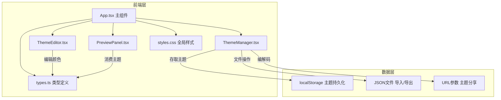
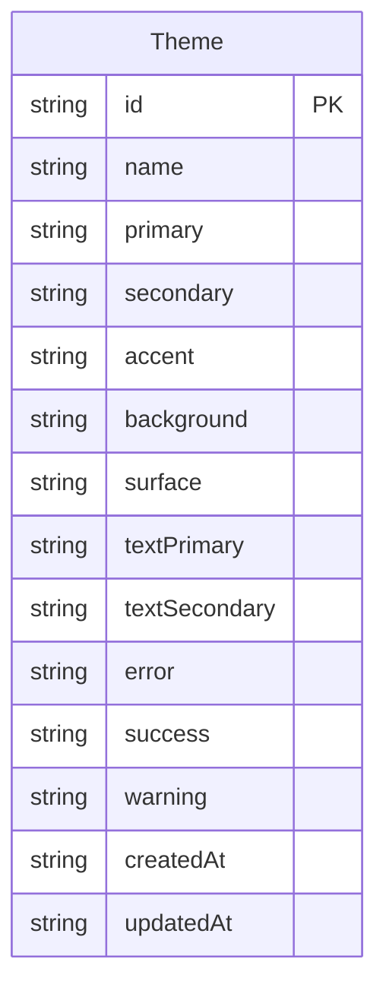

## 1. 架构设计



## 2. 技术说明

- 前端：React@18 + TypeScript + Vite
- 初始化工具：vite-init
- 颜色选择器：react-color（ChromePicker）
- 文件操作：file-saver（导出JSON）
- 状态管理：React useState + useCallback（状态提升至App.tsx）
- 数据持久化：localStorage
- 主题分享：URL Base64编码
- 无后端

## 3. 路由定义

| 路由 | 用途 |
|------|------|
| / | 主页面，包含编辑器、预览、管理器 |
| /?theme=<base64> | 通过URL参数加载分享的主题 |

## 4. 数据模型

### 4.1 数据模型定义



### 4.2 核心接口定义

```typescript
interface ThemeColors {
  primary: string
  secondary: string
  accent: string
  background: string
  surface: string
  textPrimary: string
  textSecondary: string
  error: string
  success: string
  warning: string
}

interface Theme extends ThemeColors {
  id: string
  name: string
  createdAt: string
  updatedAt: string
}

enum ComponentState {
  Normal = 'normal',
  Hover = 'hover',
  Active = 'active',
  Disabled = 'disabled'
}
```

## 5. 关键实现细节

### 5.1 颜色选择器
- 使用 react-color 的 ChromePicker 组件
- 支持 HEX、RGB、HSL 三种输入模式切换
- 编辑后通过回调实时更新父组件状态

### 5.2 色板拖拽排序
- 使用 HTML5 Drag and Drop API 实现色板拖拽排序
- 拖拽时显示半透明占位符
- 排序后更新主题颜色变量的映射关系

### 5.3 实时预览
- 预览面板通过CSS自定义属性（CSS Variables）应用主题颜色
- 组件状态切换使用 CSS transition: all 0.3s ease-out
- 主题切换使用 CSS transition: all 0.5s

### 5.4 主题管理
- localStorage 键名：`color-theme-studio-themes`
- 导出JSON包含完整颜色值和元数据（名称、创建时间）
- 导入时验证数据结构，不符则提示"无效的主题文件"

### 5.5 URL分享
- 将ThemeColors对象JSON.stringify后btoa编码为base64
- 附在URL ?theme= 参数后
- 页面加载时检查URL参数，有则自动解码加载主题

### 5.6 性能优化
- 使用 React.useMemo 缓存主题颜色计算结果
- 使用 CSS Variables 避免组件重新渲染
- 颜色更新通过CSS变量直接生效，无需React重渲染预览组件
