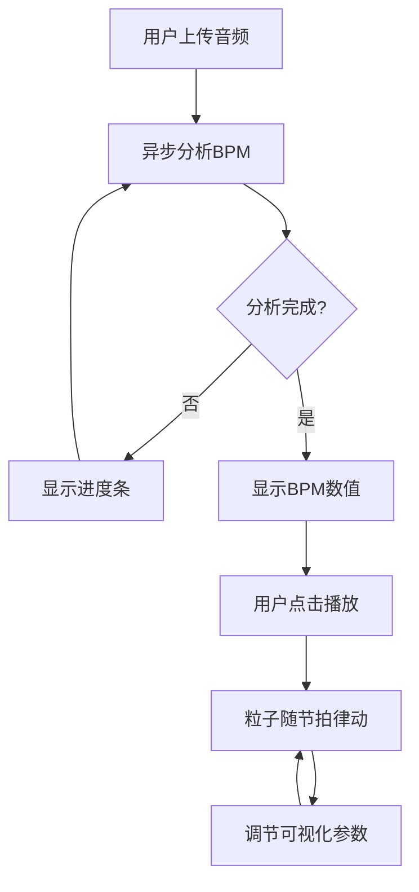

## 1. 产品概述

在线音乐可视化节拍器是一款基于 Web 的音乐可视化工具，用户上传音频文件后，系统自动分析 BPM 并生成随节拍律动的 3D 粒子动画，为音乐爱好者、DJ 和视觉创作者提供沉浸式的音乐可视化体验。

## 2. 核心功能

### 2.1 功能模块
1. **音频上传与分析**：支持 MP3/WAV 格式，自动计算 BPM，显示分析进度
2. **3D 粒子可视化**：Three.js 渲染，1000-3000 粒子，节拍驱动爆发动画
3. **控制面板**：调节粒子强度、大小、背景色、播放速度
4. **播放控制**：播放/暂停/重置，进度条显示
5. **BPM 展示**：顶部显示 BPM 数值，圆形进度环展示节拍强度

### 2.2 页面详情
| 页面名称 | 模块名称 | 功能描述 |
|---------|---------|---------|
| 主页面 | 音频上传区 | 拖拽或点击上传 MP3/WAV 文件（≤10MB） |
| 主页面 | BPM 显示区 | 顶部展示 BPM 数值（两位小数）+ 圆形强度环 |
| 主页面 | 3D 场景区 | Three.js 粒子动画主展示区 |
| 主页面 | 控制面板 | 右侧可折叠面板，调节可视化参数 |
| 主页面 | 播放控件 | 底部播放/暂停/重置 + 进度条 |

## 3. 核心流程

用户上传音频文件 → 系统异步分析 BPM（显示进度） → 分析完成显示 BPM → 用户点击播放 → 粒子随节拍律动 → 用户通过控制面板调节效果

## 4. 用户界面设计

### 4.1 设计风格
- **主色调**：深邃黑 (#0a0a1a) 背景，粒子蓝橙渐变 (HSL 220°→30°)
- **辅色调**：5 种预设背景色板（深邃黑、星空紫、海洋蓝、极光绿、暖阳橙）
- **材质**：毛玻璃半透明效果，1px 白色边框 (rgba(255,255,255,0.1))，12px 圆角
- **字体**：现代无衬线字体，数字使用等宽字体增强科技感
- **布局**：右侧固定控制面板 (320px)，主场景自适应，底部居中播放控件
- **动效**：按钮悬停缩放 1.1 倍 (0.3s ease-out)，参数平滑过渡 (<0.2s)

### 4.2 页面设计概览
| 页面名称 | 模块名称 | UI 元素 |
|---------|---------|--------|
| 主页面 | BPM 显示区 | 大号数字 + 圆形进度环动画 |
| 主页面 | 3D 场景区 | 全屏粒子动画，深色背景 |
| 主页面 | 控制面板 | 毛玻璃面板，滑块/色板/按钮，可折叠 |
| 主页面 | 播放控件 | 半透明条，环形渐变图标按钮 |

### 4.3 响应式设计
- 桌面端优先，最小宽度 800px
- 宽度低于 800px 时控制面板自动折叠为悬浮按钮
- 3D 场景自适应容器尺寸

### 4.4 3D 场景指引
- **环境**：深色背景，无 HDRI，突出粒子效果
- **光照**：粒子自发光，无需额外光源
- **相机**：PerspectiveCamera，固定视角，粒子在视野中心
- **粒子系统**：1000-3000 个粒子，每拍从中心爆发，带拖尾效果
- **动画**：爆发缩放 (0.5→2.5)，颜色渐变 (蓝→橙)，拖尾透明度衰减
- **性能目标**：60 FPS，单次节拍动画计算 ≤ 8ms
