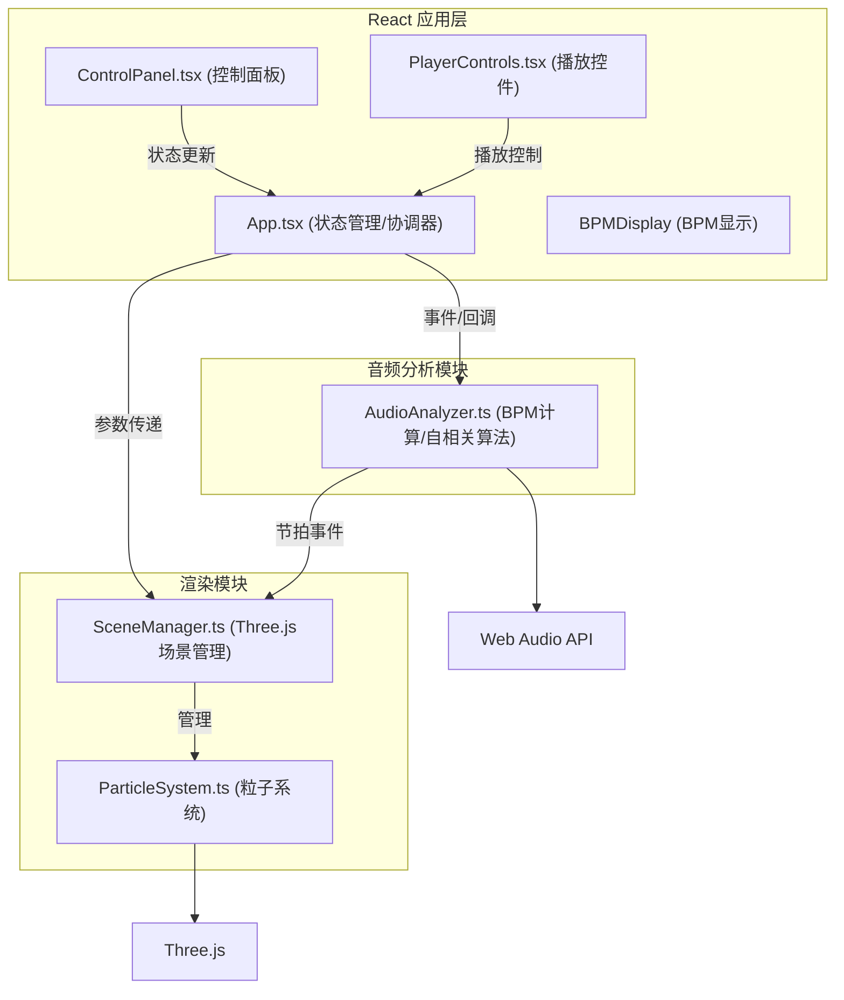

## 1. 架构设计



## 2. 技术栈说明

- **前端框架**：React@18 + TypeScript
- **构建工具**：Vite@5
- **3D 渲染**：Three.js + @types/three
- **音频处理**：Web Audio API（浏览器原生）
- **样式方案**：原生 CSS + CSS 变量（深色主题）
- **状态管理**：React Hooks (useState, useEffect, useRef)
- **包管理器**：npm

## 3. 文件结构

```
project/
├── package.json
├── vite.config.js
├── tsconfig.json
├── index.html
├── src/
│   ├── main.tsx          # React 入口
│   ├── App.tsx           # 主应用组件
│   ├── styles.css        # 全局样式
│   ├── audio/
│   │   └── AudioAnalyzer.ts   # 音频分析模块
│   ├── renderer/
│   │   ├── SceneManager.ts    # 场景管理
│   │   └── ParticleSystem.ts  # 粒子系统
│   └── components/
│       ├── ControlPanel.tsx   # 控制面板
│       └── PlayerControls.tsx # 播放控件
```

## 4. 模块接口定义

### 4.1 AudioAnalyzer 接口

```typescript
interface BeatInfo {
  time: number;          // 节拍时间点（秒）
  intensity: number;     // 节拍强度 (0-1)
}

interface BPMResult {
  bpm: number;           // BPM 值（两位小数）
  beats: BeatInfo[];     // 所有节拍点
  duration: number;      // 音频总时长
}

interface AudioAnalyzerCallbacks {
  onProgress: (percent: number) => void;
  onComplete: (result: BPMResult) => void;
  onError: (error: Error) => void;
}

class AudioAnalyzer {
  constructor(callbacks: AudioAnalyzerCallbacks);
  analyze(buffer: ArrayBuffer): Promise<void>;
  getAudioBuffer(): AudioBuffer | null;
}
```

### 4.2 SceneManager 接口

```typescript
interface ParticleParams {
  count: number;           // 粒子数量 (1000-3000)
  intensity: number;       // 爆发强度 (0.5-2.0)
  sizeMin: number;         // 最小尺寸 (0.1-5.0)
  sizeMax: number;         // 最大尺寸 (0.1-5.0)
  bgColor: string;         // 背景色
  speed: number;           // 动画倍速 (0.5/1/1.5/2)
}

class SceneManager {
  constructor(container: HTMLElement);
  setParams(params: Partial<ParticleParams>): void;
  triggerBeat(intensity: number): void;
  update(time: number): void;
  resize(): void;
  dispose(): void;
}
```

## 5. 核心算法

### 5.1 BPM 检测（自相关算法）
1. 从 AudioBuffer 获取单声道波形数据
2. 对信号进行分帧处理（帧长 1024，重叠 50%）
3. 对每一帧计算自相关函数
4. 寻找自相关峰值对应的延迟时间
5. 将延迟转换为 BPM 并统计众数
6. 输出 BPM 值及各节拍点强度

### 5.2 粒子动画
1. 每拍触发时：粒子从中心向外爆发
2. 爆发强度影响粒子速度和缩放比例
3. 颜色插值：HSL 220°(蓝) → 30°(橙)
4. 拖尾效果：粒子位置历史记录 + 透明度线性衰减 (0.8→0, 0.3s)
5. 爆发后缓慢回缩到中心位置

## 6. 性能优化策略

- 使用 BufferGeometry 而非 Geometry 提升粒子性能
- 粒子位置/颜色数据存 TypedArray，单次 draw call
- 节拍事件驱动而非每帧计算，降低 CPU 开销
- requestAnimationFrame 调度渲染循环
- 粒子拖尾使用顶点颜色 alpha 渐变，无需额外几何体
