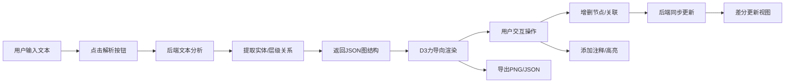

## 1. 产品概述

智能交互式思维导图应用，帮助学习者将长篇章节文本快速转化为彩色高亮、可折叠注释的交互式思维导图，解决阅读理解中逻辑脉络梳理困难、手动笔记耗时的痛点。

- **核心目标**：自动化文本结构提取 + 可视化思维导航 + 深度注释关联
- **目标用户**：学生、研究员、知识工作者等需要深度阅读长文本的学习者
- **产品价值**：将传统线性阅读转化为可视化的交互式知识图谱，提升学习效率30%以上

## 2. 核心功能

### 2.1 用户角色

| 角色 | 注册方式 | 核心权限 |
|------|----------|----------|
| 学习者 | 无需注册，本地使用 | 文本解析、导图编辑、导出保存 |

### 2.2 功能模块

1. **主界面**：左右分栏布局，文本输入区 + 思维导图画布
2. **文本解析模块**：支持拖拽/粘贴文本，一键解析生成节点与边
3. **思维导图渲染模块**：D3力导向布局，动态节点大小，彩色分类
4. **节点交互模块**：点击查看详情，拖拽创建关联，右键菜单操作
5. **注释编辑模块**：Markdown注释，折叠展开，原文高亮关联
6. **导出模块**：PNG高清导出，JSON结构化导出

### 2.3 页面详情

| 页面名称 | 模块名称 | 功能描述 |
|----------|----------|----------|
| 主应用页 | 文本输入区 | 支持拖拽txt文件、粘贴文本，字数统计(≤10000字)，解析按钮 |
| 主应用页 | 层级树状列表 | 左侧30%宽度，节点卡片缩进展示，悬停渐变，搜索过滤，点击联动定位 |
| 主应用页 | 思维导图画布 | D3力导向布局，节点圆形(20-60px动态半径)，贝塞尔曲线连接，滚轮缩放(0.3-3x) |
| 主应用页 | 顶部工具栏 | 解析按钮、缩放滑块、重置布局按钮、导出按钮(PNG/JSON) |
| 主应用页 | 节点详情面板 | 毛玻璃效果浮层，原文高亮片段，Markdown注释编辑，关联拖拽按钮 |
| 主应用页 | 右键菜单 | 删除节点（缩小消失动画） |
| 主应用页 | 节点创建表单 | 空白区域点击弹出，输入标签和原文引用 |
| 主应用页 | 拖拽连线 | 跟随鼠标虚线引导，目标节点淡黄色光晕提示 |

## 3. 核心流程

用户输入章节文本 → 点击解析按钮 → 后端提取实体与层级关系 → 返回JSON图结构 → 前端渲染力导向思维导图 → 用户点击节点查看详情/添加注释 → 用户拖拽创建关联/增删节点 → 后端同步更新 → 用户导出PNG或JSON

## 4. 用户界面设计

### 4.1 设计风格

- **主色调**：深色主题背景 `#1a1a2e`，高对比度专业感
- **节点配色**：人物蓝色 `#3b82f6`、地点绿色 `#22c55e`、概念橙色 `#f97316`、事件红色 `#ef4444`
- **辅助色**：边线 `#8e8e93`，面板背景 `rgba(255,255,255,0.15)`，连接光晕 `#fde047`
- **按钮风格**：圆角8px，毛玻璃背景，悬停放大1.05倍，平滑过渡0.2s
- **字体**：标题使用现代几何无衬线字体，正文使用高可读性系统字体，字号14px基础
- **布局风格**：左右分栏卡片式布局，大量留白，圆角8px，细腻阴影
- **图标风格**：线性简洁图标，统一24px尺寸

### 4.2 页面设计概述

| 页面名称 | 模块名称 | UI元素 |
|----------|----------|--------|
| 主应用页 | 文本输入区 | 大圆角卡片，虚线边框拖拽提示，字数计数器，渐变解析按钮 |
| 主应用页 | 层级树状列表 | 缩进层级线条，彩色分类小圆点，搜索框发光边框，卡片悬停阴影 |
| 主应用页 | 思维导图画布 | 圆形节点带发光边缘，贝塞尔曲线，缩放浮标，选中光环动画 |
| 主应用页 | 顶部工具栏 | 毛玻璃效果，底部投影，渐变按钮，进度条动画 |
| 主应用页 | 节点详情面板 | 圆角12px，毛玻璃模糊，缩放弹出动画，可折叠分区 |
| 主应用页 | 右键菜单 | 圆角6px，渐变悬停背景，淡出动画 |

### 4.3 响应式设计

- **桌面优先**：1200px+ 标准左右分栏（30% / 70%）
- **平板适配**：768-1200px 左侧列表缩至25%，字体微调整
- **移动端**：<768px 左侧列表切换为抽屉面板，从左侧滑入/滑出（动画0.3s），右侧导图占满全屏，触摸手势支持双指缩放

### 4.4 动画规范

- **首次加载**：节点依次淡入（延迟100ms错开），边线依次绘制
- **选中节点**：外扩光环脉冲动画（半径扩大30%→恢复，持续1s）
- **面板弹出**：scale(0.9)→scale(1) + opacity 0→1，过渡0.3s cubic-bezier(0.4, 0, 0.2, 1)
- **节点删除**：scale + opacity 缩小消失，过渡0.3s
- **拖拽回弹**：弹性缓动函数，释放后0.2s平滑回位
- **悬停反馈**：scale(1.05) + 阴影加深，0.2s过渡
