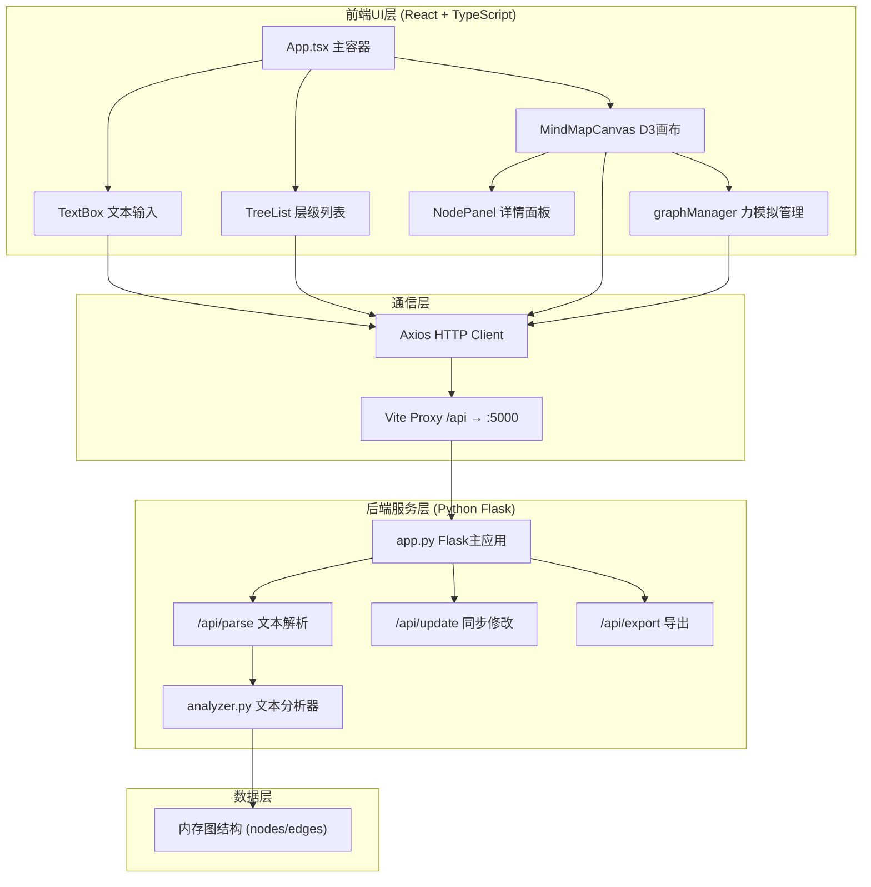
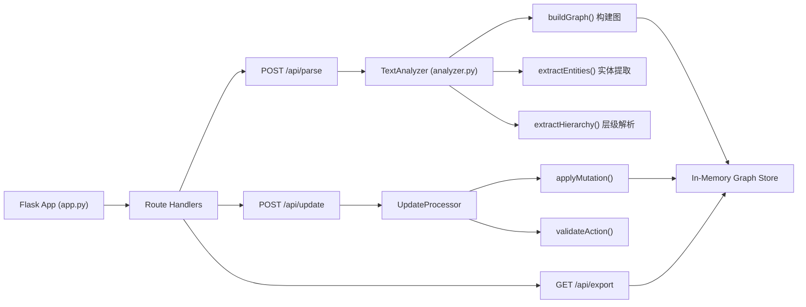
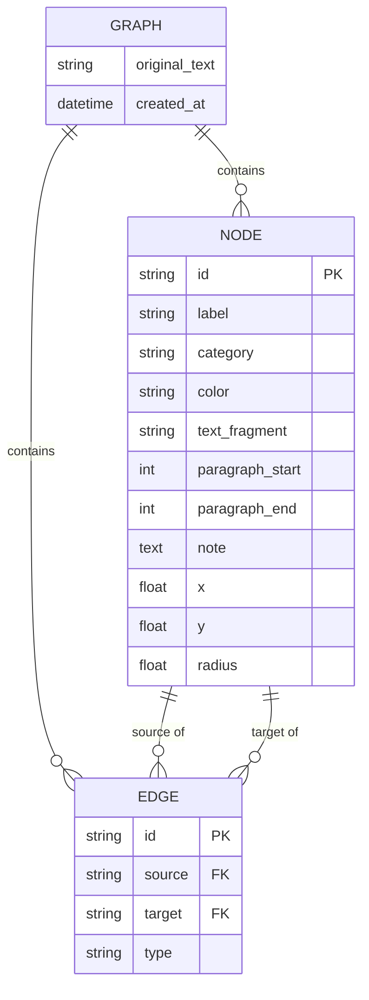

## 1. 架构设计



## 2. 技术说明

- **前端框架**：React@18 + TypeScript@5 + Vite@5
- **渲染引擎**：D3.js@7（力导向模拟、SVG渲染、缩放行为）
- **状态管理**：React useState/useRef + 自定义store（轻量级场景）
- **样式方案**：原生CSS Modules + CSS变量主题系统
- **Markdown渲染**：react-markdown
- **图像导出**：html2canvas
- **HTTP请求**：Axios
- **后端框架**：Flask@3 + Flask-CORS
- **文本分析**：基础NLP（正则匹配 + 关键词提取 + 标题层级解析）
- **开发工具**：Vite开发服务器 + 代理配置

## 3. 路由定义

| 路由 | 用途 |
|------|------|
| / | 主应用页面（单页应用，所有功能集成） |

## 4. API定义

### 4.1 TypeScript类型定义

```typescript
// 节点类型
interface GraphNode {
  id: string;
  label: string;
  category: 'person' | 'location' | 'concept' | 'event';
  color: string;
  textFragment: string;
  paragraphStart: number;
  paragraphEnd: number;
  note?: string;
  x?: number;
  y?: number;
  radius?: number;
}

// 边类型
interface GraphEdge {
  id: string;
  source: string;
  target: string;
  type: 'hierarchy' | 'causal' | 'manual';
}

// 图数据结构
interface GraphData {
  nodes: GraphNode[];
  edges: GraphEdge[];
  originalText: string;
}

// 解析请求
interface ParseRequest {
  text: string;
}

// 解析响应
interface ParseResponse {
  success: boolean;
  data: GraphData;
  message?: string;
}

// 更新请求
interface UpdateRequest {
  action: 'add_node' | 'delete_node' | 'add_edge' | 'update_note';
  payload: any;
}
```

### 4.2 接口规范

| 方法 | 路径 | 说明 | 请求体 | 响应 |
|------|------|------|--------|------|
| POST | /api/parse | 解析文本生成图结构 | `{ text: string }` | `ParseResponse` |
| POST | /api/update | 同步用户修改操作 | `UpdateRequest` | `{ success: boolean, data: GraphData }` |
| GET | /api/export | 导出JSON数据 | 查询参数 `format=json` | 下载JSON文件 |

## 5. 服务器架构图



## 6. 数据模型

### 6.1 数据模型定义



### 6.2 文件目录结构

```
项目根目录/
├── package.json          # 前端依赖与脚本
├── vite.config.js        # Vite构建配置（代理/api到5000）
├── tsconfig.json         # TypeScript严格模式配置
├── index.html            # HTML入口，设置CSS变量
├── src/
│   ├── main.tsx          # React入口
│   ├── App.tsx           # 主应用组件（左右分栏布局）
│   ├── index.css         # 全局样式与CSS变量主题
│   ├── components/
│   │   ├── TextBox.tsx       # 文本输入组件
│   │   ├── TreeList.tsx      # 层级树状列表组件
│   │   ├── MindMapCanvas.tsx # D3思维导图画布
│   │   └── NodePanel.tsx     # 节点详情浮动面板
│   ├── utils/
│   │   ├── graphManager.ts   # D3力模拟管理工具
│   │   ├── api.ts            # Axios API封装
│   │   └── types.ts          # 共享TypeScript类型
│   └── types/
│       └── index.ts          # 类型定义
└── backend/
    ├── app.py            # Flask主应用
    ├── analyzer.py       # 文本分析模块
    └── requirements.txt  # Python依赖
```
