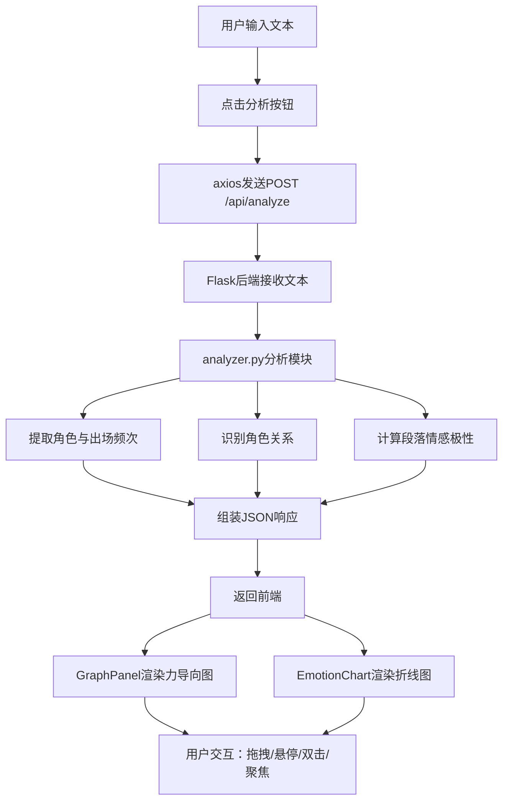

## 1. 产品概述

文学作品智能分析应用——为文学爱好者和学生提供一键式文本分析工具，自动提取角色、关系、情感脉络，并生成交互式角色关系图谱与情感变化折线图，解决阅读长篇小说时难以理清复杂人物关系和情绪走向的核心痛点。

## 2. 核心功能

### 2.1 用户角色

| 角色 | 注册方式 | 核心权限 |
|------|----------|----------|
| 普通用户 | 无需注册 | 输入文本、查看图谱、切换视图模式 |

### 2.2 功能模块

1. **主页面**：文本输入区、力导向关系图谱、情感折线图、视图模式控制

### 2.3 页面详情

| 页面名称 | 模块名称 | 功能描述 |
|----------|----------|----------|
| 主页面 | 文本输入与控制栏 | 文本框（限8000字）、分析按钮、视图模式切换（完整图谱/聚焦模式） |
| 主页面 | 角色关系图谱（左侧） | Cytoscape.js力导向图，节点=角色（直径=出场频次，颜色=阵营），边=关系（盟友/对立/爱慕/亲属），节点拖拽、悬停信息卡片、双击高亮子图 |
| 主页面 | 情感折线图（右侧） | Recharts折线图，横轴=段落序号，纵轴=情感得分(-1~1)，每角色一条线（颜色与图谱节点一致），悬停联动高亮图谱节点 |

## 3. 核心流程

用户输入文学作品文本 → 点击"分析" → 前端通过axios发送文本至Flask后端 → 后端分析模块提取角色、关系、情感 → 返回JSON → 前端渲染力导向图和折线图 → 用户可拖拽节点、悬停查看信息、双击高亮子图、切换视图模式

## 4. 用户界面设计

### 4.1 设计风格

- **主色调**：深色主题背景 #1a1a2e，面板磨砂半透明 rgba(255,255,255,0.05)
- **辅色调**：冷色系 #00d2ff（坐标轴、交互元素），霓虹辉光效果按钮
- **按钮风格**：霓虹辉光（box-shadow + transition），圆角矩形
- **字体**：正文使用系统中文字体栈，标题使用等宽字体凸显科技感
- **布局**：桌面端左右分栏（图谱60% + 折线图40%），移动端上下堆叠
- **动效**：节点弹性弹簧拖拽、连线渐变出现、hover 1.1倍放大、150ms响应

### 4.2 页面设计概览

| 页面名称 | 模块名称 | UI元素 |
|----------|----------|--------|
| 主页面 | 文本输入控制栏 | 深色文本框、霓虹辉光分析按钮、模式切换按钮组 |
| 主页面 | 力导向图谱区 | 网格线背景、径向渐变光晕、彩色圆形节点（直径=频次）、多色多线型边、悬停信息卡片 |
| 主页面 | 情感折线图区 | 冷色坐标轴#00d2ff、渐变填充区域、多色折线（与节点同色）、悬停tooltip |

### 4.3 响应式设计

- **≥1200px**：左右分栏布局，图谱占60%宽度，折线图占40%宽度
- **768px~1200px**：左右分栏但比例调整
- **<768px**：上下堆叠布局，图谱在上折线图在下，控制栏在顶部

### 4.4 关系类型视觉编码

| 关系类型 | 颜色 | 线型 |
|----------|------|------|
| 盟友 | 绿色 | 实线 |
| 对立 | 红色 | 虚线 |
| 爱慕 | 粉色 | 点线 |
| 亲属 | 蓝色 | 实线 |
