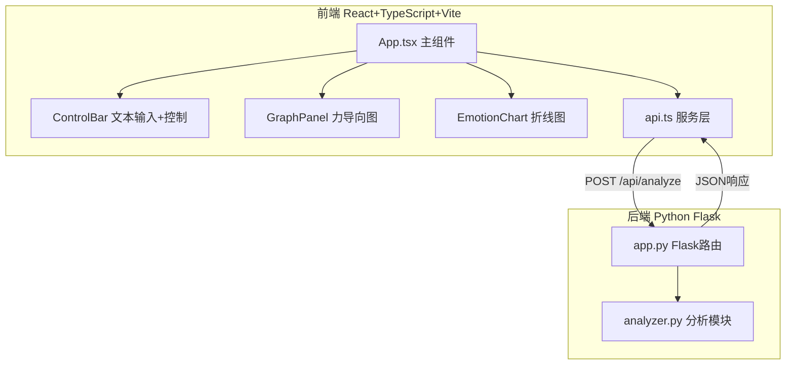
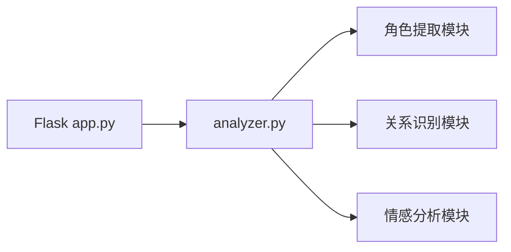

## 1. 架构设计



## 2. 技术说明

- **前端**：React 18 + TypeScript + Vite（端口5173）
- **构建工具**：Vite
- **后端**：Python Flask（端口5000）
- **数据库**：无（纯分析工具，无持久化需求）
- **核心依赖**：cytoscape.js（力导向图）、recharts（折线图）、axios（HTTP请求）、@tweenjs/tween.js（动画）、flask-cors（跨域）

## 3. 路由定义

| 路由 | 用途 |
|------|------|
| / | 主页面，包含文本输入、图谱和折线图 |

## 4. API定义

### POST /api/analyze

**请求体**：
```typescript
interface AnalyzeRequest {
  text: string;
}
```

**响应体**：
```typescript
interface AnalyzeResponse {
  nodes: Array<{
    id: string;
    name: string;
    color: string;
    frequency: number;
    emotionScores: number[];
  }>;
  edges: Array<{
    source: string;
    target: string;
    relationType: 'ally' | 'oppose' | 'love' | 'kin';
  }>;
  emotionTimeSeries: Array<{
    paragraphIndex: number;
    characterEmotions: Record<string, number>;
  }>;
}
```

## 5. 服务器架构图



## 6. 数据模型

### 6.1 数据模型定义

本应用为纯分析工具，无数据库持久化。数据流经API传输，前端状态由React组件管理。

### 6.2 文件结构

```
├── package.json
├── index.html
├── vite.config.js
├── tsconfig.json
├── src/
│   ├── main.tsx
│   ├── App.tsx
│   ├── services/
│   │   └── api.ts
│   └── components/
│       ├── GraphPanel.tsx
│       ├── EmotionChart.tsx
│       └── ControlBar.tsx
└── backend/
    ├── app.py
    └── analyzer.py
```
