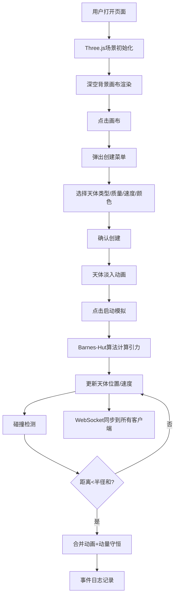

## 1. 产品概述

本项目是一个基于重力模拟的2D银河系沙盒演化系统，用户可以在画布上创建恒星、行星和黑洞，实时观察它们在万有引力作用下的N体模拟运动，体验星系形成的动态过程。

- 核心目的：提供一个交互式的宇宙模拟沙盒，让用户直观理解引力作用和星系演化
- 目标用户：天文爱好者、物理学习者、互动艺术创作者
- 市场价值：融合教育与娱乐，提供沉浸式的宇宙物理模拟体验

## 2. 核心功能

### 2.1 用户角色

| 角色 | 注册方式 | 核心权限 |
|------|----------|----------|
| 普通用户 | 无需注册 | 创建天体、控制模拟、观察演化、多客户端同步 |

### 2.2 功能模块

1. **主画布区域**：Three.js渲染的2D宇宙模拟画布，支持拖拽平移和滚轮缩放
2. **天体创建菜单**：点击画布弹出，可选择天体类型、设置质量、速度和颜色
3. **信息面板**：右侧实时显示选中天体的坐标、速度矢量和质量
4. **事件日志**：左侧记录天体合并等重要事件，带时间戳
5. **控制面板**：启动/暂停模拟按钮，重置功能
6. **后端同步服务**：WebSocket实时广播模拟状态到多个客户端

### 2.3 页面详情

| 页面名称 | 模块名称 | 功能描述 |
|----------|----------|----------|
| 主页面 | 宇宙画布 | Three.js渲染2000x2000视口的天体模拟，支持缩放(0.1-10倍)、拖拽平移 |
| 主页面 | 创建菜单 | 点击弹出，选择天体类型(恒星/行星/黑洞)、质量滑块(1-1000)、速度方向+速率、颜色选择器 |
| 主页面 | 信息面板 | 右侧半透明面板，实时显示选中天体的坐标(x,y)、速度矢量(vx,vy)、质量 |
| 主页面 | 事件日志 | 左侧毛玻璃面板，记录合并事件(时间戳+天体名称) |
| 主页面 | 控制按钮 | 星际蓝风格的启动/暂停按钮，控制模拟状态 |

## 3. 核心流程

用户打开页面 → 看到深空背景画布 → 点击画布任意位置 → 弹出生成菜单 → 选择天体类型并设置参数 → 点击确认 → 天体淡入动画出现 → 点击启动模拟 → 天体在引力作用下运动 → 距离过近触发合并 → 粒子爆裂动画 → 事件日志新增记录 → 所有客户端通过WebSocket实时同步

## 4. 用户界面设计

### 4.1 设计风格

- **主色调**：深空暗色调背景 `#0a0a2e`
- **强调色**：星际蓝 `#4fc3f7` 用于标题、按钮、边框
- **面板样式**：半透明毛玻璃效果 `backdrop-filter: blur(8px)`，背景 `rgba(10,10,46,0.7)`，边框 `1px solid rgba(79,195,247,0.3)`
- **天体效果**：微弱光晕 + 基于sin函数的脉冲发光动画，悬停放大1.2倍并显示名称标签
- **字体**：使用现代科幻风格无衬线字体，标题加粗带发光效果
- **动画**：天体创建淡入、合并粒子爆裂、悬停缩放、按钮状态过渡

### 4.2 页面设计概述

| 页面名称 | 模块名称 | UI元素 |
|----------|----------|--------|
| 主页面 | 宇宙画布 | 2000x2000视口，深蓝渐变背景，星点粒子，正交相机 |
| 主页面 | 创建菜单 | 模态弹窗，星际蓝边框，滑块控件，颜色选择器，方向箭头 |
| 主页面 | 信息面板 | 右侧固定，毛玻璃效果，实时数据更新， monospace字体显示数值 |
| 主页面 | 事件日志 | 左侧固定，滚动列表，时间戳+事件描述，最新记录高亮 |
| 主页面 | 控制按钮 | 顶部居中，圆角按钮，悬停发光，启动/暂停状态切换 |

### 4.3 响应式设计

- **桌面优先**：最小宽度1024px，最大宽度1920px
- **画布自适应**：根据窗口尺寸调整渲染区域，保持视口比例
- **面板位置**：左右面板固定宽度，中间画布弹性缩放
- **触控优化**：支持双指缩放、长按创建天体

### 4.4 2D场景指导

- **背景**：深空蓝黑渐变 `#0a0a2e` 到 `#050518`，叠加随机星点粒子层
- **光晕效果**：每个天体使用Sprite + 径向渐变纹理实现发光效果
- **粒子系统**：合并时发射20-30个粒子，颜色为两天体颜色平均值，向外扩散后淡出
- **脉冲动画**：使用ShaderMaterial，基于时间 uniforms 控制发光强度 `sin(time * 2) * 0.3 + 0.7`
- **性能优化**：使用BufferGeometry批量渲染天体，四叉树空间划分减少计算量

## 5. 性能要求

- **最大天体数**：500个天体同时模拟
- **帧率要求**：不低于30FPS
- **响应延迟**：合并/创建操作后界面更新延迟不超过50毫秒
- **算法优化**：Barnes-Hut四叉树加速，复杂度O(n log n)
- **模拟步长**：固定0.005秒
