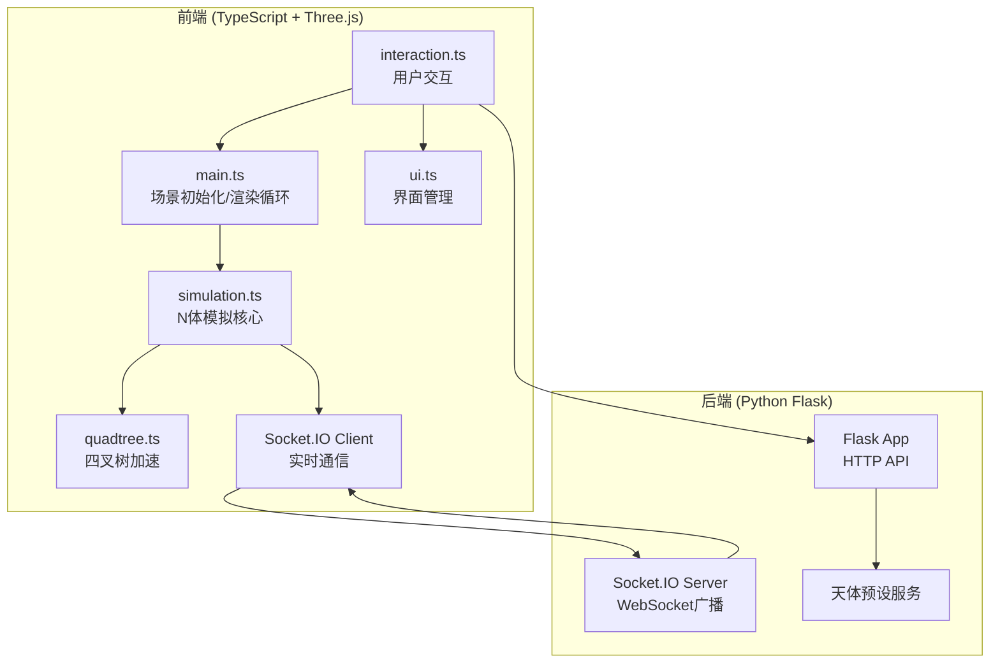
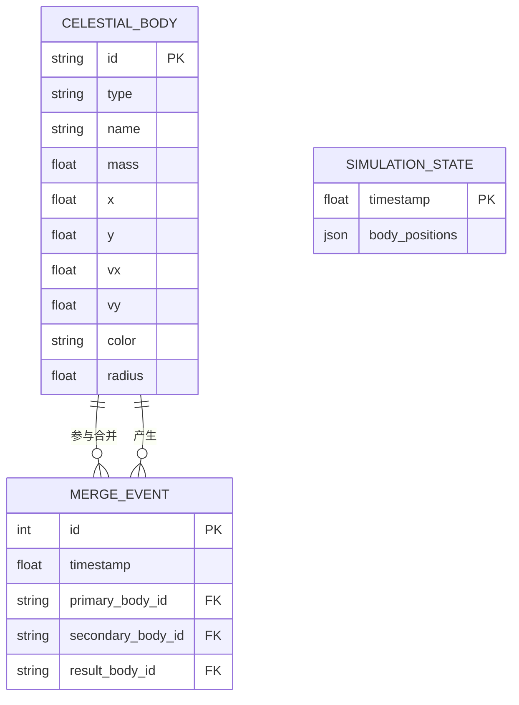

## 1. 架构设计



## 2. 技术描述

- **前端框架**：TypeScript 5.x + Vite 5.x
- **3D引擎**：Three.js 0.160.x（2D正交投影）
- **状态管理**：模块内状态 + 简单消息总线
- **HTTP客户端**：Axios 1.6.x
- **实时通信**：Socket.IO Client 4.6.x
- **后端框架**：Python Flask 3.0.x + Flask-SocketIO 5.3.x
- **跨域代理**：Vite dev server 代理到 Flask 5000端口
- **模拟算法**：Barnes-Hut四叉树 + 引力计算 + 动量守恒合并

## 3. 目录结构

```
auto63/
├── package.json
├── vite.config.js
├── tsconfig.json
├── index.html
├── src/
│   ├── main.ts          # Three.js场景初始化
│   ├── simulation.ts    # N体模拟核心
│   ├── quadtree.ts      # 四叉树数据结构
│   ├── interaction.ts   # 用户交互处理
│   └── ui.ts            # UI界面管理
├── backend/
│   └── app.py           # Flask后端服务
└── .trae/
    └── documents/
        ├── PRD.md
        └── TechnicalArchitecture.md
```

## 4. API定义

### 4.1 HTTP接口

| 方法 | 路径 | 描述 | 请求体 | 响应体 |
|------|------|------|--------|--------|
| GET | `/api/presets` | 获取天体预设列表 | 无 | `{ presets: [{type, mass, color, radius}] }` |
| POST | `/api/create-body` | 记录用户创建的天体 | `{type, mass, x, y, vx, vy, color, name}` | `{success: true, id}` |

### 4.2 WebSocket事件

| 事件名 | 方向 | 数据 | 描述 |
|--------|------|------|------|
| `body-created` | 客户端→服务器 | `{id, type, mass, x, y, vx, vy, color, name}` | 广播新天体创建 |
| `simulation-update` | 服务器→客户端 | `{timestamp, bodies: [{id, x, y, vx, vy}]}` | 每帧同步模拟状态 |
| `body-merged` | 客户端→服务器 | `{timestamp, primaryId, secondaryId, result}` | 广播合并事件 |

### 4.3 TypeScript类型定义

```typescript
interface CelestialBody {
  id: string;
  type: 'star' | 'planet' | 'blackhole';
  name: string;
  mass: number;
  x: number;
  y: number;
  vx: number;
  vy: number;
  color: string;
  radius: number;
}

interface QuadTreeNode {
  x: number;
  y: number;
  width: number;
  height: number;
  totalMass: number;
  centerOfMassX: number;
  centerOfMassY: number;
  bodies: CelestialBody[];
  children: QuadTreeNode[] | null;
}

interface MergeEvent {
  timestamp: number;
  primaryName: string;
  secondaryName: string;
  resultName: string;
}
```

## 5. 数据模型

### 5.1 实体关系图



### 5.2 核心常量

| 常量名 | 值 | 描述 |
|--------|----|------|
| G | 6.674e-11 * 1e12 | 引力常数（缩放后适用于像素级模拟） |
| TIME_STEP | 0.005 | 模拟时间步长（秒） |
| SOFTENING | 5 | 引力软化因子，避免奇点 |
| THETA | 0.7 | Barnes-Hut近似阈值 |
| MAX_BODIES | 500 | 最大天体数量 |
| MIN_SCALE | 0.1 | 最小缩放比例 |
| MAX_SCALE | 10 | 最大缩放比例 |
| MIN_BODY_SIZE | 4 | 天体最小像素大小 |
| VIEWPORT_SIZE | 2000 | 模拟区域大小 |

## 6. 性能优化策略

1. **Barnes-Hut算法**：四叉树空间划分，远场近似计算，复杂度从O(n²)降至O(n log n)
2. **WebWorker隔离**：模拟计算与渲染分离（可选扩展）
3. **BufferGeometry批量渲染**：所有天体使用同一BufferGeometry，减少draw call
4. **对象池**：粒子系统复用对象，避免频繁GC
5. **帧率自适应**：动态调整模拟精度，维持稳定帧率
6. **视口剔除**：只渲染可视区域内的天体
7. **节流更新**：UI面板数据每100ms更新一次，而非每帧更新
