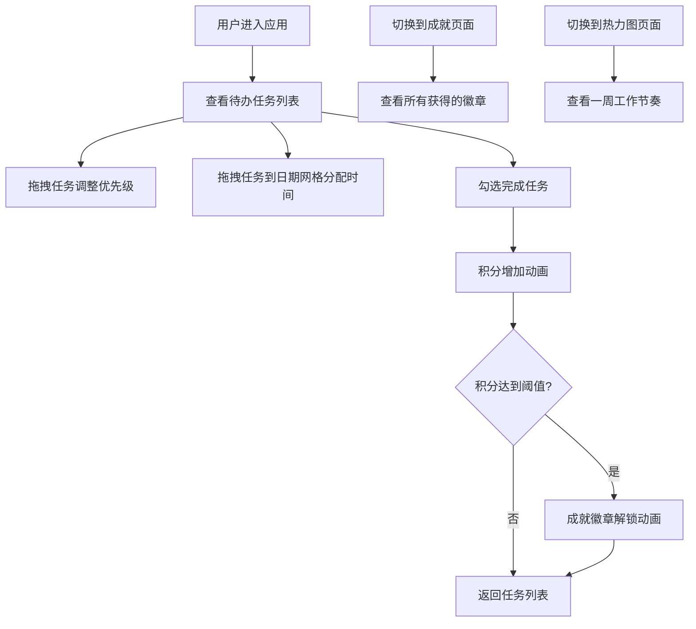

## 1. 产品概述

本产品是一款游戏化个人任务管理应用，通过拖拽式任务编排、积分成就系统和热力图可视化，解决个人任务管理缺乏激励机制和长期复盘手段的痛点。目标用户为需要提升工作效率和任务管理能力的职场人士和学生群体，核心价值在于将枯燥的任务管理转化为有成就感的游戏化体验。

## 2. 核心功能

### 2.1 用户角色

| 角色 | 注册方式 | 核心权限 |
|------|----------|----------|
| 普通用户 | 无需注册，本地数据存储 | 任务创建、拖拽编排、积分获取、成就解锁、热力图查看 |

### 2.2 功能模块

1. **任务管理面板**：待办列表展示、拖拽排序、日期网格分配、任务完成标记
2. **成就系统**：积分计数器、成就徽章解锁、成就徽章展示面板
3. **热力图分析**：一周工作节奏可视化、小时级任务分布、悬停详情展示
4. **侧边导航**：页面切换、积分展示、成就预览、全局搜索

### 2.3 页面详情

| 页面名称 | 模块名称 | 功能描述 |
|----------|----------|----------|
| 任务看板 | 待办列表 | 卡片式展示任务，支持拖拽重排序，显示优先级/截止时间/番茄钟数 |
| 任务看板 | 日期网格 | 7列x24行网格，支持拖拽任务分配到具体时间段 |
| 成就面板 | 徽章网格 | 3列展示已获得徽章，悬停翻转动画显示解锁条件 |
| 热力图 | 时间网格 | 7x24热力图展示一周工作节奏，颜色渐变表示任务数量 |
| 侧边栏 | 导航模块 | 页面切换按钮、积分计数器、成就预览、全局搜索框 |

## 3. 核心流程

## 4. 用户界面设计

### 4.1 设计风格
- **主色调**：青蓝 (#58a6ff)、橙色 (#f0883e)
- **深色主题**：背景 #0d1117、卡片 #161b22、文字 #c9d1d9
- **按钮风格**：圆角12px，悬停有缩放和阴影效果
- **字体**：现代无衬线字体，层级清晰（标题18px、正文14px、辅助文字12px）
- **布局风格**：三栏布局（左侧320px侧边栏、中间任务区、右侧日期网格）
- **动效风格**：0.5秒缓动动画，拖拽缩放阴影，粒子爆炸特效

### 4.2 页面设计概述

| 页面名称 | 模块名称 | UI元素 |
|----------|----------|--------|
| 任务看板 | 待办卡片 | 圆角12px、左侧复选框、优先级标签（颜色区分）、截止时间、番茄钟图标、拖拽句柄、完成收缩动画 |
| 任务看板 | 日期网格 | 7列星期标题、24行时间槽、悬停高亮、拖拽放置淡入动画、成功音效 |
| 成就面板 | 徽章卡片 | 3列网格、渐变光晕背景、图标、名称、获得时间、悬停0.6秒上翻显示解锁条件 |
| 热力图 | 时间格子 | 7x24网格、颜色渐变（浅灰→浅蓝→湖蓝→橙黄→深红）、0.1秒依次淡入动画、悬停弹窗显示详情 |
| 侧边栏 | 导航区 | 切换按钮（青蓝高亮）、积分计数器（数字滚动动画）、成就预览图标、搜索框（聚焦橙色边框） |

### 4.3 响应式设计
- **桌面端**（>768px）：三栏布局，侧边栏320px固定宽度
- **移动端**（≤768px）：侧边栏折叠为顶部导航条，日期网格变为上下滑动式，触控拖拽优化
- **触控优化**：拖拽热区扩大，触控反馈动画

## 5. 性能指标

| 指标 | 要求 |
|------|------|
| 热力图渲染时间 | ≤200ms |
| 拖拽操作帧率 | ≥55fps |
| 动画流畅度 | 无卡顿、掉帧现象 |
| 首次加载时间 | ≤3s |
