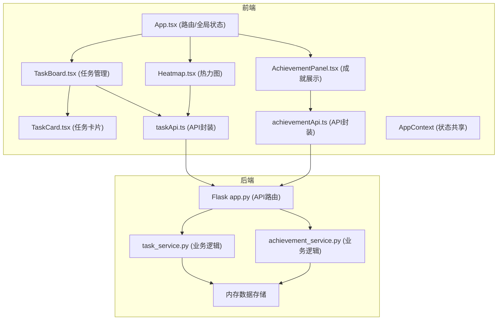
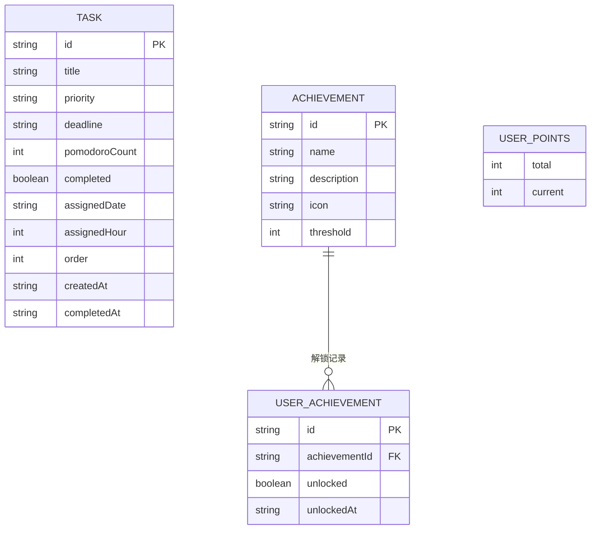

## 1. 架构设计



## 2. 技术说明

- **前端**：React 18 + TypeScript + Vite
- **状态管理**：React Context API
- **动画库**：framer-motion
- **拖拽库**：react-beautiful-dnd
- **HTTP客户端**：axios
- **日期处理**：date-fns
- **后端**：Python Flask
- **数据存储**：内存字典（开发环境）

## 3. 目录结构

```
auto74/
├── src/
│   ├── App.tsx
│   ├── api/
│   │   ├── taskApi.ts
│   │   └── achievementApi.ts
│   ├── modules/
│   │   ├── taskManager/
│   │   │   ├── TaskBoard.tsx
│   │   │   └── TaskCard.tsx
│   │   └── achievements/
│   │       ├── AchievementPanel.tsx
│   │       └── Heatmap.tsx
│   └── styles/
│       └── global.css
├── server/
│   ├── app.py
│   ├── task_service.py
│   └── achievement_service.py
├── index.html
├── package.json
├── vite.config.js
└── tsconfig.json
```

## 4. 路由定义

| 路由 | 用途 |
|------|------|
| / | 任务看板（默认首页） |
| /achievements | 成就徽章面板 |
| /heatmap | 热力图分析页 |

## 5. API 定义

### 任务相关接口

```typescript
// 任务类型定义
interface Task {
  id: string;
  title: string;
  priority: 'easy' | 'medium' | 'hard';
  deadline: string;
  pomodoroCount: number;
  completed: boolean;
  assignedDate?: string;
  assignedHour?: number;
  order: number;
  createdAt: string;
  completedAt?: string;
}

// 获取任务列表
GET /api/tasks → { tasks: Task[] }

// 创建任务
POST /api/tasks → Task

// 更新任务
PUT /api/tasks/:id → Task

// 标记任务完成
POST /api/tasks/:id/complete → { task: Task, points: number, newAchievements: Achievement[] }

// 重排序任务
POST /api/tasks/reorder → { success: boolean }

// 分配任务到日期
POST /api/tasks/:id/assign → { success: boolean }
```

### 成就相关接口

```typescript
// 成就类型定义
interface Achievement {
  id: string;
  name: string;
  description: string;
  icon: string;
  threshold: number;
  unlocked: boolean;
  unlockedAt?: string;
}

// 获取用户成就列表
GET /api/achievements/user → { achievements: Achievement[], totalPoints: number }

// 获取所有成就定义
GET /api/achievements → { achievements: Achievement[] }
```

## 6. 数据模型



## 7. 核心算法

### 积分计算
- 简单任务：+10分
- 中等任务：+20分
- 困难任务：+30分

### 成就阈值
- 100分：「初露锋芒」徽章
- 250分：「渐入佳境」徽章
- 500分：「炉火纯青」徽章

### 热力图颜色映射
- 0个任务：#21262d（浅灰）
- 1-2个任务：#58a6ff（浅蓝）
- 3-5个任务：#388bfd（湖蓝）
- 6-10个任务：#f0883e（橙黄）
- >10个任务：#da3633（深红）
