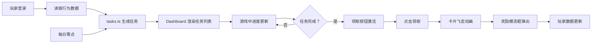

## 1. 产品概述

基于玩家行为分析的动态每日任务生成与追踪系统，为休闲游戏玩家提供个性化每日任务体验。通过分析玩家历史行为数据（通关记录、角色偏好、游戏时长等），动态生成符合玩家习惯的每日任务，配合流畅的动画效果和奖励系统，提升玩家日常活跃度和游戏留存率。

## 2. 核心功能

### 2.1 用户角色

| 角色 | 注册方式 | 核心权限 |
|------|----------|----------|
| 游戏玩家 | 游戏内登录 | 查看每日任务、追踪任务进度、领取任务奖励、查看个人统计 |

### 2.2 功能模块

1. **主仪表盘页面**：玩家信息展示、任务列表、统计面板
2. **任务生成引擎**：基于玩家行为数据的个性化任务算法
3. **任务进度追踪**：实时进度更新、倒计时、进度条动画
4. **奖励系统**：随机奖励生成、领取动画、数据更新
5. **每日重置机制**：零点自动重置任务、历史归档

### 2.3 页面详情

| 页面名称 | 模块名称 | 功能描述 |
|----------|----------|----------|
| 主仪表盘 | 玩家信息区 | 显示玩家头像（圆形发光边框）、昵称、等级 |
| 主仪表盘 | 统计面板 | 金币数（滚动数字）、今日游戏时长、今日任务完成率（环形进度条） |
| 主仪表盘 | 任务列表 | 3个个性化任务卡片，错落排列，交错淡入动画 |
| 任务卡片 | 进度展示 | 渐变进度条（绿→金）、粒子飞散效果、进度数字跳动 |
| 任务卡片 | 状态指示 | 类型彩色竖条（绿=战斗/紫=收集/橙=时间）、24小时倒计时、领取按钮 |
| 奖励弹窗 | 奖励展示 | 缩放淡入动画、奖励图标和数量展示、金币滚动增加效果 |

## 3. 核心流程

玩家登录游戏 → 系统读取玩家历史行为数据 → 任务生成引擎分析数据并生成3个个性化每日任务 → 玩家在仪表盘中查看任务列表 → 进行游戏时任务进度实时更新 → 任务完成后领取按钮激活（金色呼吸光晕） → 点击领取触发卡片飞起缩小动画 → 奖励模态框弹出展示奖励 → 玩家数据更新（金币增加等） → 每日零点自动重置任务

## 4. 用户界面设计

### 4.1 设计风格

- **主色调**：深空蓝渐变背景（#0a1628 → #1a2a4a）
- **强调色**：霓虹蓝（#00d4ff）、金色（#ffd700）
- **任务类型色**：绿色（#00ff88，战斗类）、紫色（#b366ff，收集类）、橙色（#ff9933，时间类）
- **按钮风格**：圆角毛玻璃按钮，未完成时灰白禁用，完成时金色呼吸光晕
- **字体**：现代科技感无衬线字体，标题加粗，数据使用等宽数字
- **布局风格**：左右分栏布局，左侧任务列表（错落卡片），右侧固定统计面板
- **毛玻璃效果**：半透明背景（rgba(255,255,255,0.08)）+ backdrop-filter: blur(20px)
- **动画风格**：framer-motion 流畅动画，60FPS，交错入场延迟，进度条平滑过渡

### 4.2 页面设计概述

| 页面名称 | 模块名称 | UI元素 |
|----------|----------|--------|
| 主仪表盘 | 整体背景 | 深空蓝径向渐变，微妙星空粒子效果 |
| 主仪表盘 | 任务卡片 | 毛玻璃质感，左边缘彩色竖条，错落排列（margin偏移），交错淡入入场 |
| 主仪表盘 | 统计面板 | 右侧固定，白色半透明毛玻璃，发光边框 |
| 任务卡片 | 进度条 | 渐变填充（#00ff88 → #ffd700），粒子飞散动效，百分比数字跳动 |
| 任务卡片 | 领取按钮 | 金色渐变，呼吸光晕（box-shadow pulse），禁用状态灰色 |
| 奖励弹窗 | 模态框 | 缩放+淡入，淡出关闭，奖励图标发光效果 |
| 统计面板 | 环形进度条 | SVG 绘制，霓虹蓝描边，动画填充 |
| 统计面板 | 数字显示 | 数字滚动动画（count-up effect） |

### 4.3 响应式设计

- 桌面优先设计，适配 1920x1080 和 1440x900 分辨率
- 1920x1080：任务卡片3列网格布局，统计面板宽度360px
- 1440x900：任务卡片自适应间距，统计面板宽度320px
- 使用 CSS 媒体查询处理不同分辨率下的间距和字体大小调整
