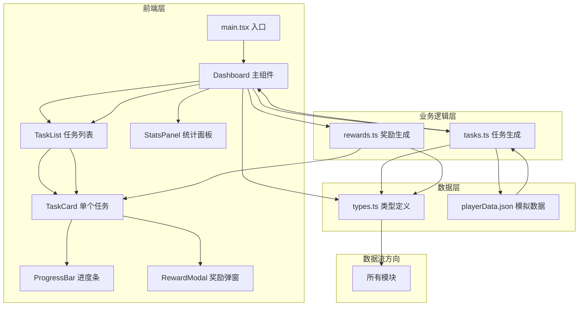
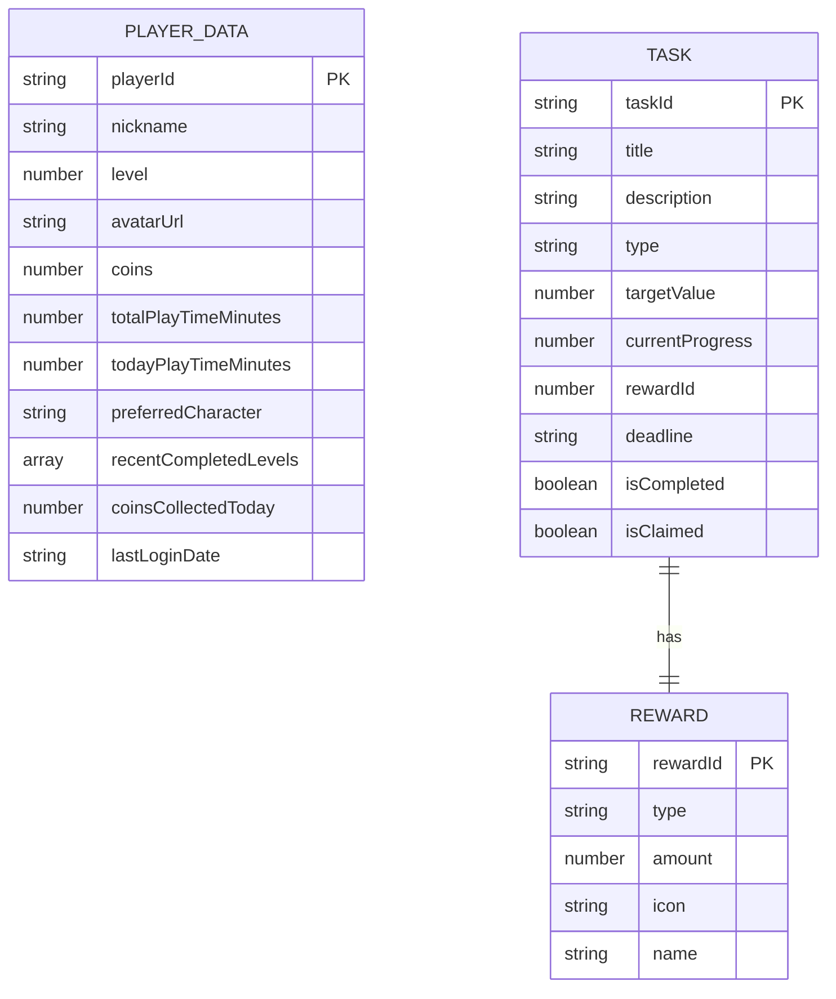

## 1. 架构设计



## 2. 技术描述

- **前端框架**：React 18 + TypeScript 5（严格模式）
- **构建工具**：Vite 5（开发端口3000）
- **动画库**：framer-motion 11
- **HTTP 客户端**：axios（预留，当前使用静态JSON）
- **样式方案**：内联样式 + CSS 变量（暗色主题）
- **数据来源**：静态 JSON 文件模拟后端数据

## 3. 目录结构

```
e:\solo\SoloAutoDemo\tasks\auto78\
├── package.json
├── vite.config.js
├── tsconfig.json
├── index.html
├── src/
│   ├── main.tsx              # 应用入口
│   ├── types.ts              # 类型定义（所有模块依赖）
│   ├── data/
│   │   └── playerData.json   # 模拟玩家行为数据
│   ├── utils/
│   │   ├── tasks.ts          # 任务生成逻辑
│   │   └── rewards.ts        # 奖励生成逻辑
│   └── components/
│       ├── Dashboard.tsx     # 主仪表盘
│       ├── TaskList.tsx      # 任务列表
│       ├── TaskCard.tsx      # 单个任务卡片
│       ├── StatsPanel.tsx    # 统计面板
│       ├── ProgressBar.tsx   # 进度条组件
│       └── RewardModal.tsx   # 奖励弹窗
```

**文件调用关系和数据流向：**

1. **types.ts** - 被所有其他文件引用，定义 PlayerData、Task、Reward、TaskType 等核心类型
2. **playerData.json** - 包含玩家行为数据，被 tasks.ts 读取
3. **tasks.ts** - 导入 types.ts 和 playerData.json，输出 generateDailyTasks() → 被 Dashboard.tsx 调用
4. **rewards.ts** - 导入 types.ts，输出 generateReward() → 被 tasks.ts 和 Dashboard.tsx 调用
5. **Dashboard.tsx** - 核心组件，导入 tasks.ts、rewards.ts、types.ts，管理任务状态和奖励领取，传递数据给子组件
6. **TaskList.tsx** - 接收 Task[] 数组 props，渲染 TaskCard 列表
7. **TaskCard.tsx** - 接收单个 Task 和回调函数，渲染进度条和领取按钮
8. **StatsPanel.tsx** - 接收 PlayerData 和任务完成统计，渲染统计面板
9. **ProgressBar.tsx** - 接收进度值，渲染带动画的进度条
10. **RewardModal.tsx** - 接收 Reward 对象，渲染奖励弹窗动画
11. **main.tsx** - 应用入口，渲染 Dashboard 组件

## 4. 数据模型

### 4.1 数据模型定义



### 4.2 TypeScript 类型定义

```typescript
type TaskType = 'battle' | 'collect' | 'time';
type RewardType = 'coins' | 'fragment' | 'skin';

interface PlayerData {
  playerId: string;
  nickname: string;
  level: number;
  avatarUrl: string;
  coins: number;
  totalPlayTimeMinutes: number;
  todayPlayTimeMinutes: number;
  preferredCharacter: string;
  preferredCharacterType: 'fire' | 'water' | 'earth' | 'wind';
  recentCompletedLevels: Array<{
    levelId: string;
    character: string;
    completedAt: string;
  }>;
  coinsCollectedToday: number;
  lastLoginDate: string;
}

interface Task {
  taskId: string;
  title: string;
  description: string;
  type: TaskType;
  targetValue: number;
  currentProgress: number;
  reward: Reward;
  deadline: string;
  isCompleted: boolean;
  isClaimed: boolean;
}

interface Reward {
  rewardId: string;
  type: RewardType;
  amount: number;
  icon: string;
  name: string;
}
```
