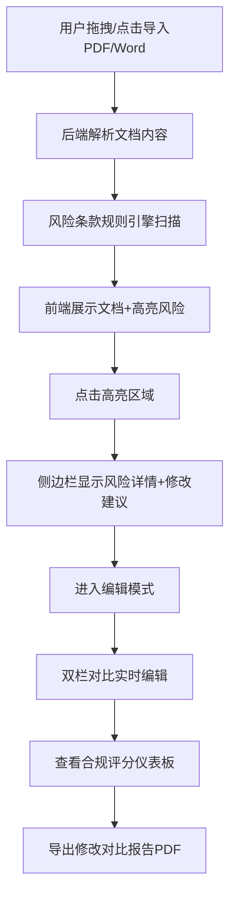

## 1. 产品概述

法律文书智能审查助手是一款面向法务人员的专业合同审查工具，通过AI技术自动识别合同中的风险条款，提供修改建议和合规性评分，大幅提升合同审查效率。

- **目标用户**：企业法务人员、律师、合同管理人员
- **核心价值**：5秒内完成全文档风险扫描，自动识别20+常见合同风险，提供专业修改建议
- **市场定位**：企业级SaaS工具，填补传统人工审查效率低、漏检率高的痛点

## 2. 核心功能

### 2.1 用户角色

| 角色 | 注册方式 | 核心权限 |
|------|----------|----------|
| 法务人员 | 企业账号登录 | 文档上传、风险审查、条款编辑、报告导出 |

### 2.2 功能模块

1. **文档导入模块**：支持PDF/Word拖拽上传，点击选择文件
2. **文档浏览模块**：全文展示、树形目录导航、章节折叠
3. **风险检测模块**：自动扫描高亮风险条款、侧边栏详情展示
4. **条款编辑模块**：实时编辑、双栏对比、差异高亮
5. **合规评分模块**：三维度评分、环形进度条、低分警告
6. **报告导出模块**：导出修改对比报告为PDF

### 2.3 页面详情

| 页面名称 | 模块名称 | 功能描述 |
|----------|----------|----------|
| 主审查页 | 顶部导航栏 | 标题显示、低分警告横幅、操作按钮 |
| 主审查页 | 左侧目录面板 | 文档章节树形导航、可折叠、点击跳转 |
| 主审查页 | 中间文档区 | 文档全文展示、风险高亮、拖拽分割线 |
| 主审查页 | 右侧功能面板 | 风险详情/编辑面板切换、评分仪表板 |
| 主审查页 | 编辑对比区 | 双栏并排显示、红绿差异高亮、实时同步 |

## 3. 核心流程

用户上传合同文档后，系统自动解析并进行风险扫描，法务人员可浏览高亮风险、查看详情建议、编辑条款、查看评分，最终导出审查报告。

## 4. 用户界面设计

### 4.1 设计风格

- **主色调**：深蓝色 `#165DFF`，体现专业、可靠的商务风格
- **辅助色**：白色 `#FFFFFF` 背景，风险红 `#F53F3F`，新增绿 `#00B42A`，警告橙 `#FF7D00`
- **按钮风格**：圆角8px，悬停微放大（1.02倍），300ms过渡
- **字体**：标题使用「思源黑体 Bold」，正文使用「思源宋体 Regular」，14px-16px字号
- **布局风格**：三栏式布局，左侧250px目录，中间60%文档区，右侧35%功能面板
- **动效风格**：所有面板切换300ms淡入淡出（opacity 0→1），拖拽分割线实时响应

### 4.2 页面设计概述

| 页面名称 | 模块名称 | UI Elements |
|----------|----------|-------------|
| 主审查页 | 顶部警告横幅 | 红色渐变背景、白色文字、轻微闪烁动画（opacity 0.8-1） |
| 主审查页 | 树形目录 | 深蓝色图标、缩进层次、hover高亮、展开/折叠动画 |
| 主审查页 | 风险高亮 | 黄色背景（低风险）、橙色背景（中风险）、红色背景（高风险） |
| 主审查页 | 评分仪表板 | 三个环形进度条（SVG实现）、渐变填充、动画加载 |
| 主审查页 | 对比编辑器 | 左侧原文红色删除线、右侧编辑版绿色下划线、行号对齐 |

### 4.3 响应式

- **桌面端（>1280px）**：三栏完整布局，所有功能完整展示
- **平板端（768px-1280px）**：左侧目录可收起为图标栏，右侧面板默认折叠，点击展开
- **触摸优化**：按钮最小44px×44px，支持双指缩放文档

### 4.4 视觉细节

- **背景纹理**：文档区添加极细微的网格纹理（opacity 0.03）
- **阴影层次**：面板使用 `box-shadow: 0 4px 20px rgba(22, 93, 255, 0.08)`
- **光标样式**：高亮区域hover时显示指针光标，拖拽分割线显示col-resize
