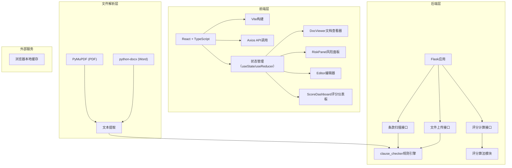
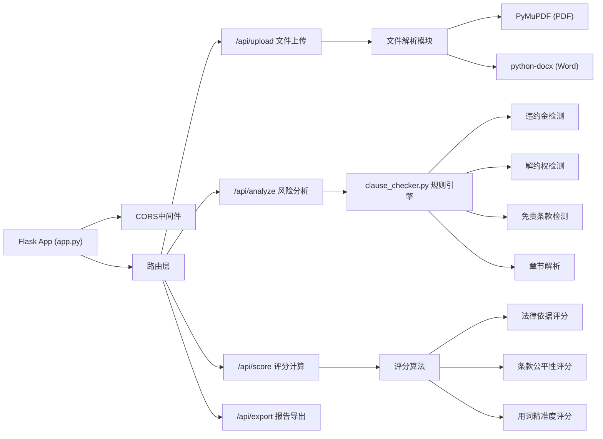
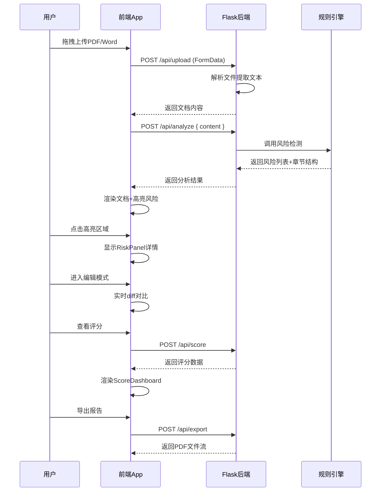

## 1. 架构设计

整体采用前后端分离架构，前端负责交互展示和状态管理，后端负责文件解析、风险检测和评分计算。



## 2. 技术描述

- **前端**：React@18 + TypeScript@5 + Vite@5
- **初始化工具**：Vite原生初始化
- **UI样式**：原生CSS + CSS变量，不使用UI框架
- **状态管理**：React内置useState + useContext
- **后端**：Flask@3 + flask-cors@4
- **文件解析**：python-docx@1.1 + PyMuPDF@1.24
- **HTTP客户端**：axios@1.7
- **文档渲染**：react-pdf@8
- **文件导出**：file-saver@2.0

## 3. 目录结构

```
project/
├── frontend/
│   ├── src/
│   │   ├── App.tsx           # 主应用、状态管理
│   │   ├── types.ts          # TypeScript类型定义
│   │   ├── api.ts            # API接口封装
│   │   └── components/
│   │       ├── DocViewer.tsx      # 文档查看器
│   │       ├── RiskPanel.tsx      # 风险详情面板
│   │       ├── Editor.tsx         # 条款编辑器
│   │       └── ScoreDashboard.tsx # 评分仪表板
│   ├── index.html
│   ├── package.json
│   ├── vite.config.js
│   └── tsconfig.json
└── backend/
    ├── app.py              # Flask应用入口
    ├── requirements.txt
    └── clause_checker.py   # 风险条款检测引擎
```

## 4. API 定义

### 4.1 TypeScript 类型定义

```typescript
interface RiskClause {
  id: string;
  type: 'penalty' | 'termination' | 'disclaimer' | 'other';
  severity: 'low' | 'medium' | 'high';
  text: string;
  startIndex: number;
  endIndex: number;
  description: string;
  suggestion: string;
  legalBasis: string;
}

interface DocumentData {
  id: string;
  title: string;
  content: string;
  chapters: Chapter[];
  risks: RiskClause[];
}

interface ComplianceScore {
  total: number;
  legalBasis: number;
  fairness: number;
  precision: number;
  details: {
    legalBasis: string;
    fairness: string;
    precision: string;
  };
}

interface Chapter {
  id: string;
  title: string;
  level: number;
  startIndex: number;
  endIndex: number;
  children: Chapter[];
}

interface DiffSegment {
  type: 'added' | 'removed' | 'unchanged';
  value: string;
}
```

### 4.2 后端接口

| 方法 | 路径 | 描述 | 请求 | 响应 |
|------|------|------|------|------|
| POST | `/api/upload` | 上传文档 | `FormData(file)` | `{ documentId, content, title }` |
| POST | `/api/analyze` | 分析文档风险 | `{ content, title }` | `{ risks: RiskClause[], chapters: Chapter[] }` |
| POST | `/api/score` | 计算合规评分 | `{ content, risks }` | `ComplianceScore` |
| POST | `/api/export` | 导出对比报告 | `{ original, modified, risks }` | PDF文件流 |

## 5. 服务器架构



## 6. 核心数据流


